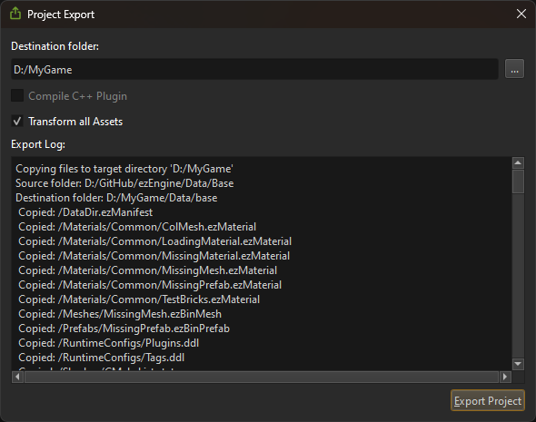

# Project Export

*Project Export* is the step to create a package that contains all the files needed to play your game, excluding the files that are only needed for development.

The [data directories](../projects/data-directories.md) of your project contain a lot of files that are only needed during development. Additionally, they are usually stored in various locations, for example the *Base* directory, which is needed by all games, is located in the SDK folder, whereas your project files probably are located somewhere entirely different. Finally, you also need various *binaries* (*EXE* and *DLL* on Windows) to launch your game, which are again located somewhere different.

The project export feature consolidates all these files into a single directory, so that it is easy to distribute.

## Export Project Dialog

To get started with generating a self-contained package of your game, use the *project export dialog* that you find in the editor under *Editor > Export Project...*.

Select an output folder and click **Export Project**.

Once the export is finished, it will automatically open the folder where the files have been copied to. The export also generates one `.bat` file for every scene in your project. These scripts launch the respective scene with [ezPlayer](../tools/player.md).

## Configuring Project Export

When you export your project for the first time, these files are added to your project directory:

1. `ProjectBinaries.ezExportFilter`
1. `ProjectData.ezExportFilter`

The first file is used to determine which *binaries* should get included in the package.
The second file is used to determine which *data files* should get included.

By default these files `#include` predefined export filters:

1. `Data\Base\CommonData.ezExportFilter`
1. `Data\Base\CommonBinaries.ezExportFilter`

These files set up the rules for typical use-cases. You can extend them in your project config files, or you can remove the `#include` and fully define your own rules.

The ezExportFilter files contain two sections: **[EXCLUDE]** and **[INCLUDE]**. Without any filter, all files are included in the output package.

To exclude certain files or file types, a pattern has to be added to the **[EXCLUDE]** section. However, sometimes you want to exclude all files of a certain type (e.g. *exe*) but include a single one regardless (for example your game.exe). In this case, add it to the **[INCLUDE]** section, to override the exclusion filter.

Each line in the file represents one file path pattern:

* If it starts with a `*`, it matches paths that end with this pattern.
* If it ends with a `*`, it matches paths that start with this pattern.
* If it starts and ends with a `*`, it matches paths that contain this pattern.
* At any other location, `*` is not allowed.
* All paths are considered to be relative to their respective data directory.

> **Note:**
>
> For inspiration how to use these path patterns, see the files `Data\Base\CommonData.ezExportFilter` and `Data\Base\CommonBinaries.ezExportFilter`.

## Limitations

* At this time it is not analyzed which plugin DLLs are actually needed, instead all DLLs are included. Edit your `ProjectBinaries.ezExportFilter` to control this.
* Currently the export step always creates `.bat` files to load each scene with ezPlayer. There is no way to automatically set up something different.
* You currently can't automatically execute custom logic (C++ code, or a script) to finalize the package.

## See Also

* [Profiling](../performance/profiling.md)
* [Supported Platforms](../build/supported-platforms.md)
* [ezPlayer](../tools/player.md)
