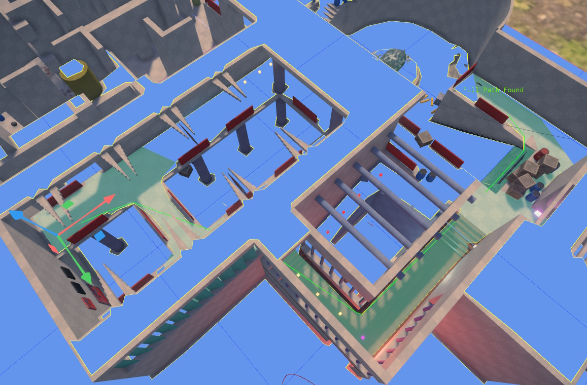
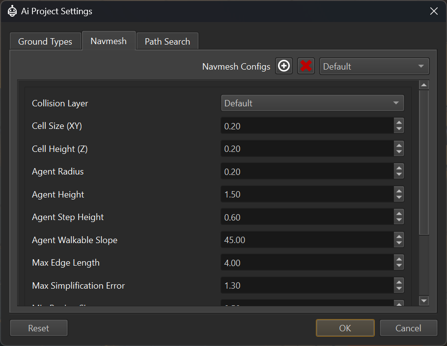

# Runtime Navmesh

The [AiPlugin](ai-plugin-overview.md) adds functionality to generate navmeshes on-demand at runtime. This is a very convenient workflow, as the navmesh incorporates level changes every time you restart the simulation.

## Input Data

The runtime navmesh generation uses the [collision geometry](../../physics/jolt/collision-shapes/jolt-collision-meshes.md) and its [surfaces](../../materials/surfaces.md) as the input data from which to build the navmesh. The data is queried *on-demand* in an area around where *path searches* are done. To see the resulting navmesh, enable the [navmesh visualization](#navmesh-visualization).

## Navigation Configuration

In a scene document select *Project > Plugin Settings > Ai Project Settings* to open the configuration dialog.

### Ground Types

The *Ground Types* tab is used to define the types of walkable (or non-walkable) ground that appear in your game. There is a maximum of 32 ground types. In this dialog you can edit their names (double click or `F2` on an entry) and select whether an entry should generally be in use (checkmark).
Entries that are not checked, will not show up in other places as selectable.

The `<None>` and `<Default>` ground types always exist and cannot be removed or renamed.

Which *ground type* a physical surface represents, is specified in the [surfaces](../../materials/surfaces.md#ai-properties). If a surface uses the `<None>` ground type, it will not be part of the navmesh, at all, meaning the navmesh will have a hole there. For surfaces that are generally not walkable, by no character, this is preferable over using a dedicated ground type that is then ignored by a *path search type*.

### Navmesh Types

The *Navmesh* tab is used to configure how a navmesh is generated. Most games only need a single navmesh type, but if you have agents of very different height or radius, you may need additional ones.

Enable the [navmesh visualization](#navmesh-visualization) and utilize the the [navmesh path test component](navmesh-path-test-component.md) to test how these options affect the result.

#### Navmesh Properties

* `Collision Layer`: The [collision layer](../../physics/jolt/collision-shapes/jolt-collision-layers.md) to use for finding geometry from which to generate the navmesh. This is mainly used to filter out high detail geometry, to speed up navmesh generation. It can also be used to ignore ground types that are generally not traversable (such as water).

* `Cell Size (XY):` How detailed the navmesh generation shall be. This has to be less than the desired character radius, and the agent radius should be a whole multiple of this value. For example if your cell size is `0.2`, the effective agent radius can only be `0.2`, `0.4`, `0.6` and so on.

* `Cell Height (Z):` The detail along the up axis with which to generate the navmesh. This mainly affects how well *steps* are detected and dealt with. Similar to the *agent radius*, the *agent step height* should be a multiple of the cell height.

* `Agent Radius:` How wide the characters are that walk over this type of navmesh. This affects how narrow passages can be, and how far away agents stay from walls. The agent radius should be a multiple of the *cell size*. Don't use multiple navmeshes only because characters shall have a slightly different radius. Use the same radius for all agents that are more or less the same size. Only use a separate navmesh type, for characters that are extremely different in size and should be forced to take different paths throughout narrow terrain.

* `Agent Height:` Similar to *agent radius*, this defines how tall a character may be. Should be a multiple of *cell height*. The same caveats as for *agent radius* apply.

* `Agent Step Height:` The maximum height of obstacles (such as stair steps) that an agent is allowed to step up. Should be a multiple of *cell height*.

* `Agent Walkable Slope:` The maximum slope of triangles that are considered for navmesh generation. Triangles steeper than this will be discarded as non-walkable.

### Path Search Types

Each navmesh defines *where* an agent can walk, and which *ground types* are in which area. *Path search types* are used to configure how fast an agent can traverse each ground type and thus which areas the agent would prefer or avoid. Additionally a path search type can be used to prevent an agent from walking on certain ground types, at all.

In this tab you can add different path search types, and for each one, you can configure the *cost* of traversing a ground type and whether it is allowed to be traversed at all.
The higher the cost, the more an agent will try to avoid it and use a different route if possible. Traversal costs can't be zero or negative.

Use the the [navmesh path test component](navmesh-path-test-component.md) to see how these options affect path finding.

## Navmesh Visualization

To be able to see the navmesh, use the [CVar](../../debugging/cvars.md) `Ai.Navmesh.Visualize`. There can be multiple different navmeshes for different character heights etc. This CVar enables visualization for *one of them* by index. So set it to `0` to see the first navmesh, `1` if you have a second one and so on.

> **Important:**
>
> No navmesh will be generated, as long as no path searches are done. Use the [navmesh path test component](navmesh-path-test-component.md) to initiate a path search.

## See Also

* [AiPlugin Overview](ai-plugin-overview.md)
* [Navmesh Path Test Component](navmesh-path-test-component.md)
