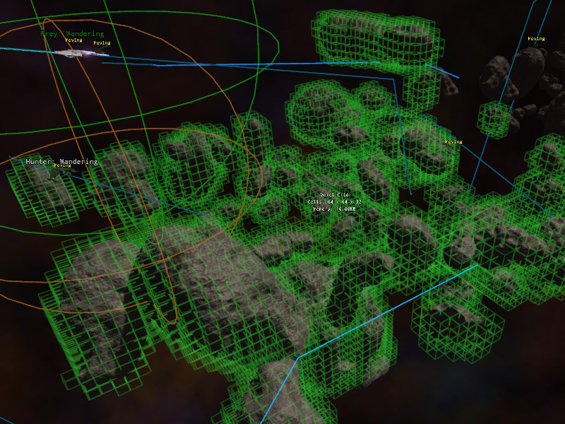
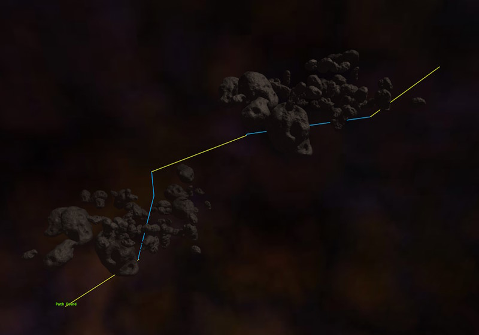

# 3D Voxel Navigation

Voxel navigation is used for objects that move freely through 3D space, such as flying creatures, submarines or spaceships. Whereas the [runtime navmesh](runtime-navmesh.md) describes walkable surfaces, a voxel grid describes which parts of the *volume* are blocked and which are free.

## Voxel Grids

The navigable space is described by one or more [voxel grid components](voxel-grid-component.md). Each grid is a box of a fixed size that is subdivided into voxels of a fixed edge length. Once the scene starts simulating, the collision geometry inside the box is rasterized into the grid, and every voxel that is touched by a triangle is marked as *occupied*. All other voxels are *free*.

Only geometry of the [collision layer](../../physics/jolt/collision-shapes/jolt-collision-layers.md) that is configured on the grid is taken into account, which allows you to exclude detail geometry or objects that should not block navigation.

Voxelization happens once, a few frames after the simulation started. It is not updated afterwards, so objects that move at runtime don't affect the grid.

Grids are managed by the `ezAiVoxelWorldModule`. Its `IsReady()` function returns true once voxelization has finished. Before that, path searches fail. The module also provides `FindGridsInBox()` to find all grids in an area.

## Path Searches

Path searches use A* through free voxels. A search may span multiple grids. Pathfinding is always done within a single grid at a time. If the destination lies outside the grid that is currently searched, the search only looks for a way out of that grid, and then continues in the next grid on the way to the destination. **Space that is not covered by any grid is treated as free.** This means that grids only need to be placed around areas that actually contain obstacles, and that the space in between is crossed in a straight line.

Path searches are limited by the number of A* iterations per grid, and by the number of grids that a path may pass through. Both are exposed as properties on the components that do the searching.

## Visualization

To see the occupied voxels of all grids in a scene, either enable the `Visualize` property on a grid component, or set the [CVar](../../debugging/cvars.md) `AI.VoxelGrid.Visualize` to true.

To check whether the grids in a scene produce the desired paths, use the [voxel path test component](voxel-path-test-component.md).

## Moving Along a Path

The [voxel navigation component](voxel-navigation-component.md) does both the path search and the steering of a game object along the resulting path. However, it mainly exists to give you a sample implementation for how a steering behavior can look like. If it doesn't fit what you need, you are encouraged to write a custom steering behavior for your use case.

## See Also

* [Voxel Grid Component](voxel-grid-component.md)
* [Voxel Navigation Component](voxel-navigation-component.md)
* [Voxel Path Test Component](voxel-path-test-component.md)
* [AiPlugin Overview](ai-plugin-overview.md)
* [Runtime Navmesh](runtime-navmesh.md)
