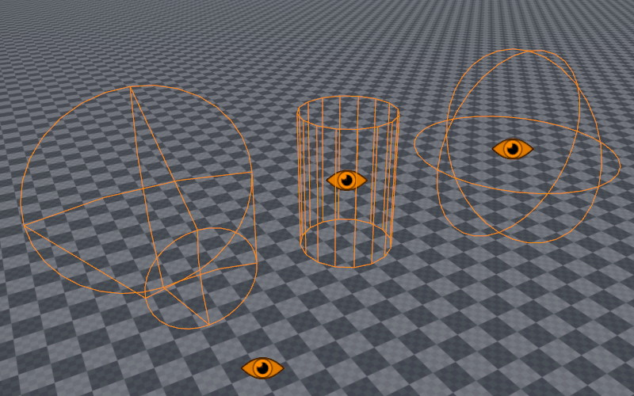

# Sensor Components

*Sensor components* are used to detect objects in a certain area and inform other game code about them. Contrary to [triggers](../physics/jolt/actors/jolt-trigger-component.md), they use the [spatial system](../runtime/world/spatial-system.md), so they work even without a physics engine. However, the sensor component can utilize additional physics raycasts, to determine whether something inside the volume is also visible and not occluded by walls.

 Sensor components are meant for AI use cases, such as determining line of sight, hearing noises or even smelling odors.

Generally the sensors query the [spatial system](../runtime/world/spatial-system.md) to detect certain objects. Use the [marker component](../gameplay/marker-component.md) to make something detectable. For example, to make a creature able to smell the player, regularly drop markers at the player's current location, that vanish after a while, so that the creature can detect and follow these markers.

## State Reporting

Sensors keep track of the objects that entered their volume. During every update they determine whether objects are still inside the volume or whether their visibility changed (line-of-sight occluded).

If anything changes, a sensor [sends the message](../runtime/world/world-messaging.md) `ezMsgSensorDetectedObjectsChanged`, which contains the full array of currently detected objects.

## Performance Considerations

Sensor components poll the world in regular intervals and thus incur a performance cost. The `UpdateRate` determines how often this polling happens. Internally updates from many sensors are automatically distributed evenly across frames, to prevent performance spikes at regular intervals.

Still, it is best to reduce the update rate as much as possible. For example in a game with large levels, you should check how close the player is to an NPC and dynamically adjust the update rate. At a large distance, the sensor can be set to update only every second, or you could even deactivate the sensor entirely. Similarly, you can use the 'alterness' state of an NPC to increase or decrease the sensor update rate.

It is also possible to set the update rate to **Never** which disables automatic updates. In this case you can explicitely instruct to sensor to do an update only on demand, via the C++ function `RunSensorCheck()`. This is for more advanced usage, for instance when writing custom AI code.

Finally, you should decide whether doing a visibility check is always necessary. The sensor would do this check for every possible target at every update. However, for a lot of game logic, once something has attracted attention, further visibility checks are not necessary. In such a case, it can be more efficient to do visibility raycasts only while a creature is not yet alert.

## Component Properties

### Shared Component Properties

* `UpdateRate`: How often the sensor component should query the world for changes. The higher the update rate, the more responsive it will be, and the less likely that short events are missed. However, higher update rates also require more processing time.
* `SpatialCategory`: The [spatial category](../runtime/world/spatial-system.md) of objects that should trigger the sensor component.
* `TestVisibility`: If enabled, the sensor will cast additional rays using the physics engine, to determine whether the target is occluded by walls or clearly visible.
* `CollisionLayer`: The [collision layer](../physics/jolt/collision-shapes/jolt-collision-layers.md) to use for the visibility raycast.
* `ShowDebugInfo`: If enabled, additional debug geometry is rendered to visualize the sensor volume and state.
* `Color`: This color is used for the debug visualization. Can be used to easily distinguish what type of sensor this is.

### Sphere Sensor Component

* `Radius`: The size of the sensor sphere.

### Cylinder Sensor Component

* `Radius`, `Height`: The dimensions of the sensor cylinder.

### Cone Sensor Component

* `NearDistance`, `FarDistance`, `Angle`: These all define the cone volume. Note that the cone not only has an angle and a length (*FarDistance*) but also a *NearDistance*. Enable `ShowDebugInfo` to see the exact cone shape. The near distance allows to ignore things that are up close, or to have that range covered by another sensor shape.

## See Also

* [Marker Component](../gameplay/marker-component.md)
* [State Machine Component](state-machine-component.md)
* [Custom Code](../custom-code/custom-code-overview.md)
* [Blackboards](../Miscellaneous/blackboards.md)
