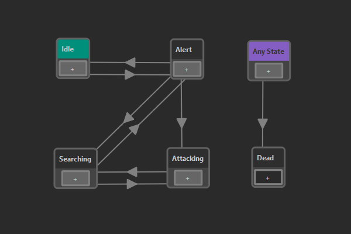

# State Machine Asset

A *state machine asset* is used to create a [state machine](https://en.wikipedia.org/wiki/Finite-state_machine) that is commonly used to keep track of an entity's state. State machines are very useful to give objects functionality. For example a door might have the states *closed*, *opening*, *open* and *closing* and in each state it has to do certain things (apply a rotation) and allow or disallow interaction.

State machines are also often used for AI (creatures or NPCs), to give them behavior. Since many AI types are rather simple, this is a viable option. For more complex AI logic, state machines quickly become too limited.

## State Machine Concept

At any time exactly one *state* is **active** in a state machine. The active state determines what actions an entity will do and what other states it can *transition* into. For example in the image above you can see that this state machine can only transition from the *Idle* state into the *Alert* state (and back), but it can't directly transition into the *Attacking* state.

What an entity does, when a certain state is active, is usually up to [other code](../custom-code/custom-code-overview.md). On the state node in the state machine asset you select what *type of state* this is. Different state types can be implemented in C++. But there are also state types that can be used to trigger script code.

State machines are updated regularly and during every update they may *transition* into another state. Possible transitions are represented by arrows between states. Just as with states, there are also different *types of transitions*. As with states, custom transition types can be implemented with C++.

During the state machine update, each transition on the active state is queried, whether its condition is met. If so, the transition is taken, and the state that it points to becomes the new active state. What it means that a transition's condition is met, is up to the transition type's implementation. For example the *blackboard transition* inspects values from a nearby [blackboard](../Miscellaneous/blackboards.md), allowing you to set up logical rules. Another type of transition may simply wait for a second and then allow to transition further, acting as a timer.

In many state machines there are states that can be reached from pretty much every other state. For example the *Dead* state in the image above is simply reached whenever the health of a creature reaches zero, no matter which state it currently is in. In a pure state machine, one would add transitions from every node to that final state. However, since this is cumbersome, EZ also allows to set up transitions that can transition from any active state to their target state. In the state machine asset, such transitions are represented as an
**Any State** (taking the place of *any other state*) from which they are drawn to the target state.

## Configuring State Machines

Right click into the window and choose **New State** or **New Any State** to add a node. To add a transition between states, click the **+** on a node and drag it to another state.

Select state nodes in the main window to see their *properties*. Here you can give the state a name and **select the state type**. Most state types have custom properties that also need to be configured here.

Select transition arrows to see their *properties*. Again, you need to **select the transition type**. Typically you also then need to configure the transition's properties.

### Default Initial State

Right click on a state and select **Set as Initial State** to make a state the *default initial state*. That means, when this state machine is used in a [state machine component](state-machine-component.md) or as a [nested state machine](#nested-state-machine), and no *initial state* is selected by the user, this state is used.

## State Types

You have to select a *state type* for every node in your state machine.

### Send Message State

When the *Send Message State* gets activated (transitioned into) or deactivated (transitioned out of), it sends the `ezMsgStateMachineStateChanged` [event message](../runtime/world/world-messaging.md) to the [game object](../runtime/world/game-objects.md) on which the executing [state machine component](state-machine-component.md) is attached. Thus other components, such as [TypeScript components](../custom-code/typescript/typescript-overview.md) can listen for this message and react accordingly.

The message can be sent with a delay. Also, if this state type is configured to send neither a message on enter, nor on exit, it effectively does nothing and can be used for states that don't require further action.

### Nested State Machine

A *Nested State Machine* state references another state machine. When the state is entered, it starts executing an instance of that state machine. Messages sent from the nested state machine will be delivered to the same owner game object. As long as the surrounding state stays active, the nested state machine gets updated. Once the surrounding state is exited, execution of the nested state machine is suspended. You can choose whether it gets reset to the initial state, or stay in the last active state. This way, once the nested state machine gets activated again later, it may either start from the beginning, or resume where it left off.

Nested state machines can be very useful to reuse state machines and to make editing easier. Also the fact that a state machine can be suspended and resumed at its last active state allows for more complex behavior.

If no *initial state* is specified, the [default initial state](#default-initial-state) is used.

## Transition Types

You have to select a *transition type* for every transition in your state machine.

### Blackboard Conditions

*Blackboard conditions* query the [blackboard](../Miscellaneous/blackboards.md). The transition condition is fulfilled, once all the specified blackboard entries have the desired values.

## Executing State Machines

In theory state machines could be used in many contexts. In [custom C++ code](../custom-code/cpp/cpp-overview.md) you are free to instantiate state machines directly via `ezStateMachineResource`.

In a scene, you can instantiate a state machine through the [state machine component](state-machine-component.md).

## See Also

* [State Machine Component](state-machine-component.md)
* [Custom Code](../custom-code/custom-code-overview.md)
