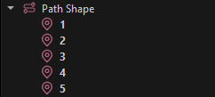
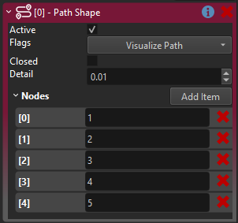

# Spline Component

The spline component defines smooth curves in 3D space using cubic Bezier curves. Other components, such as the [follow path component](follow-path-component.md) can use splines to animate objects, and scripts can sample spline data for custom logic.

<video src="media/path-component.webm" width="800" height="600" autoplay loop></video>

## How to Configure a Spline

1. Add a [game object](../../runtime/world/game-objects.md) and attach a *spline component* to it.
1. Add several game objects as child objects (at least two).
1. Attach a *spline node component* to each child object.
1. Give each child object a different name. It is easiest to just give them numbers in the order in which you want them to be used in the spline.

   

1. Add those names in the desired order to the **Nodes** property of the spline component.

   

1. Position the child objects in the world to form a spline. Enable the `Visualize Spline` flag to see a preview of the curve.

### Editing Tips

When editing a spline you often need to select the child path nodes and then go back to the spline object. `Ctrl+Q` selects the parent object of the currently selected object, which is very useful here. Also `Ctrl+B` changes to the previous selection, which can also be used to *undo* a selection change.

### Adding Points Interactively

When the *Edit Nodes* manipulator is active, small gizmos appear on each spline segment. Click on a segment gizmo to insert a new spline node at that position. The editor automatically creates a child game object with a spline node component, gives it a proper name and adds it to the nodes list.

To re-enable *manipulator mode* after translating an object, press `Q` or click on the `Edit Nodes` property again.

### Editing Tangents

Each spline node can have its tangent mode set to *Auto*, *Linear* or *Custom*:

* **Auto**: Tangents are computed automatically for smooth curvature.
* **Linear**: Creates a sharp corner at the node with no curvature.
* **Custom**: You can manually adjust the tangent direction and length using rotate and scale gizmos.

When using custom tangents, enable **Link Custom Tangents** to make the incoming and outgoing tangents mirror each other, creating a smooth transition through the point.

## Spline Features

Splines support interpolation of:

* **Position**: Smooth cubic Bezier curve between nodes.
* **Rotation**: Including a roll angle at each node.
* **Scale**: Scale values can vary along the spline.
* **Up Direction**: Computed from the roll angle for proper orientation.

## What to do with a Spline

A spline component by itself has no functionality other than to define a shape. These component types can utilize splines:

* [Follow Path Component](follow-path-component.md)

### Scripting with Splines

Visual scripts and C++ code can sample spline data using these functions:

* `GetPositionAtDistance(distance, space)`: Get position at a distance along the spline.
* `GetTransformAtDistance(distance, space)`: Get full transform including rotation and scale.
* `GetTotalLength()`: Get the total length of the spline.
* `FindKeyClosestToPoint(point, space)`: Find the closest point on the spline to a given position.

The `space` parameter can be *Local* (relative to the spline) or *Global* (world space).

See the *ScatterOnSpline* sample script in the [Testing Chambers](../../../samples/testing-chambers.md) project for an example of spawning objects along a spline.

## Component Properties

* `Flags`: Preview flags for the spline. Options include *Visualize Spline*, *Visualize Up Dir*, and *Visualize Tangents*.
* `Closed`: Whether the spline should loop back to the first node.
* `Nodes`: This array references all nodes by name or [object path](../../concepts/object-paths.md). Non-existing names are ignored.

Also see the [spline node component](spline-node-component.md) for options on each node.

## See Also

* [Spline Node Component](spline-node-component.md)
* [Follow Path Component](follow-path-component.md)
