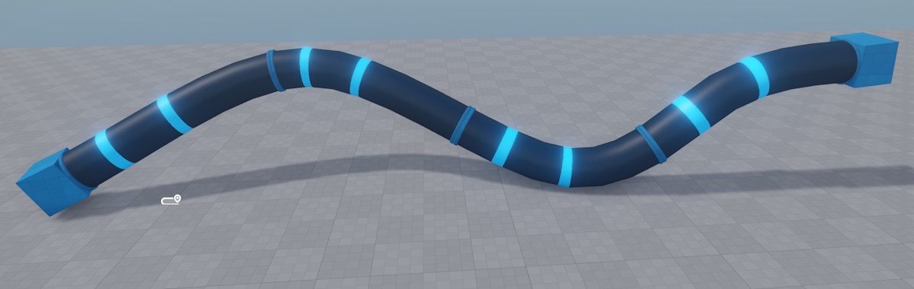

# Spline Mesh Component

The *spline mesh component* generates a mesh that follows a [spline](spline-component.md). It tiles one or more mesh pieces along the spline, making it easy to create things like pipes, roads, fences, cables or rails without manually placing individual segments.

## Setting up a Spline Mesh

1. Add a [spline component](spline-component.md) to a game object and configure the spline shape.
1. Attach a *spline mesh component* to the same object.
1. Set at least one **Middle Part** — this mesh is tiled along the spline.
1. Optionally set a **Start Part** and/or **End Part** to cap the spline with specialized meshes (e.g. a pipe end-cap).

## Distribution Modes

The **Distribution Mode** controls how many mesh pieces are placed and how they are scaled:

* **Fit to Segment**: Each middle part is stretched to fill exactly one spline segment (the span between two spline nodes). Use this when your mesh should align with the spline node positions.
* **Scale Evenly** *(default)*: The number of tiles is derived from the total spline length and the mesh length. All tiles are scaled uniformly.
* **Scale Evenly Per Segment**: Like *Scale Evenly*, but computed independently for each spline segment. This keeps tiles aligned to segment boundaries.

When multiple middle parts are specified, either a random piece or the best-fitting piece is selected at each position, depending on the distribution mode and the relative lengths of the available parts.

## Component Properties

* **Start Part**: Optional mesh placed at the beginning of the spline.
* **Middle Parts**: One or more meshes tiled along the spline body. Each entry has optional **Padding Front** / **Padding Back** values (can be negative to create overlaps).
* **End Part**: Optional mesh placed at the end of the spline.
* **Distribution Mode**: How tiles are counted and scaled (see above).
* **Seed**: Random seed used when picking among multiple middle parts. A negative value uses the owner object's stable random seed; zero or positive sets an explicit seed.
* **Offset Y**: Shifts the entire generated mesh sideways (along the spline's local Y axis).
* **Offset Z**: Shifts the entire generated mesh up/down (along the spline's local Z axis).

## Collision

To add physics collision to a spline mesh, add a [Jolt Generate Collision Component](../../physics/jolt/special/jolt-generate-collision-component.md) to the same game object. It reads the render meshes produced by the spline mesh component and generates a matching Jolt collision mesh on scene export.

## See Also

* [Spline Component](spline-component.md)
* [Spline Node Component](spline-node-component.md)
* [Jolt Generate Collision Component](../../physics/jolt/special/jolt-generate-collision-component.md)
