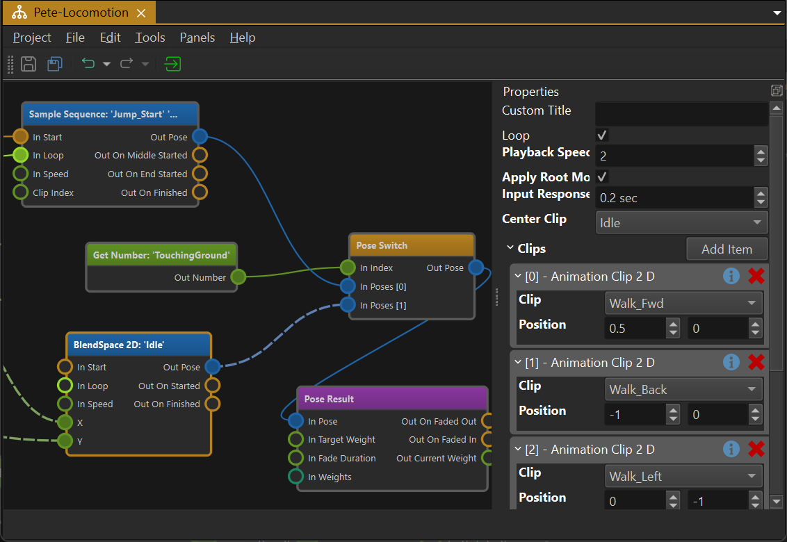

# Animation Controller Asset

The *animation controller asset* is used to configure complex animations. See the [animation controller](animation-controller-overview.md) chapter for a conceptiual description.

## Animation Controller Graph

Animation controllers are set up as graph structures. Nodes represent actions. Data flows from left to right. Nodes have **input pins** and **output pins** which represent different kinds of data, such as trigger states (*on/off*), number values, animation poses and bone weights.

The goal of an animation controller is to sample a number of [animation clips](../animation-clip-asset.md), combine them together, and generate a final pose which can then be applied to an [animated mesh](../animated-mesh-component.md).

### Creating Nodes

Right click into the main area to open a context menu. Here you select which nodes to add to the graph. Every graph requires at least an [output node](anim-nodes-output.md), a [model space conversion node](anim-nodes-modelspace.md) and a node to sample a clip, for example a [play single clip node](anim-nodes-playclip.md). Once the graph samples two different clips you also need a [combine poses node](anim-nodes-combine-poses.md).

### Connecting Nodes

You connect nodes through their pins. Just left click and drag from one output pin to another input pin. The UI will display which pins can be connected once you start dragging. Since every pin represents a certain data type, only compatible pin types may get connected.

Some pins allow to connect to multiple other pins, or have multiple incoming connections. If a pin does not allow this, creating a new connection removes previous connections automatically.

Nodes that are not ultimately connected to the output node, will not have any effect.

### Node Properties

Nodes may additionally have *properties*. These are displayed in the property pane when a node is selected. See the documentation for the different node types for more detailed descriptions.

## Using Animation Controller Assets

Once an animation controller asset is set up, it can be applied to an [animated mesh](../animated-mesh-component.md) by adding an [animation controller component](animation-controller-component.md) to the same game object. The component will evaluate the graph in every update, and send the final animation pose to the animated mesh.

To control what the animation controller does, you may also need a [blackboard](../../../Miscellaneous/blackboards.md) for storing state, and potentially a script component to decide when which animation should be active.

## See Also

* [Skeletal Animations](../skeletal-animation-overview.md)
* [Animation Controller Component](animation-controller-component.md)
* [Blackboards](../../../Miscellaneous/blackboards.md)
* [Simple Animation Component](../simple-animation-component.md)
