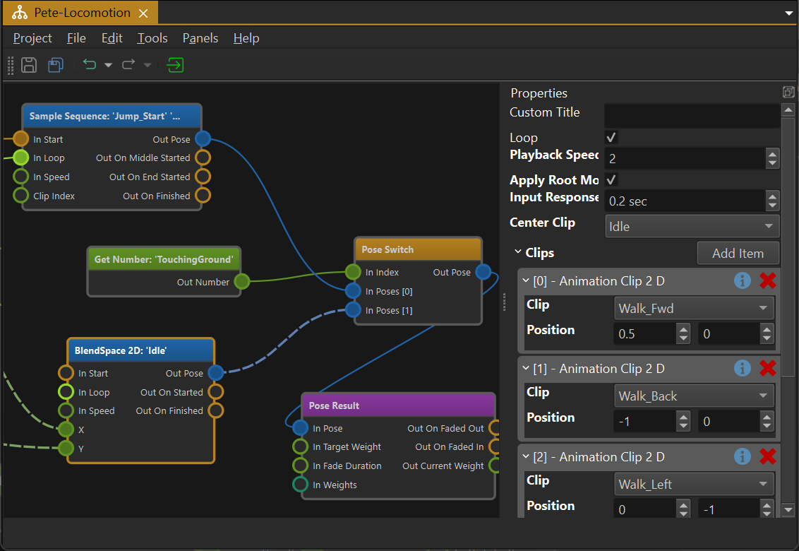
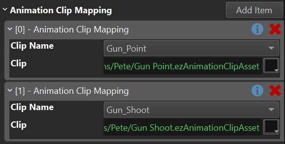

# Animation Graph Asset

The *animation graph asset* is used to configure complex animations. See the [animation graph](animation-graph-overview.md) chapter for a conceptual description.

## Video: Introduction to Animation Graphs

## Animation Graph

In the animation graph nodes represent actions. Data flows from left to right. Nodes have **input pins** and **output pins** which represent different kinds of data, such as *trigger events*, *number values*, *animation poses* and *bone weights*.

The goal of an animation graph is to sample a number of [animation clips](../animation-clip-asset.md), combine them together, and generate a final pose which can then be applied to an [animated mesh](../animated-mesh-component.md).

### Creating Nodes

Right click into the main area to open a context menu. Here you select which nodes to add to the graph. Every graph requires at least one [output node](anim-nodes-output.md) and a [pose generation node](anim-nodes-pose-generation.md).

### Connecting Nodes

You connect nodes through their pins. Just left click and drag from one output pin to another input pin. The UI will display which pins can be connected once you start dragging. Since every pin represents a certain data type, only compatible pin types may get connected.

Some pins allow to connect to multiple other pins, or have multiple incoming connections. If a pin does not allow this, creating a new connection removes previous connections automatically.

Nodes that are not ultimately connected to an [output node](anim-nodes-output.md), will not have any effect.

### Node Properties

Nodes may additionally have *properties*. These are displayed in the property pane when a node is selected. See the documentation for the different node types for more detailed descriptions.

## Animation Mapping

When no node is selected, the properties pane displays the general asset properties. Here you can edit the `Animation Clip Mapping` array.

Every array entry represents one animation. From the drop down you select the name of the animation. If the desired animation name doesn't exist yet, use the **<Edit Values...>** option to add one. These names are used throughout your project to identify animations and should be chosen carefully. Select an [animation clip asset](../animation-clip-asset.md) to map from the animation name to the clip.

In the animation graph you never select animation clips directly, but rather always choose the animation by name. Because the mapping is defined in one central place in the animation graph asset, it is easy to replace an animation by another clip, simply by changing the mapping.

Animation mapping is meant to enable you to reuse an animation graph between different creatures. Using graph composition (see next section) you can set up a an animation graph that does the same as another graph, but uses different animation clips for the same actions. For example a regular human and a zombie could share the same animation graph logic for walking, running, etc, but of course the zombie animations would look different. The mapping can also be overridden on the [animation controller component](animation-controller-component.md), both statically, as well as at runtime (via code). This could, for instance, be used to use one animation graph for all the weapon-handling behavior, but when the player switches the active weapon, a script can remap all the animation clips, such that they work for another weapon.

## Compositing Animation Graphs

An animation graph may reference another animation graph, to *include* the functionality of that graph in itself. This makes it possible to define different animation setups over multiple animation graph assets, making editing easier and making it possible to share certain animations between different graphs.

When one graph includes another graph, the *animation clip mapping* of the parent graph takes precedence over the included graph, which allows to override the mapping of the included graph.

## Using Animation Graph Assets

Once an animation graph asset is set up, it can be applied to an [animated mesh](../animated-mesh-component.md) by adding an [animation controller component](animation-controller-component.md) to the same game object. The component will evaluate the graph in every update, and send the final animation pose to the animated mesh.

To control what the animation controller does, you may also need a [blackboard](../../../Miscellaneous/blackboards.md) for storing state, and potentially a script component to decide when which animation should be active.

## See Also

* [Skeletal Animations](../skeletal-animation-overview.md)
* [Animation Controller Component](animation-controller-component.md)
* [Blackboards](../../../Miscellaneous/blackboards.md)
* [Simple Animation Component](../simple-animation-component.md)
