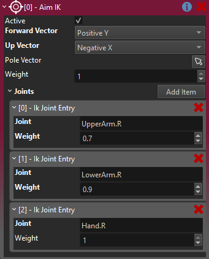

# Aim IK Component

The *Aim IK component* adds procedural animation to an [animated mesh](../animated-mesh-component.md) through *inverse kinematics*.

The aim IK component rotates a bone of the [skeleton](../skeleton-asset.md) such that it points towards a target position. Optionally, this rotation can be distributed over multiple bones in a chain, to make the result more natural.

Typical use cases for this are for characters to look at objects, guns to point correctly at a target or align feet with the ground slope.

In the video below, this is used to rotate the head such that it looks at the stone. The rotation is distributed over three bones, such that the upper body, neck and head each contribute a part of the motion.

<video src="media/lookat-ik.mp4" width="800" height="600" autoplay controls></video>

This video shows a common problem, an *aim animation* is used to have the gun point at something, but the animation doesn't let the character point precisely forwards. Once multiple animations are combined for movement, such as walking sideways, the direction that the character points into is completely off target.

<video src="media/no-aim-ik.mp4" width="800" height="600" autoplay controls></video>

In the video below, aim IK is used to correct both the right arm, as well as the head, such that the character precisely points and looks at the target. Here the IK component is also only active (and its weight is gradually faded in and out) when the player actually wants to aim.

<video src="media/aim-ik.mp4" width="800" height="600" autoplay controls></video>

> **IMPORTANT**
>
> *Inverse kinematics* is currently only applied when an animated mesh receives a new animation pose. Thus, to actually see the result of IK, you need to have a [simple animation component](../simple-animation-component.md) or an [animation controller component](../animation-graphs/animation-controller-component.md) attached, and check the option **Enable IK** on it. It also has to play some animation in a loop, such as an idle animation or literally a single keyframe pose.

## How to Set Up Aim IK

The *Aim IK component* has to be attached to a child node of the [animated mesh](../animated-mesh-component.md) that it is supposed to affect. The position of that game object is where the target bones will point at. Add one or more entries to the `Joints` array. Each entry identifies a bone to control from the [skeleton](../skeleton-asset.md). The `Weight` of each entry defines how much of the necessary IK to apply. At a value of 1, the bone would be rotated to fully point at the target. With a weight of 0.5, only half the rotation would be applied. This is used to distribute the rotation piece-wise over multiple bones.

> **IMPORTANT**
>
> The order of the bones in the array is important. Aim IK is applied once for each entry, in the order in which they are listed. Each entry affects the next one. So in this example first the upper arm will be rotated some amount, then from that result the necessary rotation for the lower arm will be computed and applied, and finally from that result, the necessary rotation for the hand is computed and applied.

> **NOTE**
>
> The *weight* for each entry is relative only for that step. Thus the value doesn't have to be increasing like in this example. For instance, you could have three bones that each have a weight of 0.5, so that they gradually come closer to the desired result. However, usually the last step uses a weight of 1, to finally reach the target. You may also need to correct multiple bones at the end of the chain with a weight of 1.

As the next step, you need to specify which axis of the target bones to align with the target direction. This is set with the `Forward Vector` property and depends both on how your skeleton is built, and what effect you want to achieve. Often you literally just need to try out, which of the 6 cardinal directions gives the desired result. You also need to set an (orthogonal) `Up Vector`. Again, this is mostly trial and error, to find the best axis.

> **NOTE**
>
> The skeleton of your animated mesh must be authored such that the bones have the proper direction and *roll*, for this to work. If, for instance, your hand bone doesn't point straight into the direction into which the hand mesh points, you cannot get the aim to work right. Similarly, if your bone has some *roll* (relative to the visual mesh), you may not be able to find an up vector that gives good results.

### Pole Vector

When rotating a bone towards a target, there is not only the main direction to consider, but also the *roll* around that direction.

The *pole vector* is an optional object to use as a secondary target, that the `Up Vector` should point towards. In the case of pointing an arm, this is typically used to specify into which direction the elbow should point (for instance to the left, right, downwards, etc). Usually the pole vector object would be another child object of the animated mesh and thus move along with it.

Again, for this to work, your skeleton needs to be build such, that the bones have the proper *roll*, such that their orthogonal directions point into a useful direction. For example an elbow joint should be built such, that the *forward* direction (for example `+Y`) goes straight along the forearm, and its *roll* should be such, that the sidewards direction (`+X` or `+Z`) points into the direction of the elbow.

> **NOTE**
>
> Often aim IK already works good enough without a dedicated pole vector, so only set it up, when the result doesn't look convincing enough without it.

## Component Properties

* `Forward Vector`: The cardinal axis of the bones to align with the aim direction. Usually found by the scientific method of trying all possible options.

* `Up Vector`: The orthogonal cardinal axis of the bone to use as the *up vector*. If available, the bone will be rotated such that the `Up Vector` points towards the `Pole Vector` object.

* `Pole Vector`: An optional object to use as a secondary target, to have the `Up Vector` point towards. See details above.

* `Weight`: The overall weight to use to apply the IK. This is typically used at runtime to gradually fade the IK in and out.

* `Joints`: An array of bones to apply IK to. Order matters. Unrelated bones can be listed, for example you can let both the left and right arm point at the same thing. However, be careful to always list parent bones first. The `Weight` defines how much of the necessary rotation to apply to a bone.

## See Also

* [Skeletal Animations](../skeletal-animation-overview.md)
* [Two Bone IK Component](two-bone-ik-component.md)
