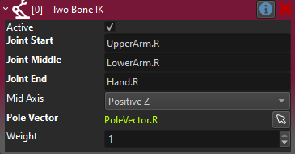

# Two Bone IK Component

The *Two Bone IK component* adds procedural animation to an [animated mesh](../animated-mesh-component.md) through *inverse kinematics*.

The component rotates two bones such, that a third end point bone comes as close to a target position, as possible.

Typical use cases for this are for characters to grab things or precise foot placement on uneven terrain.

In the video below this is used to move the arms of a character such that they reach towards an object. Note that the target position isn't always reachable.

<video src="media/two-bone-ik.mp4" width="800" height="600" autoplay controls></video>

> **IMPORTANT**
>
> *Inverse kinematics* is currently only applied when an animated mesh receives a new animation pose. Thus, to actually see the result of IK, you need to have a [simple animation component](../simple-animation-component.md) or an [animation controller component](../animation-graphs/animation-controller-component.md) attached, and check the option **Enable IK** on it. It also has to play some animation in a loop, such as an idle animation or literally a single keyframe pose.

## How to Set Up Two Bone IK

The *Two Bone IK component* has to be attached to a child node of the [animated mesh](../animated-mesh-component.md) that it is supposed to affect. The position of that game object is what the target bones will try to reach.

Select three bones that are in a chain, e.g. forming an arm or leg. There may be additional bones in between, so they don't need to be in a direct chain, but only the selected bones will be modified. Finally, select a cardinal axis around which the middle bone should bend.

> **NOTE**
>
> Your skeleton has to be build such, that the middle bone has the proper *roll*, otherwise you may not be able to find the desired `Mid Axis`.

### Pole Vector

When rotating a bone towards a target, there is not only the main direction to consider, but also the *roll* around that direction.

The *pole vector* is an optional object to use as a secondary target, that the `Joint Middle` should point towards. In the case of pointing an arm, this is typically used to specify into which direction the elbow should point. Usually the pole vector object would be another child object of the animated mesh and thus move along with it.

In the example video above, additional pole vectors are used to have the left elbow point to the left, and the right elbow point to the right. Note that it can be quite challenging to place a pole vector such that the IK always looks good. In some use cases, it may be necessary to move the pole vector around during an animation, to always have it in the desired location.

> **NOTE**
>
> Although the pole vector is optional, two bone IK rarely works as desired without it.

## Component Properties

* `JointStart`: The first bone to adjust.
* `JointMiddle`: The second bone to adjust.
* `JointEnd`: The bone that should reach the target position.
* `MidAxis`: The cardinal axis of the middle joint around which the bone can rotate. The skeleton must be built such, that there is one such side axis that aligns with the desired bend axis.
* `PoleVector`: An optional object reference to use as a secondary target, to have the middle joint point towards. See details above.
* `Weight`: The overall weight to use to apply the IK. This is typically used at runtime to gradually fade the IK in and out.
* `DebugVisScale`: If larger than zero, debug visualization will be rendered, to show the joints, axis and pole vector. Use this to easier see the effect of the configuration.

## See Also

* [Skeletal Animations](../skeletal-animation-overview.md)
* [Aim IK Component](aim-ik-component.md)
* [Creature Crawl Component](../../../gameplay/creature-crawl-component.md)
