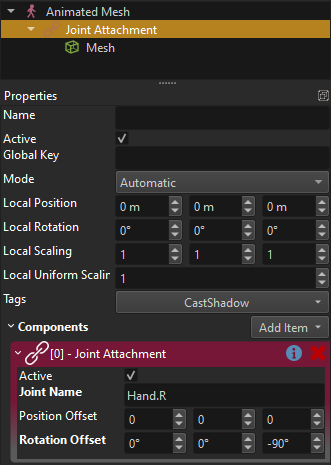

# Joint Attachment Component

The *joint attachment component* is used to expose the animated position of a bone, such that you can attach objects there.

<video src="../media/anim-point-shoot.webm" width="800" height="600" autoplay loop></video>

In the video above a joint attachment component was used to expose the position of the right hand as a game object. This was then used as the parent object for a gun object.

## Component Properties

* `JointName`: The *name* of the joint/bone of which you want to use the position as an attachment point. You can look up the bone names in the respective [skeleton asset](skeleton-asset.md).

* `PositionOffset`, `RotationOffset`: Additional local position and rotation offsets added to the bone location. The same could be achieved by adding another child [game object](../../runtime/world/game-objects.md) with an offset, but using these properties is more efficient.

## How To Use

Whenever an [animated mesh](animated-mesh-component.md) receives a new pose, it passes that pose on to all interested components that are attached to the same object or any child object. The joint attachment component listens to this message and positions its owner game object at the relative position of the selected bone.

To attach an object to a certain bone, follow these steps:

1. Create an empty [game object](../../runtime/world/game-objects.md) as a **child** of the animated mesh.
1. Add a *joint attachment component* to it.
1. Set its *JointName* property to the desired bone name. You can look up the bone name on the [skeleton asset](skeleton-asset.md) that is used by the [animated mesh asset](animated-mesh-asset.md) on the [animated mesh component](animated-mesh-component.md).
1. Add the desired object or component to the joint attachment object.

   
1. The local transform of the attachment object will be overwritten by the component when it receives an animation pose. Thus setting any values here doesn't have any useful effect during simulation. To see where your attachment ends up, you need to [simulate the scene](../../editor/run-scene.md) and an animation has to actively play on the animated mesh.
1. While the scene is simulating, you can use the *position and rotation offset* properties to tweak the exact location of the joint attachment.

> **Note:**
>
> The position and rotation offset properties are useful for minor tweaks. The same can also be achieved with another child object. However, it can be difficult to position an attachment perfectly and it might turn out that the attachment position needs tweaking depending on the animation as well. In such cases it is better to add a dedicated bone to the skeleton instead, such that you have full control over the attachment in your modeling tool.

## See Also

* [Skeletal Animations](skeletal-animation-overview.md)
* [Joint Override Component](joint-override-component.md)
