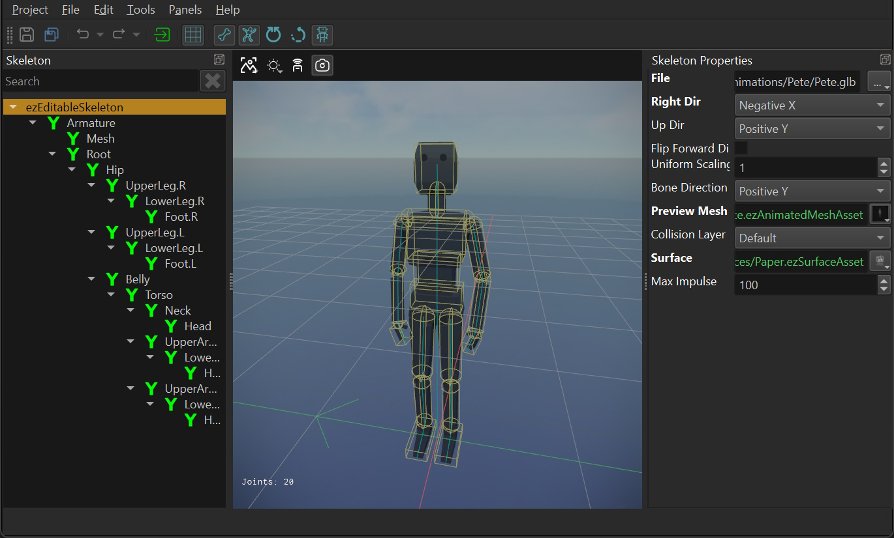
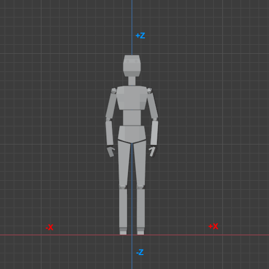

# Skeleton Asset

The main function of the *Skeleton asset* is to store information about the bone hierarchy in an [animated mesh](animated-mesh-asset.md). It is a central aspect for all [skeletal animations](skeletal-animation-overview.md).

The skeleton is used to adjust the overall scale and rotation of animated meshes. It is also used to define [collision shapes](../../physics/jolt/collision-shapes/jolt-shapes.md) for bones, which is needed for [hit detection](../../physics/jolt/ragdolls/jolt-hitbox-component.md) and when additionally joint types and joint limits are configured, the skeleton can be used for [ragdolls](../../physics/jolt/ragdolls/jolt-ragdoll-component.md).

> **Importing Skeletons:**
>
> Skeletons can be imported automatically during [mesh import](../../graphics/meshes/mesh-import.md).

## User Interface

The left hand side shows a tree view with the bone hierarchy. The top most element is always the `ezEditableSkeleton` node, which represents the skeleton in general.

When you select any node in this tree, the *Skeleton Properties* panel on the right displays the properties of the selected node. Select the root node (`ezEditableSkeleton`) to edit the overall properties, such as which file to import. Once a file is imported, the bones should show up as child nodes. Select any of them, to configure the properties of a bone.

## Asset Properties

Select the `ezEditableSkeleton` node to edit the overall asset properties.

* `File`: The file from which to import the skeleton information. This is typically the same file as in the [animated mesh asset](animated-mesh-asset.md).

* `ImportTransform`, `RightDir`, `UpDir`, `FlipForwardDir`: These properties are the same as on the [mesh asset](../../graphics/meshes/mesh-asset.md#asset-properties). Depending on how the mesh was exported, you may need to adjust these to have the skeleton (and every mesh that uses this skeleton) stand upright and look into the correct direction.

  In Blender it is common to model meshes such that they face the user when the front view is active (`Numpad 1`):

  

  With such an orientation the *right* side of the model points into the *-X* direction. The *+Z* axis corresponds to the *up* direction and the model looks into the *+Y* direction. When you export such a model to GLTF/GLB, you can keep this convention (*Y up* disabled in the export settings) or you can export it in the more common convention of using +Y as the *up* axis (*Y up* enabled). Both conventions can be mapped to EZ's preferred convention like so:

  For GLB files exported from Blender with *Y up* use:
  * `RightDir` = `Negative X`
  * `UpDir` = `Positive Y`
  * `FlipForward` = `off`

  For GLB files exported from Blender with *Z up* use:
  * `RightDir` = `Negative X`
  * `UpDir` = `Positive Z`
  * `FlipForward` = `off`

  Note that in EZ the convention is that models look along the **+X** axis. Every component (such as AI) assumes that moving along the +X axis will move the mesh *forward*, moving along +Y moves it to the *right* and moving along +Z moves it *upwards*. It is therefore best to import all meshes this way right away.

* `UniformScale`: The overall size of the skeleton. Use this if you need to adjust from centimeters to meters.

* `BoneDirection`: This setting only affects the visualization of the skeleton. It has no effect on the actual mesh skinning. It is used to tell the visualizer which cardinal direction the bones should point into. You only need to change this setting, if the skeleton visualization looks all wrong (all lines point into weird directions). You need to *transform* the asset to apply the change. Just try all options until it looks right.

* `PreviewMesh`: An [animated mesh](animated-mesh-asset.md) to render transparently over the skeleton to serve as a preview. This is especially useful when setting up collider shapes, to know how large they should be to fit nicely.

* `CollisionLayer`, `Surface`: The default [collision layer](../../physics/jolt/collision-shapes/jolt-collision-layers.md) and [surface](../../materials/surfaces.md) to use for all bone shapes. This can be overridden on each bone.

* `MaxImpulse`: When projectiles and other things apply impulses to ragdoll limbs, the forces can quickly add up and fling a ragdoll far away. This value is used to clamp the maximum impulse to apply to prevent that.

* `LeftFootJoint`, `RightFootJoint`: The names of the joints for the left foot and right foot. This is optional, and is only needed, if you want the engine to automatically calculate [root motion](root-motion.md) for an [animation clip](animation-clip-asset.md) from foot movement.

## Bone Properties

Select a bone from the hierarchy to edit its properties.

> **Note:**
>
> **All** bone properties are *physics properties* that are used for setting up [collision shapes](../../physics/jolt/collision-shapes/jolt-shapes.md) and [constraints](../../physics/jolt/constraints/jolt-constraints.md). Collider shapes are needed for [hit detection](../../physics/jolt/ragdolls/jolt-hitbox-component.md). Colliders and constraints are only needed for [ragdolls](../../physics/jolt/ragdolls/jolt-ragdoll-component.md).

* `Local Rotation`: This property only shows up on bones that have a parent bone with a collision shape. It is used to adjust the orientation of the *joint constraint*.

* `Joint Type`: Selects what kind of constraint should be between this bone and the parent bone. If it is set to `None`, the two bones are not joined. If the skeleton is not meant to be used for ragdolls, there is no reason to select anything else. If the type is set to `Fixed` the two bones are going to be joined such that they are perfectly stiff. In `Swing Twist` mode you can configure the range of motion between these bones to limit how far they can physically move when simulated as a ragdoll.

* `Stiffness`:  How easily the ragdoll joint bends.

* `Swing Limit Y/Z`, `Twist Limit`, `Twist Limit Center Angle`: All these are used to set up the swing-twist constraint. Enable the visualization of the constraint limits to see their effect. The swing limit restricts how far a bone may swing away from its parent bone. Be aware that you can only define the swing limit as a *half angle*, meaning it swings both ways. Adjust the `Local Rotation` to define what the *center* of the bone transform is, such that both extremes end up as a natural movement range. The twist limit works similar, it restricts how much the bone may twist around its main axis and the limit goes both ways.Adjust the *center angle* to be somewhere within the current limit range, otherwise the moment ragdoll mode gets activated, the bones will immediately twist to be within the limit, which ends up looking very weird.

* `Override Surface` / `Override Collision Layer`: If either of these is activated, you may specify a different [surface](../../materials/surfaces.md) or [collision layer](../../physics/jolt/collision-shapes/jolt-collision-layers.md) to use just for this bone. Note that the default is configured on the root node.

* `Bone Shapes`: An array of shapes to use for this bone. Use this to configure the approximate physical shape of the mesh, which will be used for hit detection or ragdolls.

* `Colliders`: A mesh may contain custom collider shapes, which can be extracted automatically. For this to work a mesh must use the name prefix `UCX_` to indicate that it is a convex mesh. It must then continue with the bone name to which it should be attached to. So for example, if the bone is called `Bone.001`, and the custom convex mesh is called `UCX_Bone.001` then the mesh will be used as a convex collider shape for that bone. As an example, see the *BreakableCube.glb* file in the t[Testing Chambers](../../../samples/testing-chambers.md) project and the corresponding *BreakableCube* skeleton asset.

## See Also

* [Skeletal Animations](skeletal-animation-overview.md)
* [Animated Mesh Asset](animated-mesh-asset.md)
* [Skeleton Component](skeleton-component.md)
