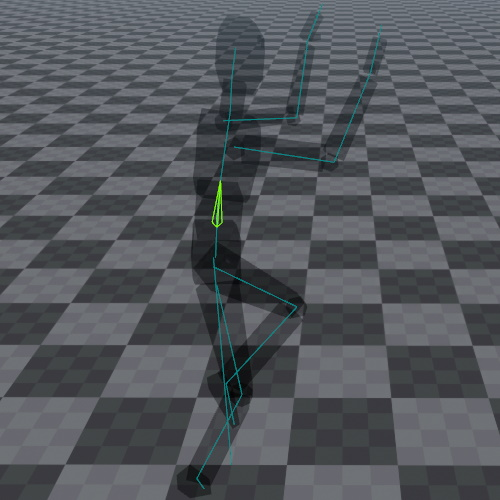

# Skeleton Component

The *skeleton component* can be used to visualize the current pose of an [animated mesh](animated-mesh-component.md).

This component is only meant for debugging purposes.

## Component Properties

* `Skeleton`: The [skeleton asset](skeleton-asset.md) to visualize. You can set a skeleton asset manually, or keep it empty. In the latter case the skeleton will automatically be taken from a sibling [animated mesh component](animated-mesh-component.md), but only when the pose of that mesh is changed.

* `VisualizeSkeleton`: Whether the component should visualize the skeleton at this time.

* `VisualizeColliders`: Whether the collision shapes of the skeleton should be visualized.

* `VisualizeJoints`: Whether the joints between the bones shall be visualized.

* `VisualizeSwingLimits`, `VisualizeTwistLimits`: Whether the swing and twist limits of the joints shall be visualized.

* `BonesToHighlight`: A semicolon-separated list of bone names (case sensitive). Every bone whose name appears in the list will be rendered with a highlight. To know the available bone names, inspect the bone hierarchy in the respective [skeleton asset](skeleton-asset.md).

## See Also

* [Skeletal Animations](skeletal-animation-overview.md)
* [Animated Mesh Component](animated-mesh-component.md)
