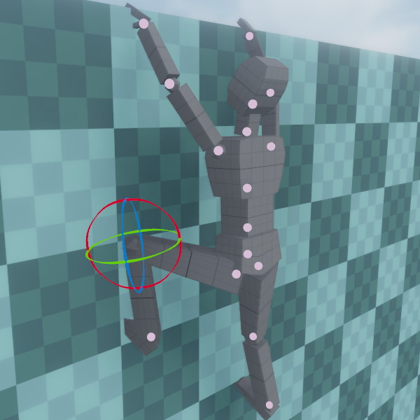
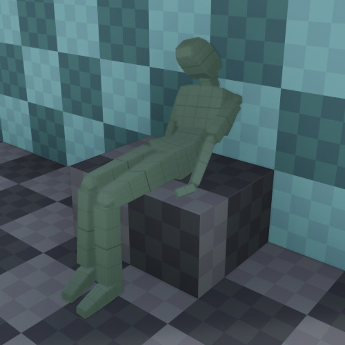

# Skeleton Pose Component

The *skeleton pose component* allows you to assign a custom, static pose to an animated mesh. This can be used for decorative purposes, for instance to place an animated mesh in different poses in your scenes, but it can also be used as a start pose for a mesh that is further animated, for example through [ragdoll physics](../../physics/jolt/ragdolls/jolt-ragdoll-component.md).

## Component Properties

* `Skeleton`: The [skeleton](skeleton-asset.md) for posing.

* `Mode`: Selects the source for the custom pose.

* `Bones`: The array of bones and their current values. Through the UI you can modify bone rotations or reset them to their default by clicking the 'x' button. However, it is more convenient to edit the bones in the 3D viewport. Click the blue property to enable the bone manipulator, then click on one of the joints to select it for editing, as seen in the image above.

## Using Ragdolls for Posing

When a pose component and a [ragdoll component](../../physics/jolt/ragdolls/jolt-ragdoll-component.md) are both present on an animated mesh, the pose component can be used to define the starting pose of the ragdoll (make sure to configure the ragdoll to *wait for a pose* before it starts simulating).

Additionally, when you [simulate a scene](../../editor/run-scene.md) in editor, you can [save the result of a ragdoll simulation](../../editor/run-scene.md#keep-simulation-changes) in a pose component:

Place your ragdoll, make sure a pose component is attached, simulate the scene and then, while the simulation is still running, make sure your ragdoll is selected and press `K` (or *Scene > Utilities > Keep Simulation Changes*). Once you stop the simulation, the pose component gets updated to mimic the pose that the ragdoll was in.

You can then adjust individual limbs and repeat the process with a new starting pose for the ragdoll, until you are happy with the result. You can also remove the ragdoll component afterwards.

## See Also

* [Skeletal Animations](skeletal-animation-overview.md)
* [Animated Mesh Component](animated-mesh-component.md)
* [Ragdoll Component](../../physics/jolt/ragdolls/jolt-ragdoll-component.md)
