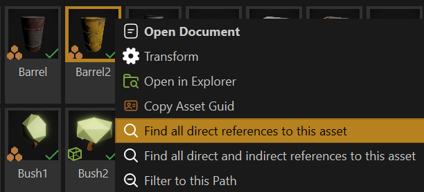
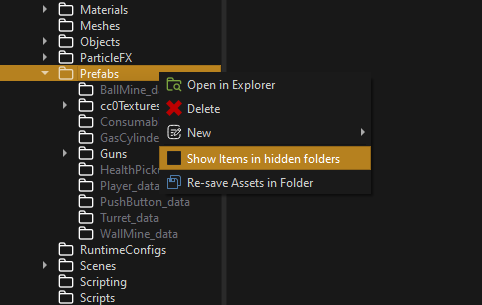

# Asset Browser

The *asset browser* is used for selecting and opening asset [documents](../editor/editor-documents.md). Assets can be filtered by type and path or searched for by name.

If the asset browser panel is not visible, select *Panels > Asset Browser*. You will notice that the asset browser will show up in two modes. The *panel* is constantly visible and can be interacted with at all times, to search for assets and open them via double click, or instantiate them with drag and drop. Additionally, when an object has an *asset reference property*, choosing *Select Asset* from the button menu right next to it will open another asset browser in *file picker mode*.

Several other options are available, for example, *Open Asset* allows you to open the referenced asset document, which can be useful to follow a chain of asset references.

## File Display

The asset browser can show all files that are on disk in the selected [data directories](../projects/data-directories.md). It distinguishes between *assets*, *importable files* and *non-importable files*.

**Assets** are typically shown with a thumbnail or dedicated icon. These are the files you work with most.

**Importable files** are files that can be [imported as an asset](import-assets.md). Right click such a file and select `Import...` to do so. If an importable file is not referenced by any asset, it is color-coded orange. Otherwise it shows up white and its context menu contains the sub-menu `Imported via` which lists all the assets that reference this file.

**Non-Importable files** are all other files. The editor can't do anything with them, other than to open the default application associated with this file type.

You can also move and delete files and assets. Note that deleting a file moves it to the trash folder, so you can restore the file through the operating system functionality, if necessary. 

## Search Field

The *Search* field in the top-left corner allows you to search for assets by name, path and GUID. The search by path or name is case insensitive. For paths, both slashes and backslashes are allowed. You can also input the GUID of an asset (for example *{ 1c47ee4c-0379-4280-85f5-b8cda61941d2 }*).

## Advanced Search

The *Search* field supports special keywords to find assets by certain criteria.

### Find Asset References (`ref` and `ref-all`)

It can be very useful to know in which assets one particular asset is used. By typing `ref:{asset-guid}` into the search field, the asset browser will display all assets that directly reference that particular asset themselves. Using `ref-all:{asset-guid}` will display also all assets that are indirectly dependent on that asset.

However, it is much more convenient to just *right-click* an asset and select *Find all references to this asset*. This will fill out the search field accordingly:

## Filter by Asset Type

Below the search field is a combo box containing all asset types. Select one to only show assets of this type. This is also where you select to show *all files* or *importable file types*.

## Filter by Folder

On the left the asset browser displays all [data directories](../projects/data-directories.md). When you select a folder in this tree view, the asset browser only displays assets located below that folder.

### Show Assets in Sub-Folders

The **eye button** to the right of the search field, toggles which assets are shown. If it shows the *open eye*, the asset browser displays *all assets* below the currently selected folder, if it shows the *closed eye*, only the files directly inside the selected folder are shown. The former mode makes it easy to find assets for which you only roughly know where they are, the latter mode is more useful when you have many assets and you only want to see the ones from a specific folder.

When any search term is entered into the text box, automatically all files are displayed. 

Some people prefer one mode or the other as their default, which is why this setting is saved and restored between editor runs.

### Filter to this Path

You can right-click on any asset and select **Filter to this Path** to set the folder filter to the path in which the selected asset resides. This is useful when you already see an asset in the browser but are interested in an asset that you know is located next to that asset (same folder or sub-folder).

### Hidden Folders

By default when an asset is located in a folder with a **_data** suffix (e.g. 'MyAssets_data'), it is not displayed in the asset browser, unless you select exactly that folder in the asset browser. This way you can easily hide assets that are rarely needed. Hidden folders are indicated with a grey font.

A common use case is to put [materials](../materials/materials-overview.md) and textures that are very specific for a [mesh](../graphics/meshes/meshes-overview.md) or [prefab](../prefabs/prefabs-overview.md) into a *xyz_data* subfolder to group the data together, but prevent it from cluttering the asset browser.

You can toggle this feature by right clicking any folder and selecting **Show items in hidden folders**.

## Create Asset Documents

You can create new asset [documents](../editor/editor-documents.md) by right clicking a folder on the left or the empty area of a folder on the right or an existing asset on the right and then selecting *New > Asset Type*. The advantage over creating a document via *File > Create...* is that the create file dialog opens directly in the location of the selected asset or folder, which makes it easier to create a new asset next to an existing asset.

## Display Assets in Recently Used Order

The editor remembers which assets you used recently. The asset browser can list recently used assets at the top. This option can be toggled from the context menu on the right hand side of the asset browser. Note that the state of this option is remembered separately for the asset browser *panel* and for the asset browser when used as a *file picker*. In panel mode, it is typically disabled and all assets are sorted alphabetically, in file picker mode, it typically sorts by recently used time.

## Copy Asset Guid

Sometimes you need the internal *GUID* (Globally Unique Identifier) of an asset. You can easily copy it to the clipboard by right clicking an asset and selecting *Copy Asset Guid*.

## Transform Assets

The asset browser allows you to quickly transform assets in multiple ways:

* **Transform All:** In the toolbar of the asset browser there is a button of a red box with a red arrow. When you press this button *all* assets that are not up-to-date get *transformed* (ie. their runtime data is created from the source input data).

* **Transform Selected:** Select one or multiple assets in the asset browser, right click and choose *Transform* to update only the selected assets.

* **Transform Single:** You can also quickly transform just a single asset by clicking the icon overlay at the bottom right of an asset's thumbnail (usually a checkmark or a gear).

## Resave all Asset Documents

In the context menu of the folder hierarchy you can select `Re-save Assets in Folder`. This opens each and every document in the selected folder, saves it and closes it again. This can be used to migrate all documents to the very latest version. Since document versioning is very robust, there is little practical use for this operation, though.

## Check Filesystem

The leftmost button in the asset browser's toolbar makes the editor check the filesystem for changes that were missed by the automatic filesystem watcher. This may be useful when you added or removed assets on disk and the changes are not reflected in the editor.

## Background Processing and Transform State

At the bottom right of the asset browser there is a widget with a colored progressbar and a play button.

The play/pause button is for switching **background processing** on and off. If enabled, outdated assets are automatically transformed in the background. The progressbar displays how many assets need updating and whether there were any errors. For details about processed assets and potential errors, check out the [asset curator](asset-curator.md). If you do not want assets to be transformed automatically, disable background processing with the pause button.

## Drag and Drop

You can drag assets from the asset browser into other documents, such as [scenes](../scenes/scene-editing.md). For mesh and prefab assets this will instantiate the asset (ie. create a new node that references the asset). For [materials](../materials/materials-overview.md) this may assign the material to the object that you drag it onto. Not all asset types support drag and drop.

When dragging assets directly into the scene tree, by default no sub-object gets created, instead the component is attached directly to the target object. Unless you hold down `Ctrl`, in which case the sub-object gets created anyway.

## Video

## See Also

* [Asset Curator](asset-curator.md)
* [Editor Documents](../editor/editor-documents.md)
* [Asset Import](import-assets.md)
