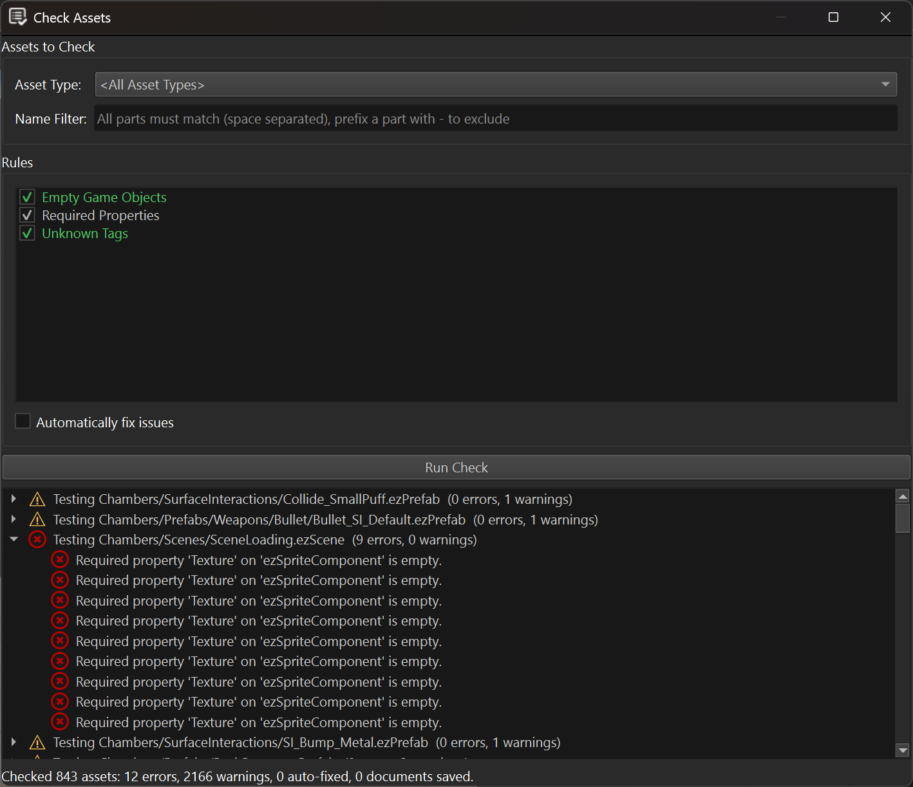

# Asset Check Panel

The *Check Assets* panel runs validation rules across the assets of a project to find errors in the data. If the panel is not visible, use *Panels > Check Assets* to open it.

Unlike the [asset curator](asset-curator.md), which reports assets that fail to *transform*, the check panel looks for problems in data that transforms successfully but is still incorrect or incomplete, for example a missing required reference or a leftover empty game object.

## Usage

**Asset Type:** Restricts the check to assets of a single document type (e.g. *Scene*). Leave empty to check all asset types.

**Name Filter:** A search pattern matched against the data-directory-relative asset path. Only matching assets are checked.

**Rules:** The list of available check rules. Enable the ones to run. Each rule shows a short description of what it checks.

**Automatically fix issues:** If enabled, rules that support auto-fixing will modify the document to resolve the issues they find. Documents that are fixed and were not already open with unsaved changes are automatically saved afterwards. If a document already had unsaved changes, the fix is still applied, but the document is not saved automatically, to avoid saving unrelated in-progress edits.

Click **Run Check** to check all assets matching the current filters. Results are listed in the tree at the bottom, grouped by asset. Double-click an entry to open the corresponding asset document.

## Built-in Rules

**Unknown Tags:** Reports used tags that are not registered in the project's [tag configuration](../projects/tags.md). This rule can auto-fix by removing the unknown tags.

**Required Properties:** Reports properties marked with [`ezRequiredAttribute`](../runtime/reflection-attributes.md) that are left empty, or, for game object / component reference properties, that reference an object which no longer exists. This rule cannot auto-fix, since there is no sensible default value to fill in.

**Empty Game Objects:** Reports game objects that have no name, no components and no child objects, i.e. that have no effect on the scene. This rule can auto-fix by removing the empty objects.

## Extending

Custom editor plugins can add their own check rules by deriving from `ezAssetCheckRule` (`Code/Editor/EditorFramework/Assets/AssetCheckRule.h`). Rules are discovered automatically. A rule can either override `CheckObject` / `CheckProperty` to hook into the default per-object / per-property traversal, or override `CheckDocument` entirely to implement custom traversal logic.

## See Also

* [Asset Curator](asset-curator.md)
* [Assets](assets-overview.md)
* [Reflection Attributes](../runtime/reflection-attributes.md)
