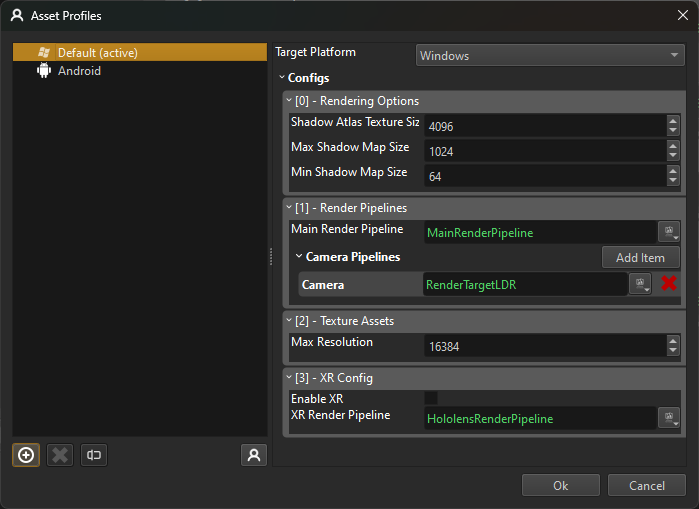

# Asset Profiles

Asset profiles are used to set platform-specific, project-wide configurations. For example, on PC a different rendering pipeline may need to be used than on Android.

Under *Project > Project Settings > Asset Profiles* you can open the **Asset Profiles** dialog. 

The list on the left hand side lists all the asset profiles that are defined for this project. You can add as many as you like, which allows you to switch between different configurations even on the same platform.

For the selected profile, the right hand side shows the available options. In the top right you can select for which target platform this profile is meant.

## Asset Profile Configs

Below that the available asset profile configs are listed. These can affect various aspect of the engine:

### Rendering Options

This allows you to configure some general rendering options that shall be used on this target platform. For example, the [dynamic shadows](../graphics/lighting/dynamic-shadows.md).

### Render Pipelines

Here you can specify what the *default* [render pipeline](../graphics/render-pipeline/render-pipeline-overview.md) should be. Different platforms have different rendering capabilities, so you may want to use a different pipeline to target that hardware best.

Additionally you can add render pipelines to be used for certain use cases. For example in the screenshot above an extra *Camera* pipeline was added, which uses a simpler render pipeline. This can then be selected on a [camera component](../graphics/camera-component.md), in case it is used for [render to texture (TODO)](../graphics/render-to-texture/render-to-texture.md). Again, you can define per platform, which pipeline to use.

### Texture Assets

This configuration specifies how to transform [texture assets](../graphics/textures-overview.md). At the moment it only allows you to clamp the maximum resolution.

### XR Config

On platforms where [XR](../xr/xr-overview.md) is supported, this configuration allows you to enable and configure XR support.

## Switching the Active Profile

In the editor there is always one profile *active*. Thus systems that can be configured through asset profiles will read their settings from this active profile and change their behavior.

Additionally, some assets produce platform specific output. For example textures may use different file formats or different transform options. The active profile determines which output to use. For example if you add a PC profile with a very low maximum texture size (say 32) and then activate that profile, the editor will switch to those assets.

## See Also

* [Assets](assets-overview.md)
* [Render Pipeline](../graphics/render-pipeline/render-pipeline-overview.md)
* [Supported Platforms](../build/supported-platforms.md)
