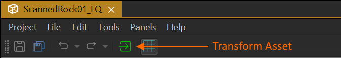

# Asset Import

All [assets](assets-overview.md) are represented by [documents](../editor/editor-documents.md). That means to get a texture into the engine, you need a [texture document](../graphics/textures-overview.md) which describes which source files (png, jpg, etc) are used to create the texture and how they shall be imported. This is where you configure such things as, whether to use compression, whether an alpha channel should be present and so on.

Other asset types of course have other options for importing.

To create these documents you have two options: Manual or automatic import.

## Create Documents Manually

You can manually create documents via *File > Create...*. In the file creation dialog, choose the file extension for the desired asset type and specify where to store the document. The newly created document will be in a blank state. You will need to fill out all the properties, including where the source files are located.

This method always works for all asset types and for some types it is the only way. Since this method always involves multiple, mostly simple steps, it can become tedious. Therefore, some asset types provide a way to automate much of this process.

## Create Documents Automatically

For asset types that are mostly defined by a single source file (e.g. [textures](../graphics/textures-overview.md) and [meshes](../graphics/meshes/mesh-asset.md)), the editor often provides an importing method that automates most of the trivial setup.

The most convenient way is to find the source asset file in the [asset browser](asset-browser.md) (ensure it shows *importable files*), right-click on it and select **Import As**. This sub-menu makes it possible to quickly import one or multiple assets as a specific asset type. It does so fully automatically. If you want to have a few more options, select **Import...** instead.

Another method is to select **Project > Import Assets...** or press **CTRL+I** to open a file browse dialog. Navigate to the file(s) that you want to import and select them. If you want to know which asset types are currently supported for automatic import, you can open the dropdown with the allowed file extensions here.

Afterwards, you will be presented with a table of options how to import the selected files:

Here we selected four files for import. One .obj file and three .jpg files. The automatic import uses heuristics to make an educated guess how to import certain source files. Here it already suggests to import the "_col.jpg" file as a diffuse texture, the "_nrm.jpg" file as a normal map and so on. If the heuristic is incorrect, you can use the dropdown on the left to fix it.

It also suggests the target document file name. You can either click *Browse* or double click into the text field to change the target file name.

Some source files can be imported in multiple ways. For example the .obj file could be imported as a mesh for rendering or as a mesh for physics. Often you want to import the same mesh for both, so you want two asset documents (a *Mesh* and a *Collision Mesh*) which reference the same input file. Therefore this table lists the .obj file twice but with different import options in the dropdown box. If, for example, you do not want a mesh to be imported as collision mesh, at all, you can just select *No Import* from the respective dropdown.

Once you click *Import* the asset documents are generated and you can then open them. If background asset processing is enabled, the editor will already start transforming the asset data. Otherwise open each document and click the button of a white box with the green arrow to manually trigger the asset transform.

The automatic import creates the documents using a set of rules to fill out its properties, depending on the template that you selected for it. So for example an image imported as a "diffuse texture" and one imported as a "normal map" are mostly the same, except that a few options are already configured in a certain way for you. You should review all options for correctness afterwards.

## Video: How to import textures

## Video: How to import meshes

## See Also

* [Assets](assets-overview.md)
* [Asset Browser](asset-browser.md)
