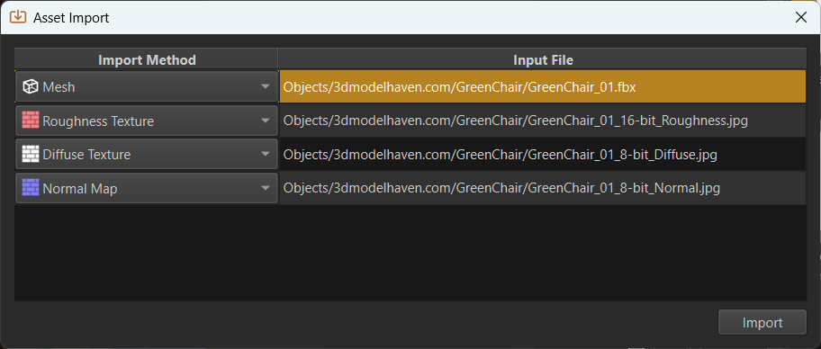

# Asset Import

All [assets](assets-overview.md) are represented by [documents](../editor/editor-documents.md). That means to get a texture into the engine, you need a [texture document](../graphics/textures-overview.md) which describes which source files (png, jpg, etc) are used to create the texture and how they shall be imported. This is where you configure such things as, whether to use compression, whether an alpha channel should be present and so on.

Other asset types, of course, have other options for importing.

> **Important:**
>
> **Meshes** are the most common type of asset to import. See [this page](../graphics/meshes/mesh-import.md) for how to import them and their dependencies.

To create these documents you have two options: Manual or automatic import.

## Video: How to import assets

## Create Documents Manually

You can manually create documents by right clicking into the [asset browser](asset-browser.md) and selecting *New > Asset Type*. If you right clicked free space, the asset document will be created in the folder that is selected on the left. If you right clicked another document, the new document will be created in the same folder as the selected asset.

The new document will be in a blank state. You need to fill out all the properties, including where the source files are located.

This method always works for all asset types and for some types it is the only way. Since this method always involves multiple, mostly simple steps, it can become tedious. Therefore, some asset types provide a way to automate much of this process.

## Create Documents Automatically

For asset types that are mostly defined by a single source file (e.g. [textures](../graphics/textures-overview.md) and [meshes](../graphics/meshes/mesh-asset.md)), the editor often provides an importing method that automates most of the trivial setup.

### Quick Import

The **most convenient** way is to find the source asset file in the [asset browser](asset-browser.md) (ensure it shows *importable files*), right-click on it and select **Import As**.

This sub-menu makes it possible to quickly import one or multiple assets as a specific asset type. It does so fully automatically. For some file types this method also allows to import assets quickly multiple times. For example, [animation clips](../animation/skeletal-animation/animation-clip-asset.md) are often packed into a single file, which requires them to be imported many times.

### Controlled Import

If you import many files, but want to select for each one how to import it, select **Import...** in the context menu.

Another method is to select **Project > Import Assets...** or press **CTRL+I** to open a file browse dialog. Navigate to the file(s) that you want to import and select them.

You then get a table where you can select for each file how to import it:

This can be useful, if you want to import many meshes, but need to decide which ones shall be static meshes and which ones animated meshes. It can also be useful, if you want to import many textures, as the dialog allows to select how each texture gets imported.

> **Note:**
>
> Importing textures directly is typically not needed when the textures are part of meshes, since the mesh import automatically imports textures for you.

Once you click *Import* the asset documents are generated and you can then open them. If background asset processing is enabled, the editor will already start [transforming](assets-overview.md#asset-transform) the asset data.

### Import Via Drag And Drop

The methods above assume that the source asset is already present inside one of the project's [data directories](../projects/data-directories.md). If that is not the case, you can drag and drop a file into the [asset browser](asset-browser.md) to copy the file into the selected directory. This also automatically launches the asset import dialog mentioned above.

## See Also

* [Assets](assets-overview.md)
* [Asset Browser](asset-browser.md)
