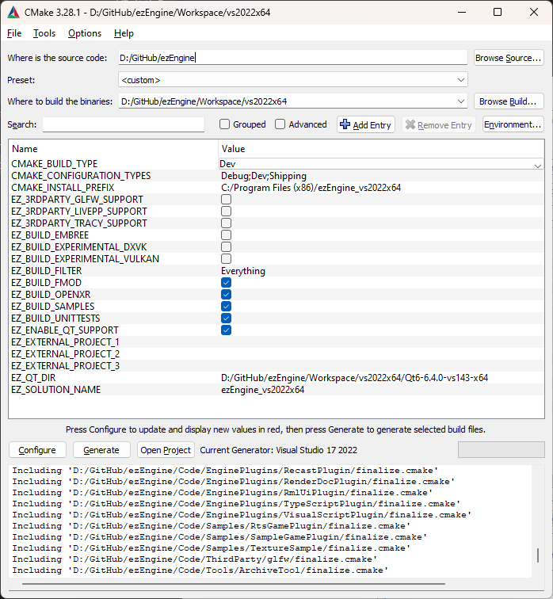

# CMake Configuration

> **Note:**
>
> Using CMake directly is only needed, if you want to choose advanced build options. This is rarely needed. Prefer to use the provided build scripts for [Windows](build-windows.md) or [Linux](build-linux.md).

To generate a solution, run the CMake GUI. Specify *Where is the source code* and *Where to build the binaries*, then run **Configure**. As a generator, pick *Visual Studio 2022 x64* (or one of the other [supported platforms](supported-platforms.md)).

The screenshot above shows a common setup. Noteworthy are the following points:

* **EZ_ENABLE_QT_SUPPORT** Disable this setting, if you want to compile EZ without Qt. This will remove all editor code and several tools from the final solution. The default is *on*. When possible the EZ CMake scripts will automatically download Qt libraries and set everything up for you. On configurations for which we do not support fully automatic setup, you need to install Qt manually and then set set **EZ_QT_DIR** to its installation folder.

* **EZ_BUILD_FMOD** Enable this, if you want to [FMOD sound](../sound/fmod-overview.md) support in your build. On Windows and Linux the default is *on*.

* **EZ_BUILD_RMLUI** Enable this, if you want to add support for [RmlUi](https://github.com/mikke89/RmlUi) to your build. The default is *on*.

Once you have configured everything, run **Generate** and then **Open Project**.

## Adding a Custom Project

The easiest way to get started with a custom project, is to use the [C++ project generation](../custom-code/cpp/cpp-project-generation.md).

Another method is to copy an existing sample, such as the [Sample Game Plugin](../../samples/sample-game-plugin.md). For starters, just create it in the same location, within the EZ source tree. If you want to move it into your own repository, you can then reference its location as an *external project* (see below).

## External Projects

The options **EZ_EXTERNAL_PROJECT_1-3** allow you to specify folders outside the EZ repository, which will be integrated into the solution. This is the most practical way to store your own code in a separate repository, yet have it all compiled in the same solution. This makes building, linking and debugging code as convenient as if it was stored inside the EZ file structure.

## Build Filter

The option **EZ_BUILD_FILTER** allows you to strip down the code that is included in the solution. This is mainly meant for use cases where EZ is [integrated as a submodule](submodule.md) and you only need parts of its functionality.

## Advanced CMake Options

Checking *Advanced* in the CMake GUI will show additional options to configure the EZ build. These are mostly used to remove specific 3rd party code (and all dependent features). This is particularly helpful, if you want to build EZ on a platform on which one of the dependencies may not compile.

## See Also

* [Supported Platforms](supported-platforms.md)
* [C++ Project Generation](../custom-code/cpp/cpp-project-generation.md)
* [ezEngine as a Submodule](submodule.md)
