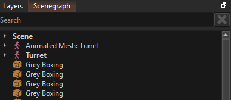

# Object Paths

Components often need to interact with other objects, not just the object that they are attached to. In this case, it is usually desirable for the user to be able to specify which object it should interact with.

There are multiple ways how a component may expose this option. For example, some components use [object references](object-references.md).

Another option are *object paths*. These are simply strings, but are used similar to file system paths to search for an object.

> **IMPORTANT**
>
> If an object path references an object *by name*, make sure that the object has that name. The editor automatically displays names for objects for easier navigation, but the **objects do not have those names** unless you set it in the properties.
> Objects with custom names are shown with **bold text** in the scenegraph, whereas objects with standard text, do not have any name.
>
> 
>
> In the image above only the objects named *Scene* and *Turret* actually have a name that can be used to identify them. The other objects are in fact unnamed.

## Object Path Syntax

The syntax for object paths is as follows:

* Path pieces are separated by forward slashes (`/`).

* If the path starts with `G:` then it will search for an object via a [global key](../runtime/world/game-objects.md#global-keys).
  * For instance, `G:keyname` will search for an object with the global key *keyname*.
  * If no such object exists, the search fails. Otherwise the found object becomes the reference object for the remainder.

* If the path starts (or continues) with `P:` it will search *upwards* the object hierarchy to find the closest parent object that has the requested name.
  * For instance, `P:parentname` will check the current object's name for *parentname*, if it doesn't match, it checks the parent object, and so on, until it finds an object, or fails because no such named parent exists.

* If the path starts (or continues) with `../` the search will go to the parent object of the current object.
  * This is repeated for every occurrance of `../`.
  * The search fails, if there are not enough parent objects.

* If the path starts (or continues) with a relative path (e.g. `a/b`) it then searches for any direct or indirect child called `a` and below that a direct or indirect object with name `b`.
  * This reports the first match that it finds. If the path is ambiguous, it is undefined which object gets used.

> **IMPORTANT**
>
> When using a [global key](../runtime/world/game-objects.md#global-keys), make sure that the target object indeed has that global key. Object names and global keys are two separate things and it is easy to set one, when you meant to set the other.

## Example Paths

* `..` -> returns the parent of the current object (one level up)
* `../..` -> starting at the current object, goes two levels up
* `G:player` -> search for the object with the [global key](../runtime/world/game-objects.md#global-keys) *player*
* `P:root` -> starting at the current object searches for the parent object called *root*
* `head/camera` -> starting at the current object searches for a child object called *head* and from there searches for a child object called *camera*
* `G:door1/P:frame` -> uses a global key to find the *door1* object and from there gets the parent object called *frame*
* `G:door1/..` -> uses a global key to find the *door1() object and returns its parent object
* `P:root/obj2` -> starting at the current object searches for a parent called *root* and from there searches for a child object called *obj2*

### Invalid Paths

* `P:name/G:key` -> `G:` must be the first part of the string.
* `obj/../` -> `..` can only appear at the beginning of the relative path
* `obj/P:name` -> `P:` must be at the very beginning or directly after `G:`

## C++ Code

In C++ code the function `ezWorld::SearchForObject()` is used to find an object through an object path. For relative paths to work, a reference object has to be passed in. Optionally, the code may also request to only find objects which have a specific component attached.

## See Also

* [Object References](object-references.md)
