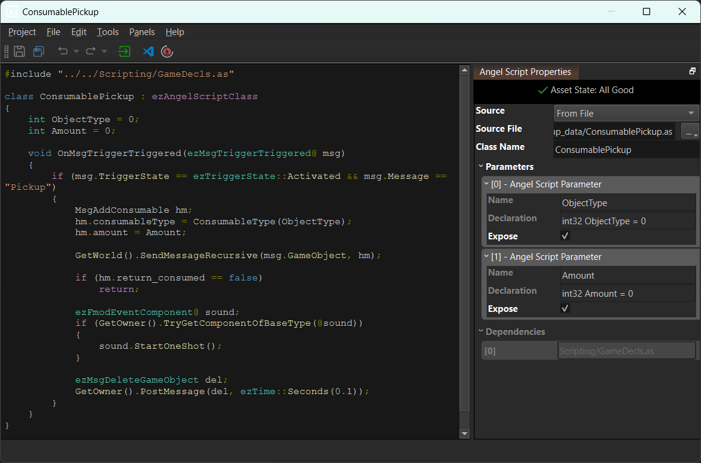

# AngelScript Asset

Each *AngelScript asset* manages the script for one [AngelScript component](as-components.md) type.



## Code Editing

The asset has two modes for where the AngelScript code is stored. You select the mode through the `Source` property:

1. `Inline`: In this mode the code is stored directly inside the AS asset. You edit it through the central text area. This is intended for very short scripts. The editing experience is very basic, there is no auto-complete, no error checking and only basic syntax highlighting. Once you need any of these features, switch to the other mode.

1. `From File`: In this mode the code is stored in a dedicated file, typically using the file extension `.as`. The `Source File` property specifies the file to use. To create a new `.as` file, click the `...` menu and select `Create AngelScript...`. In this mode the central text area displays the content of the referenced file, but it is read-only. To edit the code, click the *Visual Studio Code* icon in the toolbar.

> **Important!**
>
> For working with AngelScript code you should have [Visual Studio Code](https://code.visualstudio.com/download) (VSC) installed. Also install the VSC extension **AngelScript Language Server** (*sashi0034.angel-lsp*). EZ has dedicated support for this extension, which makes the editing experience very pleasant.

## Compiling the Code

When the asset gets *transformed*, the AngelScript code gets compiled and checked for errors. If an error occurred, the [asset transform widget](../../assets/assets-overview.md#asset-transform) displays *Asset Error: Click for Details*. When you click the widget, a message box informs you what error was encountered and in which file and location.

## Script Template

A very basic script to get started looks like this:

```cpp
class ScriptObject : ezAngelScriptClass
{
    private int PrivateVariable = 0;
    int PublicVariable = 0;

    void OnSimulationStarted()
    {
    }

    void Update(ezTime deltaTime)
    {
    }
}
```

This class has two entry points that will be called by the [script component](../visual-script/script-component.md), where you can execute your code.

## Class Name

The script class name, in the example above `ScriptObject` is important to the script asset, because a script can contain multiple classes, and it needs to know which one to instantiate.

Therefore you have to write this name into the `Class Name` property. If no such class exists, the compiler will emit an error.

You can rename your component class at any time.

## Script Parameters

In the example above, `PublicVariable` is visible from the outside. When you press the *Sync Parameters* button in the toolbar, all public variables are detected and listed in the `Parameters` section on the right.

If you then check the `Expose` option and save the script, this parameter will show up as an [exposed parameter](../../concepts/exposed-parameters.md) for this script. Meaning, when this asset is used in a [script component](../visual-script/script-component.md), the component can override the values of these variables. Thus you can instantiate the same script many times with different starting parameters.

## Non-Component AS Files

You can split up script code into multiple files, for example to easier share code between AS components. Simply create as many `.as` files as you need and `#include` them as needed. Having an *AngelScript asset* is **not required** for such files. AngelScript assets are only needed for the main AS files that represent a proper custom component type. The AngelScript assets are needed in the editor to be able to select the desired AS component code on a [script component](../visual-script/script-component.md).

## See Also

* [Custom Code with AngelScript](angelscript-overview.md)
* [Script Component](../visual-script/script-component.md)
