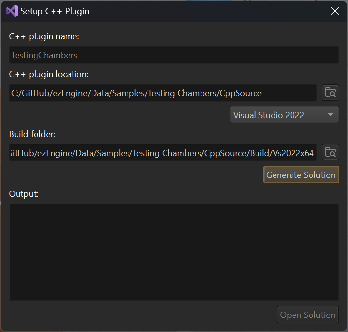

# C++ Project Generation

There are multiple ways to get custom C++ code into EZ. The best way is to create an [engine plugin](engine-plugins.md), because this way the code can be executed directly inside the editor. Additionally such a plugins can be [hot reloaded](cpp-code-reload.md) to some degree.

EZ uses CMake for its build infrastructure. See [this chapter](cpp-overview.md#build-setup) about different ways to integrate your own project into the EZ build.

The most convenient way, however, is to let the editor create a stand-alone project for you. This way you get a CMake based project that only contains your code, but has all the necessary references set up to link against EZ and output its DLLs to the right folder.

> **Note:**
>
> One downside with this approach is that your solution does **not** contain the EZ engine sources. That makes it less convenient to search for existing functionality, look up code [API docs](../../api-docs.md) and stepping through EZ code while debugging.
However, if you want that, you can include the generated plugin as an [external project](../../build/cmake-config.md#external-projects) into the EZ engine solution.

## Video: How to add custom C++ code to your game

## How to Generate a New Solution

1. Select *Editor > Open C++ Project...*. The following dialog will appear:

   

   Currently the locations for where the C++ source is stored and where the project will be built are both hard-coded to be within the project directory.

1. Choose the desired MSVC solution version.

1. Press the **Generate Solution** button and wait for it to finish.

   The CMake output is output in the *Output* window. In case of errors, please have a look here.

   If everything went fine, you can open the project and compile the code.

> **Attention:**
>
> The code has to be built for the very same build type that the editor is running in (*Debug*, *Dev* or *Shipping*), otherwise the editor won't be able to load the DLL. If the build fails because certain EZ DLLs are missing, you are most likely building the wrong build type. The same may be true if you do code changes, but running the game from the editor doesn't reflect those changes.

> **Note:**
>
> After compiling your new plugin for the very first time, you have to close the [editor project](../../projects/projects-overview.md) and reopen it, for it to load the information properly. Due to automatic [hot reloading](cpp-code-reload.md) this shouldn't be necessary later anymore, but it can still be necessary, for example when you add a new component type to your C++ code.

## Opening an Existing Solution

If you have generated the solution before, the *Open Solution* button will be active right away when you open this dialog. In this case you don't need to generate the solution again.

## Regenerating a Solution

If you have added or removed source files on disk, you need to regenerate the solution for those changes to show up in the Visual Studio solution. You have two options to do so:

1. Run CMake yourself. For example you can use the CMake GUI app, point it to the plugin's build directory, and then *Configure* and *Generate* the solution at any point you like.
1. Rerun *Generate Solution* from the dialog above. This will **clear the CMake cache** and fully regenerate the solution. Be aware that this resets all CMake options to their default values and often takes longer than strictly necessary.

## See Also

* [Custom Code with C++](cpp-overview.md)
* [Hot Reloading C++ Game Plugins in the Editor](cpp-code-reload.md)
* [Engine Plugins](engine-plugins.md)
* [Sample Game Plugin](../../../samples/sample-game-plugin.md)
