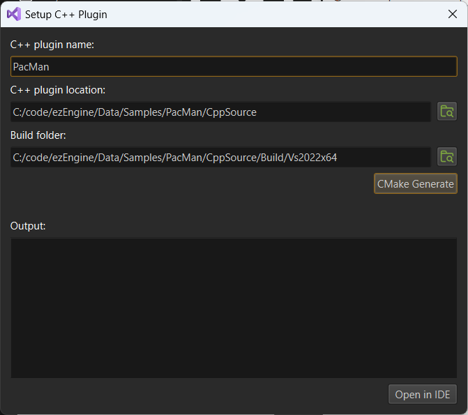

# C++ Project Generation

There are multiple ways to get custom C++ code into EZ. The best way is to create an [engine plugin](engine-plugins.md), because this way the code can be executed directly inside the editor. Additionally such plugins can be [hot reloaded](cpp-code-reload.md) to some degree.

EZ uses CMake for its build infrastructure. See [this chapter](cpp-overview.md#build-setup) about different ways to integrate your own project into the EZ build.

The most convenient way, however, is to let the editor create a stand-alone project for you. This way you get a CMake based project that only contains your code, but has all the necessary references set up to link against EZ and output its DLLs to the right folder.

> **Note:**
>
> One downside with this approach is that your C++ IDE will **not** contain the EZ engine sources. That makes it less convenient to search for existing functionality, look up code [API docs](../../api-docs.md) and stepping through EZ code while debugging.
However, if you want that, you can include the generated plugin as an [external project](../../build/cmake-config.md#external-projects) into the EZ build system.

## Video: How to add custom C++ code to your game

## How to Generate a New C++ Project

> **Note:**
>
> Generating C++ projects requires a one time setup. Go to the preferences *Tools > Preferences...* and configure the C++ compiler to use for your C++ projects. See [Editor Settings](../../editor/editor-settings.md) for details.

1. Select *Project > C++ Project > Setup C++ Plugin...*. The following dialog will appear:

   

   Currently the locations for where the C++ source is stored and where the project will be built are both hard-coded to be within the project directory.

1. Choose the desired name for the plugin or leave the default.

1. Press the **CMake Generate** button and wait for it to finish.

   The CMake output is written into the *Output* window. In case of errors, please have a look here.

   If everything went fine, you can open the project and compile the code.

> **Attention:**
>
> The code has to be built for the very same build type that the editor is running in (*Debug*, *Dev* or *Shipping*), otherwise the editor won't be able to load the DLL. If the build fails because certain EZ DLLs are missing, you are most likely building the wrong build type. The same may be true if you do code changes, but running the game from the editor doesn't reflect those changes. The editor makes sure to generate the solution only for the necessary build type and will update the solution automatically when needed.

## Opening an Existing C++ Project

If you have generated a C++ project before, the *Open in IDE* button will be active right away when you open this dialog. In this case you don't need to generate the C++ project again. You can also skip this dialog and use *Project > C++ Project > Open in IDE* instead.

## Regenerating a C++ Project

If you have added or removed source files on disk, you might need to regenerate the C++ project for those changes to show up in your IDE. You have three options to do so:

1. Use *Project > C++ Project > Regenerate C++ Project*.
1. Run CMake yourself. For example you can use the CMake GUI app, point it to the plugin's build directory, and then *Configure* and *Generate* the C++ project at any time you like.
1. Rerun *CMake Generate* from the dialog above. This will **clear the CMake cache** and fully regenerate the C++ project. Be aware that this resets all CMake options to their default values and often takes longer than strictly necessary.

## What Gets Generated

The generated solution contains two projects.

1. An engine plugin with some sample code for custom components and a [game state](../../runtime/application/game-state.md). You are supposed to implement all your game logic in here.
1. A custom [application](../../runtime/application/application.md) that is similar to [ezPlayer](../../tools/player.md). This will automatically load the engine plugin and run the game logic. This is only meant to be changed to modify the integration into the host operating system. It also gives you an `.exe` file that you can distribute.

## See Also

* [Custom Code with C++](cpp-overview.md)
* [Hot Reloading C++ Game Plugins in the Editor](cpp-code-reload.md)
* [Engine Plugins](engine-plugins.md)
* [Sample Game Plugin](../../../samples/sample-game-plugin.md)
