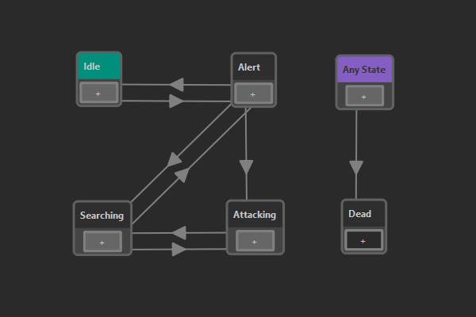

# State Machine Asset

A *state machine asset* is used to create a [state machine](https://en.wikipedia.org/wiki/Finite-state_machine) that is commonly used to keep track of an entity's state. State machines are very useful to give objects functionality. For example a door might have the states *closed*, *opening*, *open* and *closing* and in each state it has to do certain things (apply a rotation) and allow or disallow interaction.

State machines are also often used for AI (creatures or NPCs), to give them behavior. Since many AI types are rather simple, this is a viable option. For more complex AI logic, state machines quickly become too limited.

## State Machine Concept

At any time exactly one *state* is **active** in a state machine. The active state determines what actions an entity will do and what other states it can *transition* into. For example in the image above you can see that this state machine can only transition from the *Idle* state into the *Alert* state (and back), but it can't directly transition into the *Attacking* state.

What an entity does, when a certain state is active, is usually up to [other code](../custom-code-overview.md). On the state node in the state machine asset you select what *type of state* this is. Different state types can be implemented in C++ or [visual scripts](../visual-script/visual-script-overview.md).

State machines are updated regularly and during every update they may *transition* into another state. Possible transitions are represented by arrows between states. Just as with states, there are also different *types of transitions*. As with states, custom transition types can be implemented with C++ or [visual scripts](../visual-script/visual-script-overview.md).

During the state machine update, each transition on the active state is queried, whether its condition is met. If so, the transition is taken, and the state that it points to becomes the new active state. What it means that a transition's condition is met, is up to the transition type's implementation. For example the *blackboard transition* inspects values from a nearby [blackboard](../../Miscellaneous/blackboards.md), allowing you to set up logical rules. Another type of transition may simply wait for a second and then allow to transition further, acting as a timer.

In many state machines there are states that can be reached from pretty much every other state. For example the *Dead* state in the image above is simply reached whenever the health of a creature reaches zero, no matter which state it currently is in. In a pure state machine, one would add transitions from every node to that final state. However, since this is cumbersome, EZ also allows to set up transitions that can transition from any active state to their target state. In the state machine asset, such transitions are represented as an
**Any State** (taking the place of *any other state*) from which they are drawn to the target state.

## Configuring State Machines

Right click into the window and choose **New State** or **New Any State** to add a node. To add a transition between states, click the **+** on a node and drag it to another state.

Select state nodes in the main window to see their *properties*. Here you can give the state a name and **select the state type**. Most state types have custom properties that also need to be configured here.

Select transition arrows to see their *properties*. Here you can **select the transition type**. Typically you also then need to configure the transition's properties.

If you don't select a state type, a state simply does nothing. If you have a transition without a transition type, the transition will be taken immediately. This can be used to simply chain states. For example the *start state* is always active, even while the editor is not simulating. It is sometimes undesireable to have this state do anything. Therefore, a second state can be used as the "real" start state, and a transition without a type can be added between the two. This transition is only going to be taken once the scene is being simulated.

### Default Initial State

Right click on a state and select **Set as Initial State** to make a state the *default initial state*. That means, when this state machine is used in a [state machine component](state-machine-component.md) or as a [nested state machine](#nested-state-machine), and no *initial state* is selected by the user, this state is used.

## State Types

You have to select a *state type* for every node in your state machine.

### Send Message State

When the *Send Message State* gets activated (transitioned into) or deactivated (transitioned out of), it sends the `ezMsgStateMachineStateChanged` [event message](../../runtime/world/world-messaging.md) to the [game object](../../runtime/world/game-objects.md) on which the executing [state machine component](state-machine-component.md) is attached. Thus other components, such as [AngelScript components](../angelscript/angelscript-overview.md) can listen for this message and react accordingly.

The message can be sent with a delay. Also, if this state type is configured to send neither a message on enter, nor on exit, it effectively does nothing and can be used for states that don't require further action.

You can also turn on logging on enter or exit, for better debugging.

### Nested State Machine

A *Nested State Machine* state references another state machine. When the state is entered, it starts executing an instance of that state machine. Messages sent from the nested state machine will be delivered to the same owner game object. As long as the surrounding state stays active, the nested state machine gets updated. Once the surrounding state is exited, execution of the nested state machine is suspended. You can choose whether it gets reset to the initial state, or stay in the last active state. This way, once the nested state machine gets activated again later, it may either start from the beginning, or resume where it left off.

Nested state machines can be very useful to reuse state machines and to make editing easier. Also the fact that a state machine can be suspended and resumed at its last active state allows for more complex behavior.

If no *initial state* is specified, the [default initial state](#default-initial-state) is used.

### Compound State

A *Compound State* has no functionality by itself, rather it holds an array of other state types. All events (state entered/left) are forwarded to all sub-states equally. Thus it can be used to trigger multiple reactions at the same time.

### Script State

The *Script State* runs a [visual scripts](../visual-script/visual-script-overview.md). It executes the `OnEnter`, `OnExit` and `Update` event handlers for state machine states.

### Switch Object State

This state sets the *enabled flag* on a game object and disables all other objects in the same group.

This state allows to easily switch the representation of a game object.
For instance you may have two objects states: *normal* and *burning*.
You can basically just build two objects, one in the normal state, and one with all the effects needed for the fire.
Then you group both objects under a shared parent (e.g. with name 'visuals'), give both of them a name ('normal', 'burning') and disable one of them.

When the state machine transitions from the *normal* state to the *burning* state, you can then use this type of state
to say that from the 'visuals' group you want to activate the 'burning' object and deactivate all other objects in the same group.

Because the state activates one object and deactivates all others, you can have many different visuals and switch between them.
You can also only activate an object and keep the rest in the group as they are (e.g. to enable more and more effects).
If you only give a group path, but no object name, you can also use it to just disable all objects in a group.
If multiple objects in the same group have the same name, they will all get activated simultaneously.

Make sure that essential other objects (like the physics representation or other scripts) are located on other objects, that don't get deactivated.

#### State Properties

* `PathToGroup`: A list of object names, separated with slashes, that forms a relative path starting at the game object on which the state machine component is located, to a game object which acts as a *group* and contains multiple sub-objects.
* `ObjectToEnable`: The name of the sub-object in the *group* that should get *enabled*.
* `DeactivateOthers`: If true, all other objects within the *group* get disabled. Otherwise they stay as they are.

## Transition Types

You have to select a *transition type* for every transition in your state machine.

### Blackboard Conditions

*Blackboard conditions* query the [blackboard](../../Miscellaneous/blackboards.md). You can configure the transition condition to be fulfilled either when at least one or all the specified blackboard entries have the desired values.

### Timeout Transition

This transition is fulfilled after a certain amount of time has passed. This can be used to automatically transition to the next state after a fixed amount of time. Together with a *compound transition* it can also be used to prevent transitioning before a minimum of time has passed.

### Compound Transition

The *Compound Transition* allows you to create complex logical conditions. It holds an array of other transition types. You can select whether either at least one of them, or all of these conditions need to be met, for the compound transition to be fulfilled.

For example, you can add a blackboard condition and a timeout transition. If you set the compound transition to `AND`, both of these must be true, meaning the transition can only be taken after the blackboard values are correct and the minimum time has passed. If, however, you set it to `OR`, the transition is taken once either the timeout or the blackboard state is fulfilled.

Note that you can use nested compound transitions to create even more complex logical conditions.

### Transition Event Transition

This type of transition is taken when a *transition event* with the expected name has been raised. Transition events can be raised from [visual scripts](../visual-script/visual-script-overview.md) or C++ through the [state machine component](state-machine-component.md). This allows script code to report back, that a certain condition was met, and that the state machine may leave its current state.

## Executing State Machines

In theory state machines could be used in many contexts. In [custom C++ code](../cpp/cpp-overview.md) you are free to instantiate state machines directly via `ezStateMachineResource`.

In a scene, you can instantiate a state machine through the [state machine component](state-machine-component.md).

## See Also

* [State Machine Component](state-machine-component.md)
* [Custom Code](../custom-code-overview.md)
