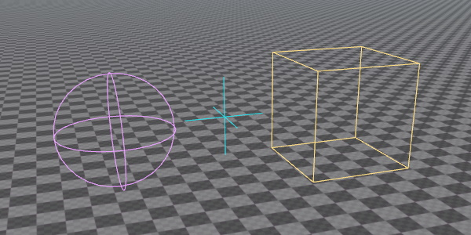

# Debug Rendering

The rendering in EZ is optimized to handle large and complex data efficiently. However, to achieve this you must implement certain patterns, and to get started a non-trivial amount of code is involved. To visualize simple things, the `ezDebugRenderer` is provided. This class allows you to quickly add debug visualizations to your game, with just a few lines of code.

This interface is also (partially) available through [TypeScript](../custom-code/typescript/typescript-overview.md).



## Usage

The `ezDebugRenderer` class has a number of static functions that you can call from any thread and at any time. The debug renderer gathers all requests and renders them at a specific point in the frame. Afterwards all requests are cleared and you must resubmit the same calls in the next frame, if you want it to appear again.

### Render Context

Every function in `ezDebugRenderer` takes an `ezDebugRendererContext` as its first parameter. This specifies where the debug geometry should be rendered. You can either pass in an `ezViewHandle` or an `ezWorld` here. If you pass in a view handle, the geometry will only be rendered in the corresponding `ezView`, meaning you can have the debug geometry only appear in a specific render target. If you pass in an `ezWorld`, the geometry appears in all views that render that world.

It is more common to bind debug geometry to an entire `ezWorld`, such that it appears in any view. The [TypeScript](../custom-code/typescript/typescript-overview.md) binding omits the `ezDebugRendererContext` parameter and always binds it to the world.

### Debug Geometry Types

The debug renderer allows you to render arbitrary lines and triangles. For convenience it also provides functions to render a number of common shapes:

* 3D lines
* 2D lines (screenspace)
* Boxes (wireframe)
* Boxes (solid)
* Spheres (wireframe)
* Capsules (wireframe)
* Frustums (wireframe)
* 3D triangles (solid)
* 3D triangles (textured)
* 2D rectangles (solid, screenspace)
* 2D rectangles (textured, screenspace)
* 2D text (screenspace)
* 2D info text (screenspace, automatically placed non-overlapping)
* 3D text (3D location, fixed size and always facing the camera)

### Shading

The debug renderer always uses a fullbright shading model. No lighting is ever applied to debug geometry. In fact, most geometry simply has a color, and only some functions allow you to choose a texture.

## Example

A full example for how to use the debug renderer is given in the [Sample Game Plugin](../../samples/sample-game-plugin.md). Here, the `DebugRenderComponent` shows how to utilize the debug renderer.

The following code snippet is sufficient to render a wireframe sphere at the location of the component:

<!-- BEGIN-DOCS-CODE-SNIPPET: debugrender-sphere -->
```cpp
ezBoundingSphere sphere = ezBoundingSphere::MakeFromCenterAndRadius(ezVec3::MakeZero(), m_fSize);
ezDebugRenderer::DrawLineSphere(GetWorld(), sphere, m_Color, ownerTransform);
```
<!-- END-DOCS-CODE-SNIPPET -->

This has to be called in every frame in which it should appear. Therefore this has been added to the `DebugRenderComponent::Update()` function.

## Performance Considerations

The debug renderer is meant for quickly visualizing data. If the data potentially changes every frame anyway (like visualizing AI raycasts), its performance will be on par with what a 'proper' solution could do. However, if you want to place things in a scene that may stay for a longer duration, it's usually much better to instead build a game object, attach a [mesh component](../graphics/meshes/mesh-component.md) and just render a proper asset. This enables culling, static object optimizations, and gives you the option to choose [materials](../materials/materials-overview.md).

## See Also

* [Debugging C++ Code](debug-cpp.md)
* [Shader Debugging](../graphics/shaders/shader-debugging.md)
* [Jolt Debug Visualizations](../physics/jolt/jolt-debug-visualizations.md)
* [Custom Code with TypeScript](../custom-code/typescript/typescript-overview.md)
