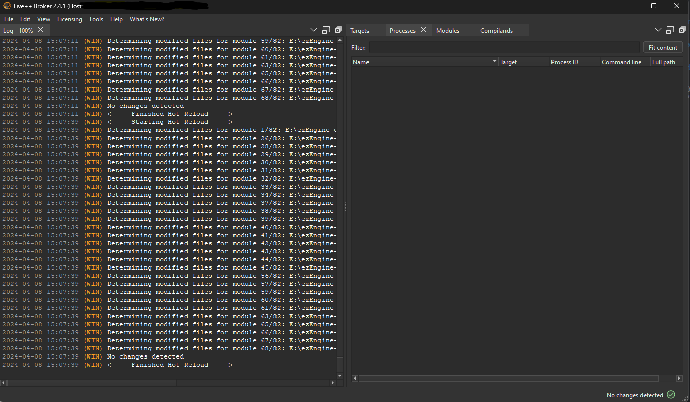
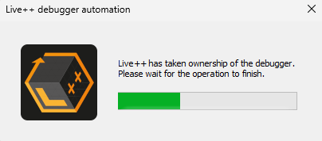

# Live++ Integration

Live++ is a commercial hot-reloading middleware for C++ applications. Live++ makes it possible to edit code while it is running, which can significantly reduce iteration times. Visit the [Live++ website](https://liveplusplus.tech) for details.

> **Important!**
>
> There is a 30-day trial version for Live++, but after that you'll need to pay for a license.

## How to enable Live++

Visit the [Live++ website](https://liveplusplus.tech) and download the free-trial package. This should include the Live++ API and tools. Copy the contents into `Code/ThirdParty/LivePP` in the EZ repository.

Use the [CMake GUI](https://cmake.org/) to adjust the [CMake configuration](../build/cmake-config.md). Enable `EZ_3RDPARTY_LIVEPP_SUPPORT` then click *Configure* and *Generate*.

Compile EZ and run the editor. Now the Live++ Broker app should show up:

Verify in the *Processes Section* that `ezEditor.exe`, and `ezEditorEngineProcess.exe` are shown in the Live++ Broker.

Now to try Live++ out, edit some source file, save it, and press `CTRL + ALT + F11`. After a second you should see this:

Once this dissapears, another message should show up, stating that hot-reloading was successful.

## Alternatives

Live++ can hot reload most code changes and it works even while running the game. However, even without Live++, EZ can hot reload the engine inside the editor, which means you can rapidly iterate between [playing the game](../editor/run-scene.md) without closing the editor. See [this chapter](../custom-code/cpp/cpp-code-reload.md) for details.

## See Also

* [Hot Reloading C++ Game Plugins in the Editor](../custom-code/cpp/cpp-code-reload.md)
