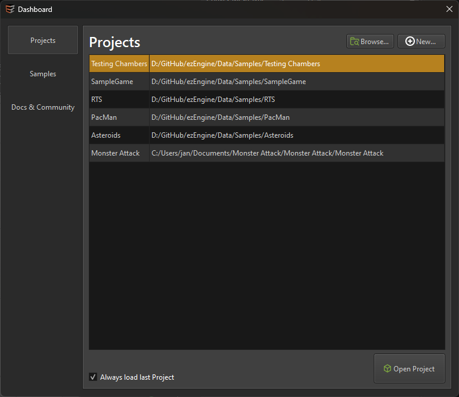

# Dashboard

The editor dashboard is a welcome screen that helps you getting started quickly. The buttons on the left-hand switch between the available options.

## Projects

On the projects page you can easily open a recently used [project](../projects/projects-overview.md). To create a new project, click the **New** button. To *open an existing project* that isn't shown in the list, click the **Browse...** button.

To open a project selected from the list, use the **Open Project** button or double click the list entry.

If you uncheck *Always load last project*, then the editor won't automatically open the project that you had open last time, when it starts up. Instead, it will always display the dashboard.

You can also start the editor without loading any project by using the command line options, or via the Windows taskbar jumplist. See [Launching the Editor](editor-launch.md) for details.

## Samples

On the samples page you can see all the available sample projects. Open one via the **Open Sample** button or double-click.

## Docs & Community

On the community page you find buttons to quickly go to the available online resources, such as the [API Docs](../api-docs.md) and [contact options](../../contact.md).

## See Also

* [Launching the Editor](editor-launch.md)
* [Projects](../projects/projects-overview.md)
* [Contact](../../contact.md)
