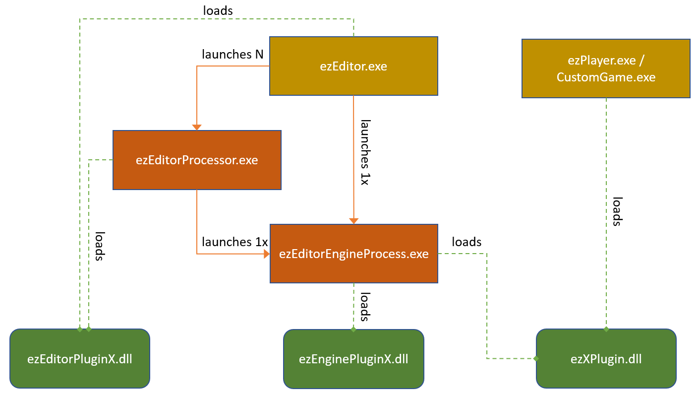

# Editor Plugins

The functionality of ezEditor can be extended through plugins. However, the editor actually uses multiple processes to make it more resilient to crashes and also to be able to multi-thread asset processing. Therefore, some operations are executed in one process and some in another process, which means that depending on what functionality you want to add, you may need one, two or three different plugins.

## Process Structure

The diagram below shows the different processes involved and which plugins they load.



Running ezEditor generally involves three different processes:

1. ezEditor.exe
1. ezEditorEngineProcess.exe
1. ezEditorProcessor.exe

### ezEditor.exe

*ezEditor.exe* is the main application binary. This shows all of the windows with the 2D UI elements. If this process crashes, the entire editor crashes and unsaved work is lost. This process **doesn't run the 3D engine**, at all. It works on an abstract representation of asset data, that automatically handles serialization, undo/redo and versioning. This process never loads game code. As such it is much less likely to run into issues that lead to a crash.

*ezEditor.exe* launches an instance of *ezEditorEngineProcess.exe* to handle all of the 3D viewport rendering and also execute the game simulation.

It may launch multiple instances of *ezEditorProcessor.exe* to process multiple assets in parallel in the background. When necessary, it may also do asset processing itself.

*ezEditor.exe* links against *EditorFramework*, which is the central library where all of the shared editing functionality resides.

### ezEditorEngineProcess.exe

*ezEditorEngineProcess.exe* is the process that actually loads the engine and game code. One such process always exists to render to the 3D viewports of *ezEditor.exe*. These two processes communicate closely with each other, where the *ezEditor* process synchronizes all state changes to the *ezEditorEngineProcess* and the engine process sends back information about picking (object selection) and such.

In case of a crash of *ezEditorEngineProcess*, usually *ezEditor.exe* can continue unharmed. It displays a button to restart the engine process, and then simply synchronizes the scene state over to the engine process again. It is even possible to save files and do more scene modifications (like undo/redo) while the engine process doesn't run. This is especially useful in case a problematic change was made to an asset, that keeps crashing the engine process.

Some assets can only be [transformed](../assets/assets-overview.md#asset-transform) by an engine process, because they need access to runtime code. For example, scene export needs to call the overridden `ezComponent::Serialize()` functions. Therefore these types of asset documents are transformed by an engine process, whereas other [assets](../assets/assets-overview.md) can be transformed by *ezEditor.exe* or `ezEditorProcessor.exe`.

Because of the split into multiple processes, *ezEditor.exe* cannot simply read and modify arbitrary data, which often makes it more complicated to implement editing functionality, that would be quite trivial in other engines, where the editor is just a single process. Some functionality has to be implemented across both processes, in which case they need to send messages back and forth to communicate.

### ezEditorProcessor.exe

*ezEditorProcessor.exe* is a trimmed down version of *ezEditor.exe* which is only used to [transform assets](../assets/assets-overview.md#asset-transform) in the background. Consequently it loads the same editor plugins and also launches its own engine process. In case an *ezEditorProcessor* crashes, a new one may be launched. Asset transform activity is shown in the [asset curator panel](../assets/asset-curator.md).

*ezEditorProcessor.exe* doesn't show any UI. It can be launched manually, to transform all assets for a project. This is utilized, for example, by the *GameEngineTests*.

## Plugin Types

As the diagram above shows, there are three types of plugins. Most plugins use a specific naming scheme, though it is not a requirement. **Every** type of plugin is optional, depending on what functionality you want to add. However, if you need a plugin for the *ezEditorEngineProcess* then you typically also need a plugin for the *ezEditor* process, to expose the functionality to the user (e.g. through a new asset type).

These plugin types exist:

1. The plugin that extends the engine runtime. Typically called *ez**X**Plugin.dll* (with **X** being the feature name). This plugin is needed, if the *feature* adds any custom [component type](../runtime/world/components.md). If you add *only* component types, and don't need any custom editing functionality, you don't need to add the other plugin types.

2. The plugin that extends the ezEditor process. Typically called *ezEditorPlugin**X**.dll*. This plugin is needed, if you want to add new [document types](editor-documents.md) such as new [assets](../assets/assets-overview.md).

3. The plugin that extends the editor engine process. Typically called *ezEnginePlugin**X**.dll*. This plugin is needed, if you add a new asset or document type that needs the engine either for a custom 3D visualization or to transform data. This plugin may link directly against the runtime plugin to get access to those data structures.

In rare cases you may have code or data structures that need to be used across these plugins, in which case it can be useful to put it into a separate library that the other plugins link against. For example the project *SharedPluginAssets* is used both by *EnginePluginAssets* and *EditorPluginAssets*.

### ezPluginBundle

The editor needs to know which plugins exist, which DLLs they are made up of and what dependencies they have. For this, *ezPluginBundle* files are used.

The files need to be located in the same directory as *ezEditor.exe*. Use the CMake command `ez_copy_plugin_bundle` to automatically copy such a file from a plugin source directory into the output directory:

```cmake
ez_create_target(LIBRARY ${PROJECT_NAME})
ez_copy_plugin_bundle(${PROJECT_NAME} "GameComponents") # copies GameComponents.ezPluginBundle into the output directory
```

If you have multiple DLLs that make up your plugin, only add this copy step to one of them.

> **NOTE**
>
> The copy step is only executed when compiling the library. So if you make changes to the original file, you need to make sure that it actually gets copied, otherwise the editor may only see an outdated copy.

At startup the editor finds all plugin bundle files. It then lists them in the [plugin selection dialog](../projects/plugin-selection.md), which is where you enable the usage of a plugin for your project.

#### Plugin Bundle File Format

The plugin bundle files use the [OpenDDL](https://openddl.org/) format.

```cpp
PluginInfo
{
	// The name with which the bundle appears in the UI.
	string %DisplayName{"Pretzel Plugin"}

	// A description of what functionality this bundle adds.
	string %Description{"Procedural mesh generation."}
	
	// List of plugins (without path or extension) to load into the editor process.
	string %EditorPlugins{"ezEditorPluginPretzel"}

	// List of plugins (without path or extension) to load into the editor engine process.
	string %EditorEnginePlugins{"ezEnginePluginPretzel"}

	// List of plugins (without path or extension) to load into the engine process (e.g. also ezPlayer.exe and stand-alone apps).
	string %RuntimePlugins{"ezPretzelPlugin"}
	
	// List of bundles (without path or extension) that are always needed for this bundle to work.
	string %RequiredPlugins{}

	// List of additional files that need to be shipped for the plugin to work right (usually other DLLs).
	string %PackageDependencies{}
	
	// List of tags for "features" that this bundle provides. 
	// Only one bundle with each feature may be selected.
	// Typically used to prevent multiple physics or sound engines to be in use at the same time.
	string %ExclusiveFeatures{}

	// List of 'template' names in which this bundle should be selected.
	// All used template names appear in the UI for the user to choose from.
	// For a bundle to be active by default in new projects, include the "General3D" template here.
	string %EnabledInTemplates{}

	// if true, the plugin is not shown in the UI and always loaded
	// only used for system functionality
	bool %Mandatory{false}
}
```

## Editor Process Plugins

Plugins that are loaded into *ezEditor.exe* are typically called *ezEditorPluginX.dll*, however, this is just a convention, the actual DLL names are specified in the plugin bundle file.

These plugins contain the following functionality:

* Asset type definitions and their window code (2D UI only, 3D viewports go into the engine process plugin)
* Asset transform code, if the asset type can be transformed without the 3D engine
* *Actions* that are added to the UI (buttons, menu entries, etc) and their default [shortcuts](editor-settings.md#shortcuts).
* Qt UI functionality (dialogs, widgets)
* 2D Icons (also for custom components)
* Drag and drop handlers
* Definitions for new [preferences](editor-settings.md#preferences) (plugin specific editor settings)

Editor process plugins need to **link** against the **EditorFramework** library.

## Engine Process Plugins

Plugins that are loaded into *ezEditorEngineProcess.exe* are typically called *ezEnginePluginX.dll*, however, this is just a convention, the actual DLL names are specified in the plugin bundle file.

These plugins contain the following functionality:

* engine side asset type support (see `ezEngineProcessDocumentContext`)
* asset type thumbnail generation (see `ezEngineProcessDocumentContext::ExportDocument()`)
* asset type 3D visualization support (see `ezEngineProcessViewContext`)
* Asset transform code, if the asset type cannot be transformed without the 3D engine
* scene export modifiers (see `ezSceneExportModifier`)

Editor engine process plugins need to **link** against the **EditorEngineProcessFramework** library.

## Game Engine Plugins

Plugins that are loaded into the actual game (either a custom [application](../runtime/application/application.md) or [ezPlayer](../tools/player.md) but also the *ezEditorEngineProcess*) are typically called *ezXPlugin.dll*, however, this is just a convention, the actual DLL names are specified in the plugin bundle file.

These plugins contain the following functionality:

* [component](../runtime/world/components.md) types
* [resource (TODO)](../runtime/resource-management.md) types
* [world modules](../runtime/world/world-modules.md)
* [game states](../runtime/application/game-state.md)
* [CVars](../debugging/cvars.md)
* custom rendering code (see `ezRenderer`)

## Getting Started

The best way to get started, is to copy a entire library. Delete all files that are unnecessary, strip the code down to the bare minimum and then rename files and classes and make this bare bones plugin compile.

In most cases there will be some runtime functionality (through new component types). So the first thing to start with, is to add an [engine plugin](../custom-code/cpp/engine-plugins.md). As an example, have a look at the *JoltPlugin* or the *AiPlugin*.

Add an [ezPluginBundle](#ezpluginbundle) to that library, so that it shows up in the [plugin selection dialog](../projects/plugin-selection.md).

New component types will already show up in the scene editor.

If you need a custom [asset type](../assets/assets-overview.md), the next step is to create an *editor plugin*. See the *EditorPluginJolt* or *EditorPluginFmod* as an example. Make sure to adjust your plugin bundle file and also that the copied file gets overwritten.

If the editor process loads your editor plugin correctly, the new asset type will show up.

If you then also want to have 3D visualization inside your asset document, add an editor engine process plugin, see for example *EnginePluginJolt*.

## Data for Plugins

If your plugin requires additional files, put them into `Data/Plugins/YourPluginName`. The folder `Data/Plugins` is always mounted as a [data directory](../projects/data-directories.md) so you can read files from there using the relative path `YourPluginName/MyFile.data`.

This is a stopgap solution and will be improved in the future.

## Distributing Plugins

There is currently no way to easily distribute and install compiled plugins. You can write a script (PowerShell, Python) to copy the necessary files into an EZ installation, but be aware that your DLLs may not be compatible with their installation, if the user compiled it themselves and there are differences in their version and the one that you used.

## See Also

* [Engine Plugins](../custom-code/cpp/engine-plugins.md)
* [ezPlayer](../tools/player.md)
* [Application](../runtime/application/application.md)
