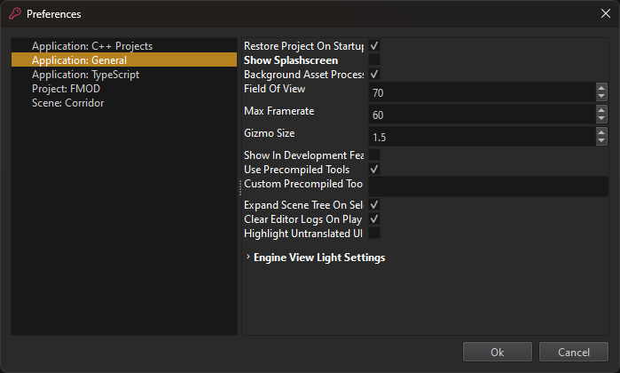

# Editor Preferences

Preferences are user specific editor settings. Preferences may affect the entire editor application, only a certain [project](../projects/projects-overview.md), or even just a single [document](editor-documents.md). For additional editor settings, see [this page](editor-settings.md).

To open the preferences dialog, select *Tools > Preferences...*.

The list on the left lists all the available preferences. Items prefixed with `Application:` affect the general editor, no matter which project is open. Items prefixed with `Project:` are specific to the currently open project and can be configured differently for other projects. Per-document preferences only show up while a document is open.

### Application: C++ projects

* **C++ IDE:** Select which IDE you want to use as default when opening C++ projects.

* **Compiler Preferences:** Settings on what compiler to use to compile C++ projects.

  * **Compiler Preset:** Select one of the auto detected compiler presets available on your system, or use a "custom" preset to manually configure a compiler.
 
  * **C++ Compiler:** Path to the C++ compiler executable to use.
 
  * **C Compiler:** Path to the C compiler executable to use.
 
  * **RC Compiler:** Path to the resource compiler executable to use.

### Application: General

* **Restore Project On Startup:** If enabled, the editor will load the project that was open the last time.

* **Show Splashscreen:** Disable this to not have a splashscreen show up every time the editor starts.

* **Background Asset Processing:** If set, background [assets processing](../assets/assets-overview.md) will be activated by default, when you open a project.

* **Field Of View:** The FOV of the generic editor camera.

* **Max Framerate:** Limits how fast the editor should render the scene.

* **Gizmo Size:** Allows you to change the size of the editor gizmos.

* **Show In Development Features:** Some features (mainly [components](../runtime/world/components.md)) are hidden by default from menus. That's because those features are not considered ready to be used productively. If you do want to try them out regardless, check this option for them to show up.

* **Use Precompiled Tools:** If enabled, the editor will prefer to use the tools under `Data\Tools\Precompiled`, rather than the ones from its own binary directory. The precompiled tools are built with maximum optimizations and are therefore typically faster, however, they only get updated infrequently and may not have all the latest features and bugfixes.

* **Custom Precompiled Tools:** If not empty use the given path instead of `Data\Tools\Precompiled` when looking for tools. This is especially useful on Linux if you want fast tools while using a debug build of the editor.

* **Expand Scene Tree On Selection:** If enabled, selecting an object in a scene will automatically expand the corresponding item in the scene tree view. If disabled, the scene tree will not change on selection from the viewport, and jumping to the selected tree item has to be done manually using `CTRL+T`.

* **Clear Editor Logs On Play:** If enabled, the engine log gets cleared every time you [run a scene](run-scene.md).

* **Highlight Untranslated UI:** If enabled, the editor will highlight all texts in the UI which are missing a translation.

* **Engine View Light Settings:** Many [assets](../assets/assets-overview.md) have 3D previews that require lighting. These are the lighting settings to use.

* **CameraRotationSpeed:** Allows to adjust how quickly the [editor camera](../scenes/editor-camera.md) rotates.

## See Also

* [Editor Settings](editor-settings.md)
