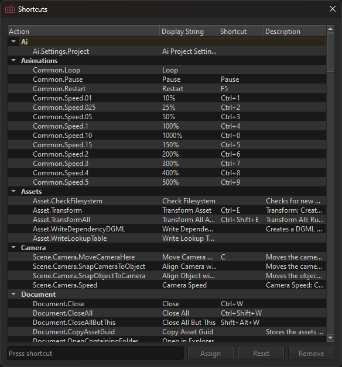

# Editor Settings

Editor settings are user specific and independent of projects. They are stored in a OS user folder and thus are not checked into source control.

There are also [project settings](../projects/project-settings.md), which are not user-specific and affect the entire project.

## Shortcuts

*Tools > Shortcuts...* opens a dialog to configure the shortcuts.

The shortcuts dialog includes a search box to help you quickly find specific shortcuts.

### Keyboard Layout Support

The editor uses scancodes (physical key positions) instead of character codes for most camera controls and movement shortcuts. This ensures that camera controls like WASD work consistently across different keyboard layouts (QWERTY, AZERTY, QWERTZ, etc.).

However, there is an important limitation: single-character shortcuts (like `G` for grid toggle) only work on keyboard layouts that contain that specific character. For example, shortcuts with Latin characters won't work on Cyrillic layouts unless you remap them.

**Workaround**: Shortcuts that use modifiers (CTRL, ALT, SHIFT) work universally across all keyboard layouts since they operate by physical key position rather than character. If you're using a non-QWERTY layout and encounter issues with single-character shortcuts, you can remap them to characters that exist on your keyboard layout using the shortcuts dialog.

## Preferences

*Tools > Preferences...* opens a dialog to configure the preferences.

For details see [the editor preferences page](editor-preferences.md).

## Video

## See Also

* [Project Settings](../projects/project-settings.md)
* [Editor Preferences](editor-preferences.md)
