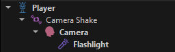

# Camera Shake Component

The *camera shake component* is used to apply a shaking effect to the game object that it is attached to.

<video src="../media/camera-shake.webm" width="600" height="600" autoplay loop></video>

How much shake to apply is controlled through the `MinShake` and `MaxShake` properties. Typically `MinShake` is zero, meaning there is no shake, at all, but you can procedurally raise the value at any time.

However, it is more convenient to instead place a [camera shake volume](camera-shake-volume-components.md). This allows to easily define where in a scene the camera should shake and how much.

The shake is applied as a local rotation around the Y and Z axis, assuming the [camera](../../graphics/camera-component.md) is looking along the positive X axis. Insert a dedicated shake object as a parent of your camera like this:

The component could theoretically also be used to add a shake effect to other decorative objects.

## Component Properties

* `MinShake`: The minimum amount of shake to apply to the owner object at all times. Measured in angle, because the shake is applied as a rotation.
* `MaxShake`: The maximum amount of shake to apply to the owner object. This is used as the reference value when a shake volume has a strength of `1`.

## See Also

* [Camera Shake Volume Components](camera-shake-volume-components.md)
