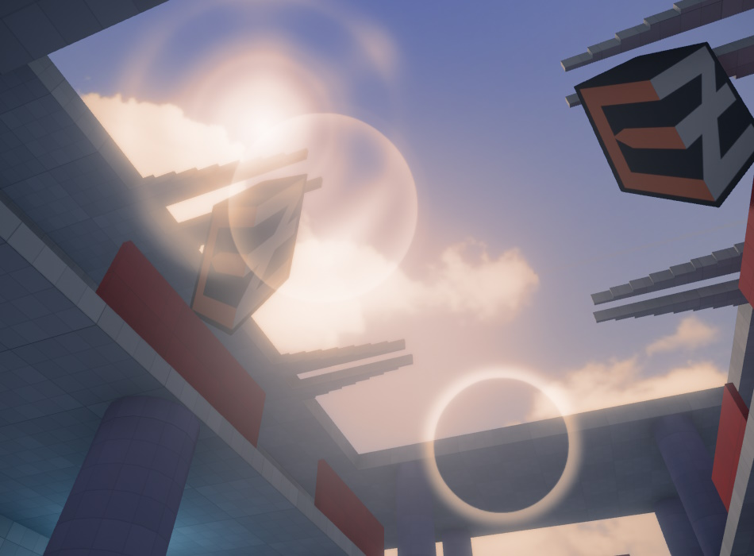

# Lensflare Component

The *lensflare component* adds a screen-space effect for simulating [lens flares](https://en.wikipedia.org/wiki/Lens_flare).

Lens flares can be added to any light source or even to other objects. Lens flares consists of several textures that are placed along a line in screen-space that rotates around the screen center. One end of the line is at the position of the lens flare object and the other end is mirrored across the screen center.

The renderer determines how much the lens flare object is occluded and scales the intensity of the effect accordingly. Thus the effect smoothly fades in when the object becomes visible around a corner.

See the video below for an example:

<video src="media/lensflare.mp4" width="800" height="600" autoplay loop controls></video>

## Component Properties

* `LinkToLightShape`: Links the lens flare to the first light component on the same owner object or any of its parent objects.

  When a lens flare is linked it will take the light color and intensity to modulate the lens flare color and intensity for elements that have the `ModulateByLightColor` flag set.

  For [directional lights](../graphics/lighting/directional-light-component.md) the lens flare is positioned at far plane and moved with the camera to simulate a light that is at infinite distance, like the sun.

  For [spot lights](../graphics/lighting/spot-light-component.md) the lens flare intensity is additionally adjusted so that the it is only visible when the camera is inside the light cone.

* `Intensity`: Adjusts the overall intensity of the lens flare.
* `OcclusionSampleRadius`: Sets the world space radius in which the depth buffer is sampled to determine how much the lens flare is occluded. Typically this would be the size of the light emitting area, like a light bulb, or slightly larger.
* `OcclusionSampleSpread`: Moves the occlusion sample center towards the lens flare corner to introduce a slight gradient when the lens flare is only partially occluded. This value is relative to the sample radius (0..1 range).
* `OcclusionDepthOffset`: Adjusts the occlusion sample depth in world space. Negative values will move towards the camera. This can be used to prevent self occlusion with the light source object.
* `ApplyFog`: If enabled, fog is added on top of the flare.
* `Elements`: Array of lens flare elements.
    * `Texture`: The [texture](../graphics/textures-overview.md) to use.
    * `GreyscaleTexture`: Whether the given texture is a greyscale or color texture. If enabled, the texture's alpha channel is ignored entirely and the red channel is used for all colors. Thus if you have a single-color texture, which would usually show up red, this turns it into greyscale. For color textures that are already greyscale, this will only have an effect, if their alpha channel is not entirely white. In this case choose whatever looks best.
    * `Color`: A tint color.
    * `ModulateByLightColor`: Modulates the element's color by the light color and intensity if the component is linked to a light component.
    * `Size`: The world-space size of the element. This determines the size of the flare at varying distances. Note that the final size on screen gets clamped by `MaxScreenSize`, thus you can exaggerate the size, to have the flare stay visible even at large distances, without having it exceed a maximum size on screen. That is why the default is set to a very large value, because for directional light-sources that are projected to be very far away the size needs to be extremely big.
    * `MaxScreenSize`: The maximum screen-space size in 0..1 range.
    * `AspectRatio`: The width-to-height ratio. A ratio other than one will stretch the element along the X or Y axis.
    * `ShiftToCenter`: Moves the element along the lens flare origin to screen center line. 0 is at the lens flare origin, 1 at the screen center. Values below 0 or above 1 are also possible.
    * `InverseTonemap`: Applies an inverse tonemapping operation on the final color. This can be useful if the lens flare is not linked to a light or does not use an HDR color since lens flares are rendered before tonemapping and can look washed out in this case.

## See Also

* [Lighting](../graphics/lighting/lighting-overview.md)
* [Fog](fog.md)
* [Sprite Component](../graphics/sprite-component.md)
* [Post-Processing Component](post-processing/post-processing-component.md)
