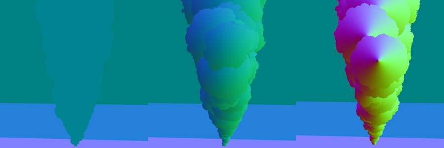
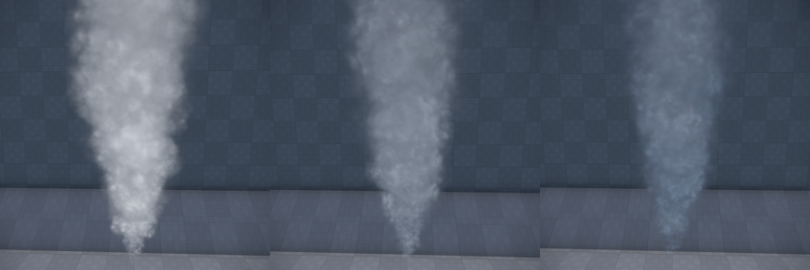

# Particle Renderers

## Quad Renderer

This renderer visualizes each particle as a quad. There are several modes to choose from how this quad is oriented. There are also different modes how to blend the particle with the background. This renderer is very versatile.

**Orientation:** This mode defines how the quad is oriented and around which axis it may rotate. In the 'rotating' modes the quad geometry constantly rotates around some axis that is decided when the particle is spawned. In the 'fixed' modes the quads themselves will not rotate, but have a fixed plane decided when they spawn. If they have a non-zero rotation speed, their texture will rotate around the quads center. In the 'axis' modes, the quads have one fixed axis and one that orients itself into the direction of the camera.

* *Billboard* - This is the most common mode. Billboards always face the camera. If the camera moves around the effect, the billboards keep orienting towards it. When billboards should rotate, they always rotate in screen-space, meaning around the current forward axis of the camera.

  <video src="media/billboards.webm" width="500" height="500" autoplay loop></video>

* *Rotating: Ortho Emitter Dir* - In this mode the quads rotate around the orthogonal axis between the direction of the emitter and the direction the particle moves into. This mode is particularly useful for simulating debris of concrete for bullet impacts and such. When the particles have a high [rotation speed](particle-initializers.md#rotation-speed-initializer), they will fly off in a spectacular fashion. For this type of effect it is also best to use alpha-masked textures representing debris, and to use the 'Opaque' *render mode*.

  <video src="media/quad-rotating-ortho.webm" width="500" height="500" autoplay loop></video>

* *Rotating: Emitter Dir* - Similar to the mode above, but uses the direction of the emitter as its rotation axis. This can be used for muzzle flashes (the part that shows along the direction of the barrel) or impact effects.

  <video src="media/quad-rotating-emdir.webm" width="500" height="500" autoplay loop></video>

* *Fixed: Emitter Dir* - In this mode the quad always uses the emitter direction as its plane normal (with some optional *Deviation*). This mode is useful for creating shockwave effects at a point of impact, or things like ripples in water. It can also be used for muzzle flashes (the part sideways out of a barrel).

  <video src="media/quad-fixed-emdir.webm" width="500" height="500" autoplay loop></video>

* *Fixed: World Up* - Similar to *Fixed: Emitter Dir* but the axis used is always the world up direction. This can be useful for effects where the emitter may have an arbitrary direction, but the particles should always face upwards. For example for the ripples of water impact effects.

* *Fixed: Random Dir* - In this mode each quad gets a random axis assigned when it is spawned. This can be useful for creating shockwave effects in explosions.

  <video src="media/random-color-init.webm" width="500" height="500" autoplay loop></video>

* *Axis: Emitter Dir* - In this mode the quads fixed axis is the direction of the emitter. The quad will rotate around this axis to face the camera as much as possible. Additionally, the quad will not scale around its center, but around one of its edges. Therefore, when scaling up or down, that edge will stay in a fixed position. This can be used to create muzzle flashes and other impact effects which should generally move into the direction of the emitter, but also face the camera as much as possible, to be well visible. This mode won't look too convincing if the particles' movement deviates strongly from the emitter direction. For most common use cases, the particles may not move at all, but only change their size.

  <video src="media/quad-axis-emdir.webm" width="500" height="500" autoplay loop></video>

* *Axis: Particle Dir* - In this mode the quads fixed axis is its own fly direction. The quad will rotate around this axis to face the camera as much as possible. This is useful for creating sparks or laser blasts which shall stretch a little while moving into some direction.

  <video src="media/continuous-emitter.webm" width="500" height="500" autoplay loop></video>

**Render Mode:** This mode specifies how the color from the particle will be combined with the scene background.

* *Opaque* - The particle will use the alpha channel of the texture as mask. Pixels are either fully transparent or fully opaque. This is mostly useful for debris.

* *Additive* - The particle's color will be added to the background. The alpha-channel is not used. This is used for everything that should glow (magic spells, sparks, ...)

* *Blended* - The alpha channel of the texture is used to interpolate the particle's color with the background. This is used for everything that should be transparent, but not glowing (smoke and such). It is also the most tricky mode to make look good, as it depends the most on a good texture with a proper alpha channel. Particles rendered with this mode must be sorted by distance by the renderer, which incurs an additional performance cost.

* *Blended Foreground/Background* - Same as *Blended* but when there are multiple particle systems using *Blended* mode, this allows you to influence in which order the systems are rendered. This is used to fix rendering issues.

* *Custom* - Use a custom material for rendering. See **Custom Material** below.

**Custom Material:** When *Render Mode* is set to *Custom*, you can assign a custom [material](../../materials/materials-overview.md) for particle rendering. The material must have its *Asset Filter Tag* set to `QuadParticle` to appear in the asset browser. Custom materials can be created using [shader templates](../../graphics/shaders/shader-templates.md) or [visual shaders](../../materials/visual-shaders.md), enabling advanced effects like distortion, custom lighting, or other special rendering techniques.

**Lighting Mode:** Controls whether the particles receive dynamic lighting.
  * `Fullbright`: Particles will not be lit dynamically.
  * `Vertex Lit`: Lighting will be calculated at each vertex and interpolated across the particle.

**Normal Curvature:** For particle lighting, how round the particle appears. At `0` the particles are treated like flat pieces, at `1` they are lit more like spheres. The image below shows a curvature of `0`, `0.5` and `1.0`.

  

**Light Directionality:** For particle lighting, how much the light wraps around the particle. At `0` the direction of incoming light is completely ignored, whereas at `1` particles will be clearly lit from the side from which a light source shines at it. Note that the directionality somewhat depends on the camera direction. The image below shows smoke lit with light directionality of `0`, `0.5` and `1.0`.

  

**Texture:** The texture used for rendering. May be a texture atlas or contain flipbook animations.

**Texture Atlas:** Specifies how to interpret the content in *Texture*:

* *None* - The texture contains only a single image.

* *Random Variations* - The texture contains *NumSpritesX* x *NumSpritesY* images in a regular grid. Each image is independent and each particle uses a random one.

* *Flipbook Animation* - The texture contains an animation starting at the top left, going to the right and down. Every particle starts with the first image, and over its lifetime will traverse through the frames to play the animation.

* *Random Row, Animated Column* - The texture contains *NumSpritesY* animations, each with *NumSpritesX* frames. Each particle plays one random animation over its lifetime.

**Tint Color Param:** An optional [effect parameter](particle-effects-overview.md#effect-parameters) name. If set, the parameter is used to tint the final color of the particle.

**Particle Stretch:** Only available in the 'axis' render modes. Allows to stretch the particles along their fixed axis. Useful to create sparks.

## Mesh Renderer

This renderer visualizes each particle using a [mesh](../../graphics/meshes/mesh-asset.md).

**Mesh:** The mesh to use for rendering. If the mesh contains multiple sub-meshes, the renderer will randomly select one sub-mesh for each particle. This allows for visual variety in effects like debris or broken pieces by including multiple mesh variations in a single mesh asset.

**Material:** The material to use on the mesh. If specified, this material overrides the materials defined on the mesh asset. If left empty, the mesh's own materials are used.

**Scale:** A scale factor to adjust the size of the mesh independently of the particle size. This allows you to fine-tune the visual size of the mesh without having to modify the particle size parameter.

**Tint Color Param:** An optional [effect parameter](particle-effects-overview.md#effect-parameters) name. If set, the parameter is used to tint the color of the meshes.

<video src="media/mesh-renderer.webm" width="500" height="500" autoplay loop></video>

## Light Renderer

The light renderer treats each particle as a light source and thus illuminates the scene around it. Usually one would add this renderer as a second renderer to a particle system, such that one can easily reuse the behavior and color of for example billboards. Since light sources have a very high performance overhead, and adding as many lights into a scene as billboards would often be way too much, this renderer may visualize only a fraction of all particles in the system.

**Size Factor:** A factor to scale the particle's size with to determine the light influence radius. If the particles are also visualized as, for instance, billboards, the light source around the billboard should often be three to five times bigger.

**Intensity:** The light intensity.

**Percentage:** How many of the particles in the system should also be used as light sources. Typically you should only use 10% or so of the particles. Fewer lights is not only better for performance, it often also looks better, as there will be more contrast and flickering. Too many lights will result in constant brightness, making the effect less interesting.

**Tint Color Param:** An optional [effect parameter](particle-effects-overview.md#effect-parameters) name. If set, the parameter is used to tint the color of the lights.

**Intensity Scale Param:** An optional [effect parameter](particle-effects-overview.md#effect-parameters) name. If set, the parameter is used to scale the intensity of the lights.

**Size Scale Param:** An optional [effect parameter](particle-effects-overview.md#effect-parameters) name. If set, the parameter is used to scale the light influence radius.

<video src="media/light-renderer.webm" width="500" height="500" autoplay loop></video>

## Trail Renderer

This renderer visualizes particles as long lines that draw the path that the particle took. Trail particles are made up of a fixed number of segments. The more segments the renderer uses, the longer the trails will be. Also the faster a particle moves, the longer the trail will stretch. More segments cost more performance to update and render. For very short sparks that should just stretch a little, it is better to use billboards with *Orientation* set the *Axis: Particle Dir* and *StretchFactor* set to some value between 2 and 5.

**Render Mode, Custom Material, Texture, Texture Atlas, TintColorParam, Lighting Mode:** These options are identical to the [quad renderer](#quad-renderer). For custom materials on trails, the *Asset Filter Tag* must be set to `TrailParticle`.

**Segments:** The number of segments to use for each particle. More segments cost more performance but also result in longer and more detailed trails.

<video src="media/trail-renderer.webm" width="500" height="500" autoplay loop></video>

## Effect Renderer

This renderer visualizes each particle using another particle effect. The referenced effect is spawned at the position of each particle and then moved along as the particle moves. This allows you to create effects like fireworks, where each 'rocket' is represented by a single particle flying into the sky, but visualizes as a complete burning particle effect.

**Effect:** The particle effect to spawn and move along for each particle in this system. Usually the other particle system would use at least one continuous emitter, such that the effect will be active for the whole lifetime of the particle that references it.

**Random Seeed:** An optional random seed to pass into the spawned effect.

<video src="media/effect-renderer.webm" width="500" height="500" autoplay loop></video>

## See Also

* [Particle Effects](particle-effects-overview.md)
* [Particle Initializers](particle-initializers.md)
* [Particle Behaviors](particle-behaviors.md)
