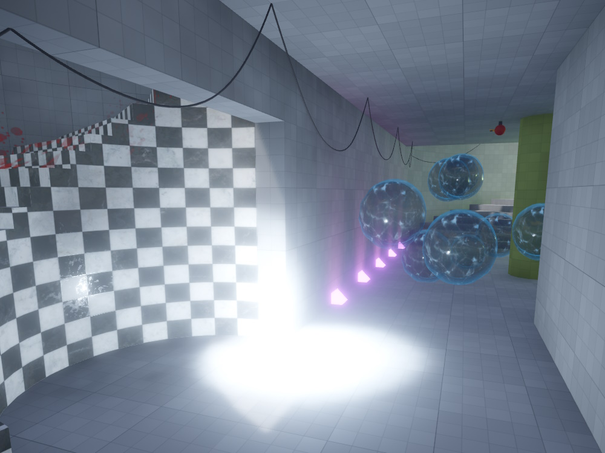
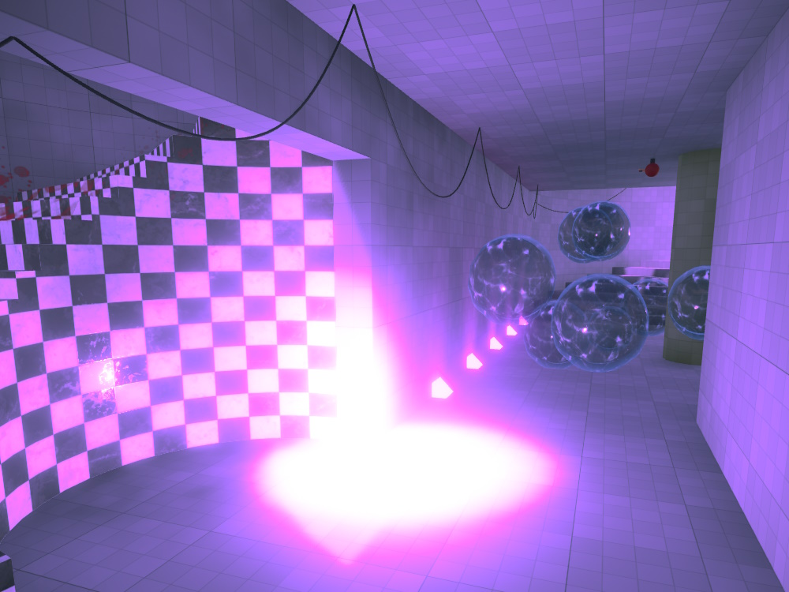
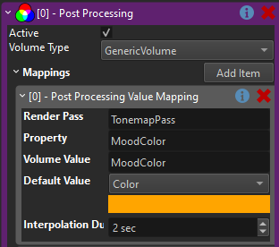
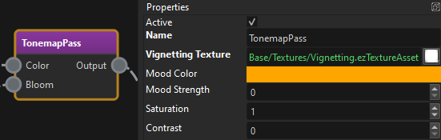

# Post-Processing Component

The post processing component is used to dynamically modify settings of the [render pipeline](../../graphics/render-pipeline/render-pipeline-overview.md).

The component relies on [volume components](volume-components.md) to define where in a level which values shall be used. The following image shows a scene without custom post processing values:

With post processing, the area can be made to look very different:

The level uses a volume component to specify that this area should have a different athmosphere and thus use different values for post processing.

To enable custom post processing, attach the post processing component to the same object where the main [camera component](../../graphics/camera-component.md) is attached to. This would typically be inside a player prefab. If, however, the post processing component is attached to an object with a camera component that is configured for [render to texture (TODO)](../../graphics/render-to-texture/render-to-texture.md), it will only affect that.

It is also possible to place this component simply anywhere in a level. In this case it is always active and affects the currently active camera. This can be very useful during testing, since it also affects the editor camera and thus you can test values and volume placement just by moving the editor camera around, without even simulating the scene.

## Component Properties

* `Volume Type`: A [spatial category](../../runtime/world/spatial-system.md) that is used as a filter to determine which [volume components](volume-components.md) to use for looking up values.
* `Mappings`: An array of mappings from that configure which values in a [render pipeline](../../graphics/render-pipeline/render-pipeline-overview.md) to modify. See the images below for an example.
    * `Render Pass`: The *name* of the render pass in the pipeline to change.
    * `Property`: The name of the *property* to change.
    * `Volume Value`: The name of the value to use from the [volume](volume-components.md).
    * `Default Value`: The value to use for `Property` if the camera is currently in no volume.
    * `Interpolation Duration`: The property is interpolated towards the target value over this time. A duration of `0` means the value changes immediately, anything larger means the change happens more smoothly.

## Example

In this example, the post processing component is used to alter the *Mood Color*:

    

The image below shows the *Tonemapping* render pass from the game's [render pipeline](../../graphics/render-pipeline/render-pipeline-overview.md). On the right are it's properties that get modified.
 

Be aware that once post processing component is used, the values for these properties on the render pipeline have no effect anymore, since they are always being overwritten anyway.

## Constant Overrides

If you leave the `Volume Value` property for a mapping empty, the component overrides the render pipeline with the default value, but never reads a value from a volume. This can be used to just set a value to a different value in a level. This way you can also use this component just to have different values per level. In this case the component should not exist on the player object, but just be added to each level.

## See Also

* [Volume Components](volume-components.md)
* [Lighting](../../graphics/lighting/lighting-overview.md)
* [Fog](../fog.md)
