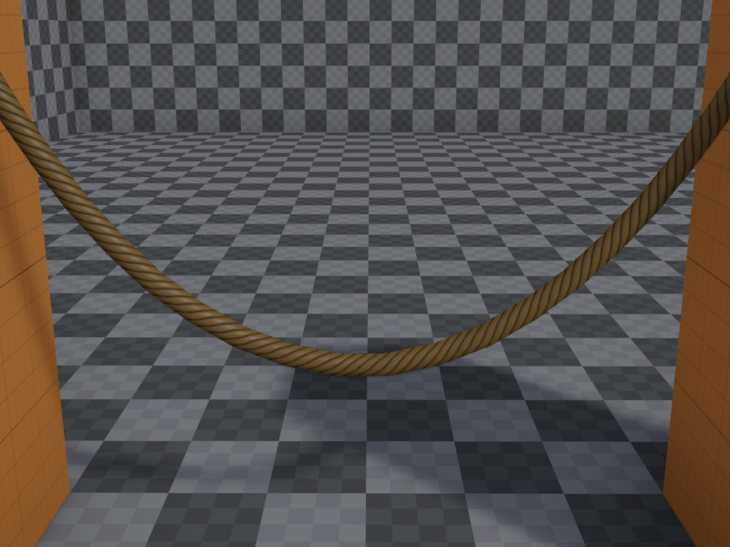

# Rope Render Component

The *rope render component* is used to render a rope or cable.

The rope simulation is done by other components, such as the [rope component](../physics/jolt/special/jolt-rope-component.md) or the [fake rope component](fake-rope-component.md). The rope render component has to be attached to the same object as the simulation component.

## Component Properties

* `Material`: The [material](../materials/materials-overview.md) to use for rendering.
* `Color`: The object color. This is typically multiplied into the diffuse part of the material, but the shader may use the color in different ways, as well.
* `Thickness`: The thickness of the rope mesh.
* `Detail`: How many polygons the rope mesh uses to appear round. More detail costs more rendering performance. Note that this has no effect on how many segments the rope is made up of, that is a property of the simulation component.
* `Subdivide`: Whether the rope mesh should have an extra segment subdivision to make it look smoother at strong bends. This doubles the amount of triangles in the mesh. Enable this for ropes that still should look as good as possible even under strong curvature. 
* `UScale`: The texture is always wrapped exactly once around the rope. Howver, along the rope's length, this option defines how often it will be repeated.

## See Also

* [Jolt Rope Component](../physics/jolt/special/jolt-rope-component.md)
* [Fake Rope Component](fake-rope-component.md)
