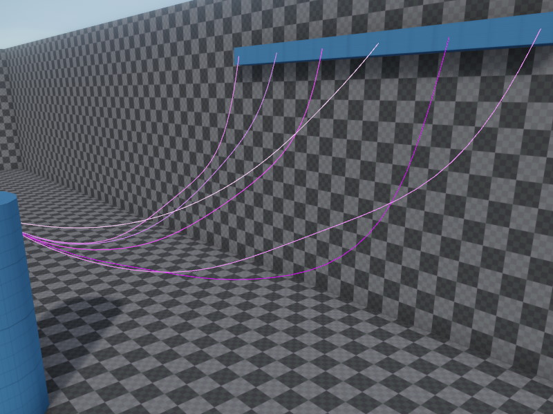
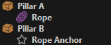
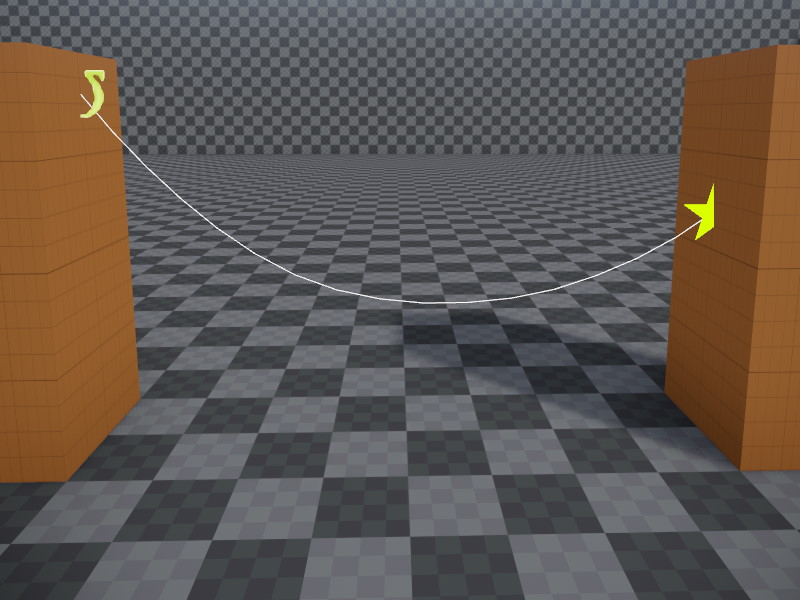

# Fake Rope Component

The *fake rope component* is used to simulate simple cables, ropes and wires for decorative purposes.

These ropes are not able to pull on another object and thus can't be used as a gameplay element. Use the [rope component](../../physics/jolt/special/jolt-rope-component.md) for such use cases.

On the other hand, the fake rope component is more lightweight to simulate and is optimized to have very little overhead when it has reached a resting state (doesn't swing anymore). Therefore it can be used in larger quantities for decorative purposes.

## Setting Up a Rope

A rope requires two anchor points between which it hangs. One anchor point is the rope object position itself, for the other one typically uses a dummy game object. The `Anchor` [object reference](../../concepts/object-references.md) is used to select which one to use.

In the object hierarchy it typically looks like this:

The position of the anchors can be moved in the 3D viewport to position the rope as desired. The shape of the simulated rope will be shown as a preview. Use the `Slack` property to make the rope sag.

[Run the scene](../../editor/run-scene.md) to see the final shape and behavior.

### Rendering

With just the rope simulation component, you won't be able to see the rope, at all. You also need to attach a [rope render component](rope-render-component.md) to the same game object.

### Examples

The [Testing Chambers](../../../samples/testing-chambers.md) project contains a dedicated **Ropes scene** with many examples.

## Component Properties

* `Anchor`: A [reference](../../concepts/object-references.md) to an object whose position determines where the rope ends.

* `AttachToOrigin`, `AttachToAnchor`: Whether the rope is fixed at the origin or anchor location. If the rope is not attached at one or both ends it is free to move away from there.

* `Pieces`: How many individual pieces the rope is made up of. More pieces look prettier, but cost more performance and may decrease the simulation stability.

* `Slack`: How much slack the rope has. A value of zero means the rope is hung perfectly straight between its anchors. Positive values make the rope sag downwards.

* `Damping`: How quickly the rope loses energy while swinging. Higher values make the rope come to rest more quickly, low values make the rope swing for a long time. Once a rope comes to rest, it takes significantly less processing power.

* `WindInfluence`: How strongly [wind](../wind/wind.md) should make the rope swing. Be aware that having many swinging ropes costs a lot of performance.

## See Also

* [Jolt Rope Component](../../physics/jolt/special/jolt-rope-component.md)
* [Rope Render Component](rope-render-component.md)
