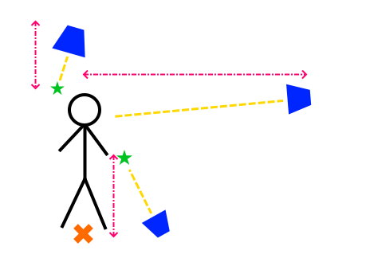

# Thirdperson View Component

The *Thirdperson View* component is used to place an object, typically a [camera](../../graphics/camera-component.md), relative to another object with clear line of sight. The component will make the owner object look at the target point and place it at a certain distance. When there are physical obstacles between the camera and the target, it moves the owner object closer.

<video src="media/3pview.mp4" width="800" height="600" autoplay controls></video>

## Setup

Reference the component properties below for more details.

In the diagram below:
* the blue trapezoids represent possible camera positions
* the orange cross is the `TargetObject`
* the green stars are `TargetOffsetHigh` and `TargetOffsetLow` respectively
* the pink lines represent `MaxDistanceUp` (left), `MaxDistanceDown` (bottom) and `MaxDistance` (from left to right)

When the view is rotated to look downward, its maximum distance is determined by `MaxDistanceUp`. In this example it therefore moves clsoer. It also focuses more on the `TargetOffsetHigh` point. When it is rotated to look upward, its distance is determined by `MaxDistanceDown`. It also focuses more on `TargetOffsetLow`.

When the view is rotated to look straight, it zooms out up to `MaxDistance`. It focuses at the point in between `TargetOffsetLow` and `TargetOffsetHigh`.

## Component Properties

* `TargetObject`: An [object path](../../concepts/object-paths.md) identifying the object that this object should look at. It may be a parent object, in which case the view will also move and rotate with that object. The default value of `..` references the direct parent. Often the target object is positioned directly on the floor. Use the offset values below to adjust which point to look at exactly.

* `TargetOffsetHigh`, `TargetOffsetLow`: Two offest positions relative to the `TargetObject`. Setting these to non-zero values allows to look for example at a point slightly before or behind the target object, or even offset the center sideways.
  If the view looks down from above, it focuses on `TargetOffsetHigh`, if it looks up from below it focuses on `TargetOffsetLow`. In between the two points are interpolated. This allows to have the camera look over the shoulder of a character when viewing from above, and up behind its head, when viewing from below.

* `MinDistance`, `MaxDistance`: When there is no obstacle, the view will place the camera at `MaxDistance`. If there are obstacles, the camera moves in closer, but no closer than `MinDistance`. Make sure that the radius of the [character controller](../../physics/jolt/special/jolt-character-controller.md) is large enough to prevent the camera from being pushed into surrounding geometry.

* `MaxDistanceUp`, `MaxDistanceDown`: The more that the camera is looking at the target from above or below, the more it will use `MaxDistanceUp` or `MaxDistanceDown` rather than `MaxDistance`. This allows to pull the camera closer or move it even further out, when viewed from these extreme angles.

* `MinUpRotation`, `MaxUpRotation`: The minimum and maximum angle that the view may look at the target object from above and below. An angle of zero means looking straight ahead.

* `CollisionLayer`: The [collision layer](../../physics/jolt/collision-shapes/jolt-collision-layers.md) to use for checking collisions with the environment. Only static geometry is checked, dynamic geometry gets ignored.

* `SweepWidth`: The diameter of the sphere that is swept backwards to determine collisions with the environment. Too small values mean the camera may be able to move through small openings, which will move the camera back and forth frequently.

* `ZoomInSpeed`, `ZoomOutSpeed`: The speed with which the camera zooms in when it encounters an obstacle, and out when the obstacle has passed.

## Scriptable Functions

* `void RotateUp(angle)`: Makes the camera rotate up or down by the given angle within the defined boundaries.

## See Also

* [Camera Component](../../graphics/camera-component.md)
* [Character Controller](../../physics/jolt/special/jolt-character-controller.md)
* [Custom Code with Visual Scripts](../../custom-code/visual-script/visual-script-overview.md)
* [Head Bone Component](headbone-component.md)
