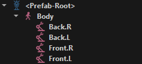
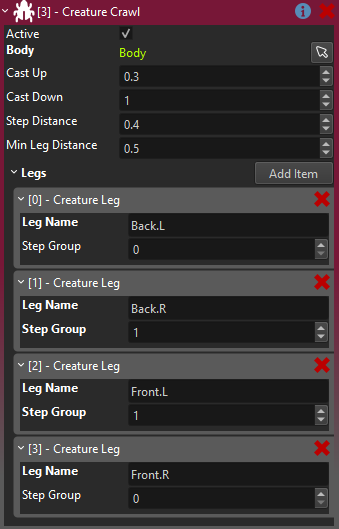
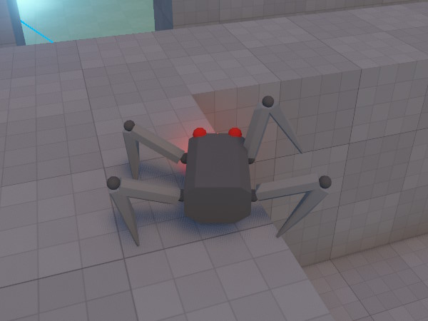

# Creature Crawl Component

The *creature crawl component* is used to procedurally animate legged creatures using *inverse kinematics*. It gives convincing leg movement without the use of any [animation clips](../animation/skeletal-animation/animation-clip-asset.md).

<video src="media/crawl.mp4" width="800" height="600" autoplay controls></video>

> **NOTE**
>
> This component is only meant as a starting point for people to build their own game specific functionality. Thus it may not cover all use cases. If you need more control, copy the code and change it how you need it.

## How to Set Up a Crawling Creature

For an example how to set up such a creature, look at the *SpotBot prefab* in the [Testing Chambers](../../samples/testing-chambers.md) sample project.

The first thing you need is an object that actually moves around. You can use a [character controller](../physics/jolt/special/jolt-character-controller.md) to set this up. If you want to control it yourself, you also need an [input component](../input/input-component.md) and a [visual script](../custom-code/visual-script/visual-script-class-asset.md) to hook things up.

Next, you need an [animated mesh](../animation/skeletal-animation/animated-mesh-component.md) that represents your creature and that contains properly rigged legs. Add this as a child object to your overall creature (below the character controller).

Now set up [two bone IK](../animation/skeletal-animation/ik/two-bone-ik-component.md) for each leg. You can test the IK by running the simulation in the editor and manually dragging the IK target node around, to see how the leg behaves. Now give each leg IK target a unique name.

In the example above, the [character controller](../physics/jolt/special/jolt-character-controller.md), [input component](../input/input-component.md), [visual script](../custom-code/visual-script/visual-script-class-asset.md) and *creature crawl component* are all located on the `<Prefab-Root>`. Whereas the [animated mesh](../animation/skeletal-animation/animated-mesh-component.md) is added to the `Body` node, so that it can be tilted freely. The IK targets for each leg are below the body. Each leg uses [two bone IK](../animation/skeletal-animation/ik/two-bone-ik-component.md).

> **IMPORTANT**
>
> The current implementation requires that an animation is played on the animated mesh, otherwise IK is never applied. That is why we also apply a dummy idle animation loop on the body through a [simple animation component](../animation/skeletal-animation/simple-animation-component.md).

Finally the *creature crawl component* needs to know which legs to move and what body object to tilt:

Here we add all the leg references, set up the `Step Groups` and define how high and low the legs can be moved. For more details see the component properties section below.

Now when you move the object that has the creature crawl component attached, it tries to find a good spot for each leg, and moves the IK target there. If you specified a `Body` object, then the body will also tilt depending on the height of the legs.

## Component Properties

* `Body`: An optional reference to a child object that represents the main body of the creature. If set, this object will be tilted to accomodate the ground slope.

* `Cast Up`, `Cast Down`: The target position for each leg is determined using physics raycasts. `Cast Up` defines how much higher (than the default leg position) the raycast starts, and `Cast Down` says how far downwards to cast. Thus these values affect how high up the creature tries to place its legs and how far downwards it will attempt to reach.

* `Step Distance`: The maximum distance between the current leg position and the desired leg position, before the creature takes a step.

* `Min Leg Distance`: If the creature is close to an edge or a wall, where it can't place the leg at the desired distance away from its body, it may need to pull the legs closer towards the center of its body. This distance value describes how close it could pull the leg. Be aware that the shape of the body and the legs puts a physical limit on how close a leg could be placed. The image below shows that the leg on the right back is pulled in closer than the legs on the left. On the other hand the leg on the right front is too close to the edge and thus it lifted up. How much it is lifted up is defined by the `Cast Up` value.

    

* `Legs`: This array specifies which child objects to use as *legs*. `Leg Name` is the unique name of the child object. It is assumed that each leg contains an [IK component](../animation/skeletal-animation/ik/two-bone-ik-component.md) that will ultimately control the leg. This component only moves the leg object towards the target position. The `Step Group` is a value of typically 0, 1 or 2. All legs with the same group index will move in sync.

## See Also

* [Skeletal Animations](../animation/skeletal-animation/skeletal-animation-overview.md)
* [Two Bone IK Component](../animation/skeletal-animation/ik/two-bone-ik-component.md)
