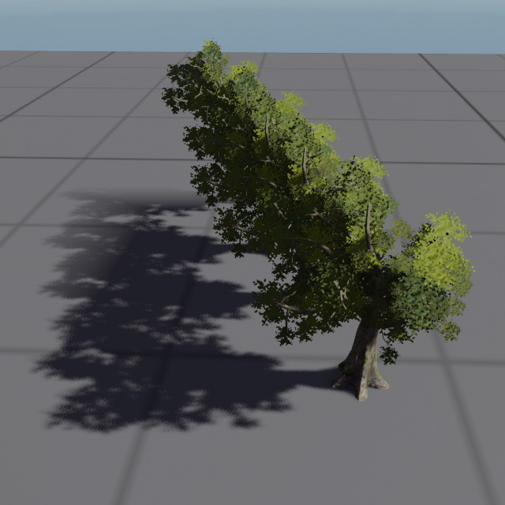

# Directional Light Component

The *directional light component* adds a light source that illuminates the entire scene from one direction. This is typically used for sun light. Since directional light affects everything, it isn't possible to cast shadows everywhere. Instead, shadows are restricted to a region around the camera and objects that are too far away from the camera, won't cast shadows.

You can use multiple directional light sources, for example if you want directional [ambient light](ambient-light-component.md), however, for performance reasons only one directional light should cast shadows.

## Component Properties

See [this page](dynamic-shadows.md#shadow-component-properties) for shadow related component properties.

* `LightColor, Intensity`: The color and brightness of the light.

* `NumCascades`: How many shadow cascades to use. The more cascades are used, the crisper shadows close to the camera become. However, each cascade costs additional performance.

* `MinShadowRange`: How far from the camera the light should cast shadows. A low value means that only objects a short distance away will cast shadows, and objects farther away won't.

  > **Note:**
  >
  > The shadow cascades are distributed based on this value. When the camera's field of view (FOV) exceeds 45 degrees, the final cascade may extend beyond the configured distance, utilizing the available shadow map information across a wider range to optimize performance. This means actual shadow coverage often exceeds `MinShadowRange` at higher FOV values.
  >
  > When implementing zoom features that reduce the camera FOV, you may notice shadows appearing to have reduced distance at lower FOV settings. To address this, configure `MinShadowRange` for your lowest expected FOV. The shadows will then extend further at higher FOV values. Alternatively, you can dynamically adjust the shadow range when zooming, which is a common approach in games but requires a game-specific implementation.

* `FadeOutStart`: At what fraction of the shadow range it should start to fade out. For instance, if the `MinShadowRange` is set to 10 meters, and `FadeOutStart` is set to 0.8, then the shadows will start to fade out at a distance of 8 meters.

* `SplitModeWeight`: TODO

* `NearPlaneOffset`: TODO

## See Also

* [Lighting](lighting-overview.md)
* [Dynamic Shadows](dynamic-shadows.md)
