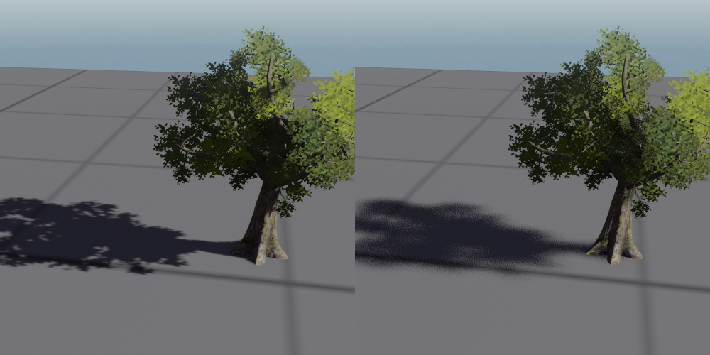

# Dynamic Shadows

Light sources, such as [point lights](point-light-component.md), [spot lights](spot-light-component.md) and [directional lights](directional-light-component.md) may cast dynamic shadows.

The image below shows a spot light casting shadows:

Whether an object casts a shadow depends on whether it has the [tag](../../projects/tags.md) `CastShadow` set.

## Performance

Shadows are implemented using *shadow maps*. That means every light source that shall cast a shadow, has to first render the current scene depth to a texture. This is a very costly operation, which is why you should keep the number of shadow casting light sources as low as possible.

This also is more expensive, the more complex the shadow casting geometry is. Therefore consider switching shadows off for complex geometry and for small objects that don't contribute much anyway. For large complex geometry, you can also use low resolution proxy geometry for casting shadows, though you have to be careful with self-shadowing artifacts if the geometry is very different.

Use your knowledge about the scene to switch shadow casting lights off when they are not needed. For example, if you need a light inside a room to cast dramatic shadows, but the room entrance is only visible from a corridor, use a [trigger](../../physics/jolt/actors/jolt-trigger-component.md) to only switch the light on when the player can actually see the light.

Prefer to use spot lights over point lights, if that makes it possible to get away without shadows in the first place.

All shadow casting light sources share a single shadow texture atlas. Every frame the engine determines the on-screen size of each light source and then allocates some area of the texture atlas to each light source. That means lights that are farther away will use a lower resolution shadow map than close up lights.

## Shadow Quality

Shadow maps are prone to artifacts called *shadow acne*. Either light leaks through objects where there should be shadows, or shadows leak through objects where there should be light. This happens due to precision issues, especially when a shadow is cast nearly perpendicular to a surface. The `SlopeBias` and `ConstantBias` properties (see below) allow to tweak the shadows to reduce this issue in specific places, but there is no solution that will always work.

## Global Shadow Settings

You can adjust global settings for shadows in the platform-specific [asset profile](../../assets/asset-profiles.md).

* `Shadow Atlas Texture Size`: How large the texture atlas should be that is used for all shadow rendering. This is a single texture, where all shadow maps are stored. For many shadow casting lights with high quality shadows, this texture has to be reasonably large.

* `Min/Max Shadow Map Size`: The minimum and maximum space that a single shadow map should take up inside the shadow map atlas. The minimum size determines how bad the shadow quality can get, ie a very low value means that far away light sources can look very blurry. The maximum size determines how good the quality can get, ie with a large value, close up shadows are very crisp whereas with a low value, even close shadows are very blurry. If these values are low and only few dynamic lights are used, the shadow atlas size can also be reduced.

**Note:** These values can also be adjusted at runtime using the [CVars](../../debugging/cvars.md) `cvar_RenderingShadowsAtlasSize`, `cvar_RenderingShadowsMaxShadowMapSize` and `cvar_RenderingShadowsMinShadowMapSize`.

## Shadow Component Properties

Dynamic light sources such as [directional lights](directional-light-component.md), [point lights](point-light-component.md) and [spot lights](spot-light-component.md) can cast dynamic shadows. These components all have properties to tweak the shadows for quality. The following properties are common to these component types:

* `CastShadows`: If enabled, the light will cast dynamic shadows.

  > **Important:**
  > Casting shadows costs a lot of performance. Make sure to only have a small number of lights with shadows active at any one time, otherwise your game may perform poorly.

* `TransparentShadows`: If enabled, geometry that uses the *dithering* mode for transparency, will cast shadows. The shadows appear transparent, though they may be quite noisy.

* `PenumbraSize`: This value specifies how soft the edge of shadows is supposed to be. The image below shows a penumbra size of `0` on the left and `0.5` on the right:

  

* `SlopeBias, ConstantBias`: TODO

* `ShadowFadeOutRange`: If specified, shadows are faded out when the light source has less than a certain size in screen space. This makes it possible to have many shadow casting lights in a scene, and although all of them contribute light, only the most prominent ones cast shadows, which reduces the performance impact.

By default this range is the same as the light range.

## See Also

* [Directional Light Component](directional-light-component.md)
* [Point Light Component](point-light-component.md)
* [Spot Light Component](spot-light-component.md)
* [Fill Light Component](fill-light-component.md)
