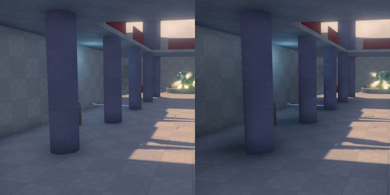

# Fill Light Component

Fill lights are non physically based light sources that can be used to fake global illumination (GI) or modulate ambient light. They have a customizable falloff exponent and use wrapped diffuse lighting with a configurable factor. They also allow negative intensity.

Fill lights are placed to brighten or darken areas in more subtle ways than a regular light source would do. They don't use specular lighting or shadows.

The image above shows a scene without (left) and with (right) fill lights placed behind the columns. Here the fill lights are used to darken the scene to create fake shadowed areas.

Similar to all other dynamic light types, fill lights cost performance, although slightly less than a regular [point light](point-light-component.md).

## Component Properties

* `Light Mode`: How the light is combined with the other scene lighting.
    * `Additive`: The light is added to all other lighting. This is how typical light sources work. Note that to darken the scene with this mode, set a negative `Intensity` on it, then it is simply a subtractive light source.
    * `Modulate Indirect`: Multiplies the [ambient light](ambient-light-component.md) (but not the direct light). This is typically used to introduce fake shadows. Since the direct light is not affected, the fill light darkens an area that is lit by ambient light, but doesn't  affect it when a proper light source illuminates the area.
* `Use Color Temperature`: If enabled, the light color is defined through a temperature value. This makes it easier to set up physically accurate lighting conditions.
* `Light Color`: The color of the light.
* `Intensity`: The brightness. Note that fill lights may use negative intensity values.
* `Range`: The distance over which the light affects geometry.
* `Falloff Exponent`: How rapidly the light strength changes from its center to its edge. Values below `1` mean that the lighting changes very slowly from the center outwards, but then very suddenly at the outer edge. Values above `1` are the opposite, the effect reduces quickly at the center and then gradually fades out at the edge.
* `Directionality`: How much the light wraps around the geometry. A value of `0` means that it fully wraps around geometry, as if it comes from all directions. A value of `1` means it doesn't wrap around geometry, at all, behaving more like a traditional light source.

## See Also

* [Lighting](lighting-overview.md)
* [Ambient Light Component](ambient-light-component.md)
* [Point Light Component](point-light-component.md)
