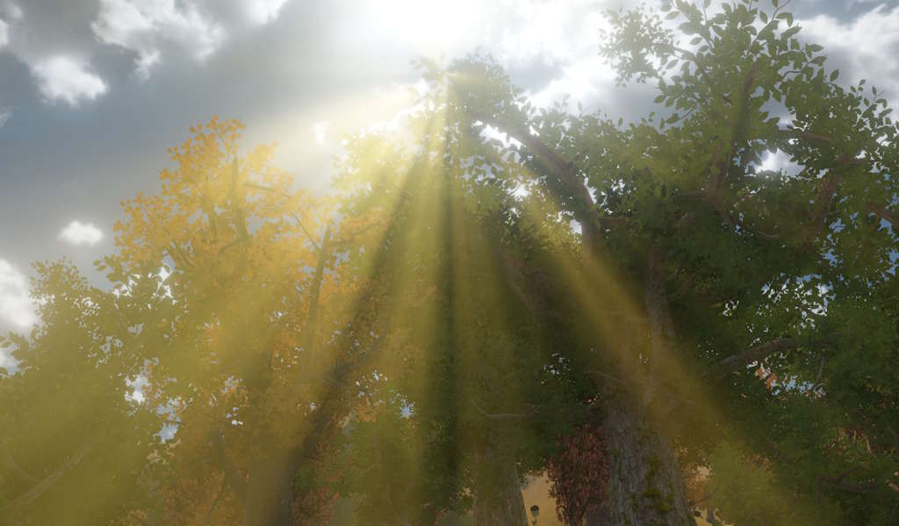

# Light Shafts Component

The *light shafts component* adds a screen-space volumetric light shaft effect (also known as *god rays* or *crepuscular rays*) to the scene. The effect simulates light scattering through the atmosphere by radiating bright streaks from the sun's position on screen.

The component is typically attached to the same game object as a [directional light](directional-light-component.md). Only one light shafts component can be active per scene.

The effect requires the [Light Shafts Pass](../render-pipeline/render-pipeline-passes.md#light-shafts-pass) to be present in the active [render pipeline](../render-pipeline/render-pipeline-overview.md).

## Component Properties

* `Intensity`: Controls the overall brightness of the light shafts.

* `BrightnessThreshold`: Only pixels brighter than this value contribute to the light shaft mask. Increasing this value restricts the effect to the brightest parts of the sky and helps avoid artifacts in overcast or dim scenes.

* `MaxBrightness`: Clamps the brightness of contributing pixels to prevent excessively bright areas from causing visual artifacts.

* `DiskMaskRadius`: Masks a small disk around the projected sun position as the only source for the light shafts. The radius is in relative screen space, where `0.1` corresponds to 10% of the screen height. This is useful when the sky does not have a distinct bright sun disk and the `BrightnessThreshold` alone is insufficient to prevent artifacts.

* `TintColor`: Applies an additional color tint on top of the color sampled from the sky around the sun position.

## See Also

* [Lighting](lighting-overview.md)
* [Directional Light Component](directional-light-component.md)
* [Render Pipeline Passes](../render-pipeline/render-pipeline-passes.md#light-shafts-pass)
