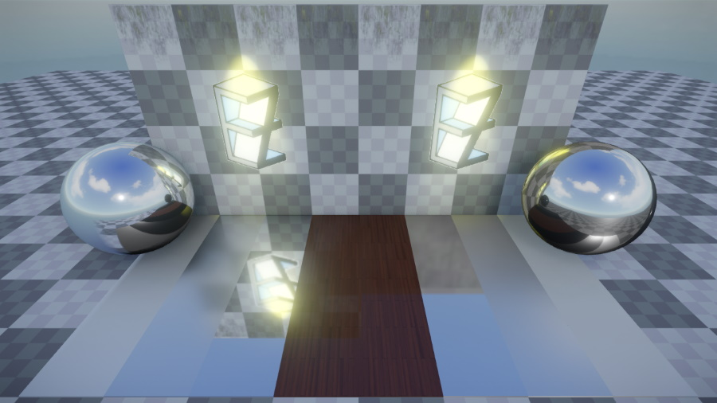

# Reflection Probe Components

The two reflection probe components, *box reflection probe component* and *sphere reflection probe component* allow for localized reflections to be added to a scene. The probe makes a 360 degree screenshot of the scene to capture the overall lighting at this location into a cubemap which can be sampled at runtime to generate reflections.

## Scene Setup

Sphere reflection probes project the captured cubemap to infinity, i.e. no parallax effect is observed when moving. Box reflection probes on the other hand project the cubemap to their extents, allowing for parallax correction of the reflection when moving in the scene.
Probes take the parent game object's scale into account. Thus, sphere probes can actually be ellipsoids if scaled non-uniformly. The image below shows the difference between a box (to the left) and a sphere reflection probe (to the right). While the reflection in the metal ball both look convincing, the reflection on the floor is clearly off for the sphere reflection probe.

By default, each probe captures everything in its radius. In many cases it makes sense to [tag](../../projects/tags.md) the `ExcludeTags` with `SkyLight` though so that the resulting cubemap is transparent where no geometry was rendered. This allows for the cubemaps to be dynamically composited at runtime. The benefits of this is that the skylight can change dynamically and won't be baked into the probe and it allows for parallax between e.g. a box probe and the sky light fallback reflection.

The captured reflection is only visible in the probe's influence volume. For sphere probes this is defined by their radius and for box probes by their extents.

At runtime, all probes are sorted by their volume and the smallest probe is sampled first. If the reflection is transparent in the cubemap, then next bigger cubemap that influences the geometry is sampled next. This continues until we hit an opaque pixel in a cubemap or if the fallback reflection of the [sky light component](sky-light-component.md) is reached.

The probe's `ReflectionProbeMode` by default is set to `static`, in which case the captured cubemap reflection is only updated once at the start or whenever the settings change. Alternatively it can be set to `dynamic`, in which case probe is updated  continuously.

## Component Properties

Sphere reflection component:

* `Radius`: The influence range of the probe. The reflection is only visible on geometry intersecting this radius.
* `Falloff`: Percentage of the radius that is smoothly blended into other probes.

Box reflection component:

* `Extents`: The extents of the box projection. The cubemap will be projected to this box.
* `InfluenceScale`, `InfluenceShift`: The influence volume can be smaller than the projected volume (extents) of the probe. This can be useful if you have e.g. a long corridor that you want to place multiple probes in. Each will have the same projection but a different part of the projection volume will be set as the influence volume centred around a probe capture offset.
* `PositiveFalloff`, `NegativeFalloff`: Percentage of the influence volume in each direction that is smoothly blended into other probes. The falloff is defined for each face of the box.

Common properties for both sphere and box reflection probes that describe how the probe is captured:

* `ReflectionProbeMode`: `Dynamic` makes the skylight update continuously. `Static` will only update once at the start.
* `IncludeTags`, `ExcludeTags`: These [tags](../../projects/tags.md) define which objects in the scene are used to capture the scene. This is the same mechanism as used in the [camera component](../camera-component.md). By default, the `SkyLight` tag is excluded to allow for dynamic composition with the [sky light component](sky-light-component.md).
* `NearPlane`, `FarPlane`: Camera settings used when the lighting is captured from the scene. If `NearPlane` is set to `Auto`, a value is computed automatically from the `FarPlane`.
* `CaptureOffset`: The capture offset allows for the capture position of the probe to be decoupled from the game object position.
* `ShowDebugInfo`: If enabled, a sphere with a preview of the probe cubemap is rendered at the position of the capture offset. Use this to check whether all desired objects contribute to the probe. Above the sphere will be a stack of other spheres that showcase the reflection with increased roughness.

## See Also

* [Lighting](lighting-overview.md)
* [Ambient Light Component](ambient-light-component.md)
* [Sky Light Component](sky-light-component.md)
