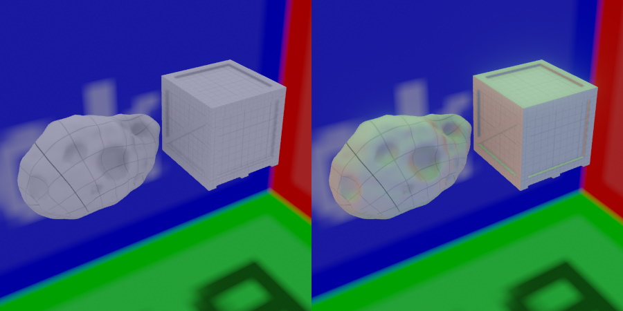
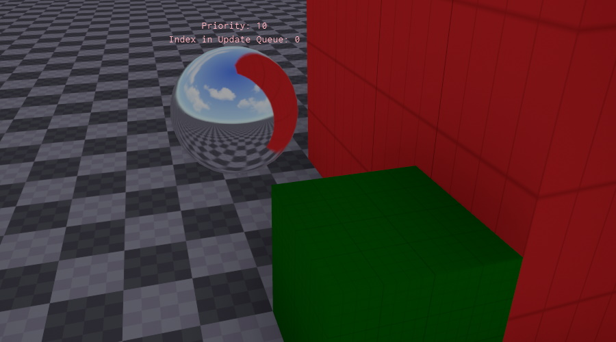

# Skylight Component

The *skylight component* illuminates the entire scene, similar to the [ambient light component](ambient-light-component.md). There are three main differences:

1. Objects are illuminated using 6 different colors, one for each main direction (a so called 'ambient cube'). The ambient light component uses only 2 colors (top and bottom).
1. The colors are dynamically computed from the scene. If the color of your sky changes, the ambient lighting of objects in the scene will reflect this.
1. A global fallback reflection probe is generated. This is used for reflections if no local [reflection probe components](reflection-probe-components.md) are present.

The image above shows some objects lit only with the skylight component. Here the scene uses a [skybox](../../effects/sky.md) with blue sky, which is why the objects appear with a slightly blue tint.

## Skylight vs. Ambient Light Component

The [ambient light component](ambient-light-component.md) uses a fixed color for lighting objects. Although you could animate those colors over time, for instance using a [property animation (TODO)](../../animation/property-animation/property-animation-overview.md), it is not possible to be directional. Using the skylight component you can have a bit of directional lighting.

In the image below the objects on the left are lit with an ambient light component. Note that the lighting is very flat. The objects on the right are lit with a skylight component. To demonstrate how it illuminates objects directionally, the skybox is set to have red, green and blue faces.

The ambient light component also does not generate a fallback reflection probe. So you are completely reliant on [reflection probe components](reflection-probe-components.md) for reflections.

## Scene Setup

The skylight component continuously makes a 360 degree screenshot of the scene to capture the overall lighting. However, typically you don't want to capture the entire scene, but only very few elements. Most notably, you want to capture the background sky, e.g. the skybox. You may also want to capture the ground. Finally, if you have distant background geometry, like a city backdrop or mountains, which the player can never reach, you may want to include those in your skylight snapshot as well, especially when that geometry can affect the visibility and thus brightness of the sky.

Therefore, the skylight component requires you to select those few objects and [tag them](../../projects/tags.md), such that the update of the skylight only includes those objects.

By default the `IncludeTags` property is already set to `SkyLight`, which means that only objects with this tag will be used for computing the overall lighting. Consequently, you have to select objects, like your skybox, and assign that tag to them, otherwise the skylight will stay black.

The skylight `ReflectionProbeMode` can also be set to static. In this mode, it will either just do one scene capture at the start or, if `CubeMap` is set, just compute the ambient light and reflection from the given cubemap.

The image below shows the `ShowDebugInfo` mode. Here the skylight component visualizes the geometry that is used to compute the skylight. In this case the skybox, the floor and the red object were all tagged with `SkyLight`, and therefore appear in the preview. The green box though, was not tagged and therefore does not affect the result.

> **Important:**
>
> When you insert the skylight into the scene, it will override existing ambient lighting, and your scene may turn black. That's because no object in the scene is yet contributing to the skylight. You need to add the proper tag on your [sky](../../effects/sky.md) to get the desired illumination.

## Component Properties

* `ReflectionProbeMode`: `Dynamic` makes the skylight update continuously. `Static` will only update once at the start or generate the lighting from a cubemap asset, if the `CubeMap` property is set.
* `CubeMap`: Select a static cubemap asset as the source of the lighting instead of capturing the scene. Only available if `ReflectionProbeMode` is set to `Static`.
* `Intensity`: This allows you to adjust the intensity of the applied ambient light.
* `Saturation`: With a saturation of 1, the color of the sky is applied exactly as it is to the scene. Often this would result in too colorful lighting, for example a strong blue hue. By reducing saturation, the light will become more monochrome. In the image at the top, saturation was set to 0.4 to reduce the blue tint from the sky. 
* `IncludeTags`, `ExcludeTags`: These [tags](../../projects/tags.md) define which objects in the scene are used to compute the skylight. Make sure that the object that renders your [sky](../../effects/sky.md) has this include tag set. This is the same mechanism as used in the [camera component](../camera-component.md).
* `NearPlane`, `FarPlane`: Camera settings used when the lighting is captured from the scene. If `NearPlane` is set to `Auto`, a value is computed automatically from the `FarPlane`.
* `ShowDebugInfo`: If enabled, a sphere with a preview of the sky image is rendered at the position of the skylight object. Use this to check whether all desired objects contribute to the skylight. Above the sphere will be a stack of other spheres that showcase the reflection with increased roughness.

## See Also

* [Lighting](lighting-overview.md)
* [Ambient Light Component](ambient-light-component.md)
* [Reflection Probe Components](reflection-probe-components.md)
