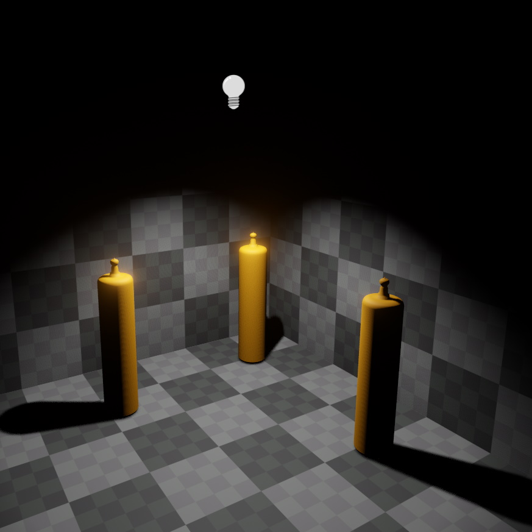
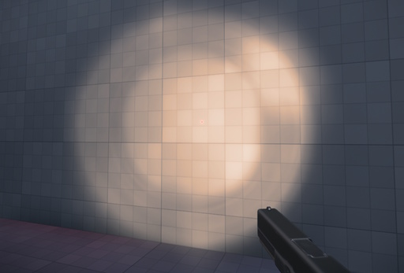
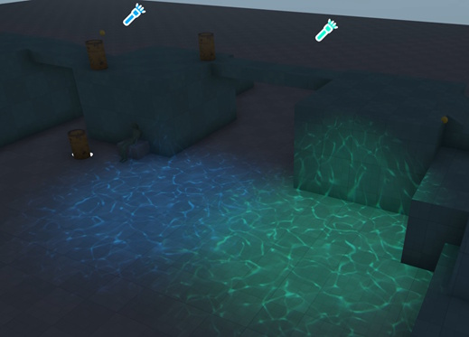

# Spot Light Component

The *spot light component* adds a dynamic light source that illuminates the scene within a cone. The cone's inner angle determines the area that is illuminated equally bright. Between the inner angle and outer angle the light will fade to black. Spot lights should be preferred over [point lights](point-light-component.md) when this can prevent the need for [dynamic shadows](dynamic-shadows.md). For example, a light mounted to a ceiling should illuminate the area below it, but not shine through the ceiling and illuminate objects above. A spot light with a large cone can achieve this.

Each light source costs performance. Try to reduce the number of light sources that illuminate the same area. Use the [light count render mode](../../editor/editor-views.md#light-count) to find hotspots.

Note that unless a light source casts [dynamic shadows](dynamic-shadows.md), it's light will shine through walls. Casting shadows is very costly, though. When it is possible to avoid casting shadows, for example by using multiple smaller lights instead, the performance should always be better.

## Video: How to create a light source

## Projected Light Patterns

A spotlight may use a static texture or even an animated material to project an image.

Use the `Cookie` option to mask the light with a static image. This is useful to give the projected light more structure, for example for flashlights. But it can also be used to fake complex shadows instead of casting dynamic shadows.

For even more complex effects, an animated *decal material* may be used (see `Material` property below).

This allows for a dynamically changing light projection.

## Component Properties

See [this page](dynamic-shadows.md#shadow-component-properties) for shadow related component properties.

* `LightColor, Intensity`: The color and brightness of the light.

* `Use Color Temperature`: If enabled, the light color is defined through a temperature value. This makes it easier to set up physically accurate lighting conditions.

* `Range`: The distance over which the light source affects geometry. By default this is set to `Auto`, meaning the necessary range will be computed from the light's brightness. For full control, the range can be set manually. The light will always attenuate to zero within the given range, so by specifying a small range you can create a small, yet very bright light.

* `InnerSpotAngle`: The inner angle of the spot light's cone. Within this angle the spot light will not attenuate (except by distance) and stay equally bright.

* `OuterSpotAngle`: The spot light will attenuate between the inner angle and the outer angle to zero. If the outer angler is very close to the inner angle, the spot light will have a very sharp cut off. If the outer angle is considerably larger than the inner angle, the spot light will smoothly fade to black at the edges.

* `Cookie`: A texture to project a light pattern ("cookie") into the scene. This can be used for effects like complex shadows or light shapes.

* `Material`: Uses a decal material for animated light projection effects. Such materials can be created with the [Visual Shader Editor](../../materials/visual-shaders.md). They need to use the *decal* output node, and to be selectable in the [Asset Browser](../../assets/asset-browser.md) their `Asset Filter Tags` property has to be set to **Decal**.

* **Note:** If both a material and a cookie are set, only the material will be used.

## See Also

* [Lighting](lighting-overview.md)
* [Point Light Component](point-light-component.md)
