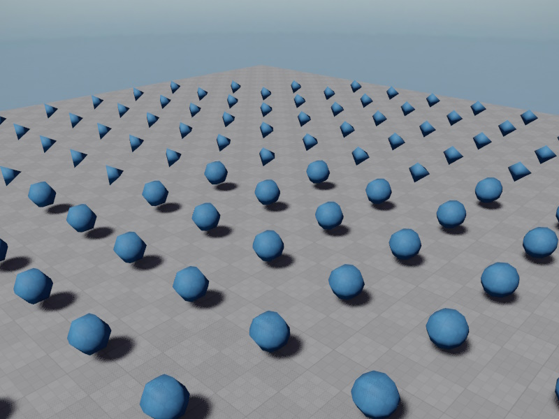

# LOD Component

The *Level-of-Detail (LOD) component* switches child objects named `LODn` (with `n` from 0 to 4) on and off, depending on how close this object is to the main camera.

The LOD component is used to reduce the performance impact of complex objects when they are far away.
To do so, a *LOD object* consists of multiple states, from highly detailed to very coarse.
By convention the highly detailed object is called `LOD0` and the lesser detailed objects are called `LOD1`, `LOD2`, `LOD3` and finally `LOD4`.

This component calculates how large it roughly appears on screen at it's current distance. This is called the *coverage* value.
Using user defined coverage thresholds, it then selects which LOD child object to activate. All others get deactivated.
The LODs have to be direct child objects called `LOD0` to `LOD4`. Other child objects are not affected.

How many LODs are used depends on the number of elements in the `LodThresholds` array.
The array describes up to which coverage value each LOD is used.
Thus if it contains one value, two LODs will be used, `LOD0` for coverage values above the specified threshold, and `LOD1` at lower coverage values.

To see the current coverage, enable the debug drawing.

The coverage calculation uses spherical bounds. It should be configured to encompass the geometry of all LODs.

To prevent LODs switching back and forth at one exact boundary, the LOD ranges may overlap by a fixed percentage.
This way once one LOD gets activated, the coverage value has to change back quite a bit, before the previous LOD gets activated.
Since this behavior can make it harder to set up the LOD thresholds, it can be deactivated, but in practice it should stay enabled.

## Component Properties

* `BoundsOffset`, `BoundsRadius`: Define the bounding sphere for the LOD object. This should be setup such that it surrounds all visible child geometry of all LODs, otherwise the component may not properly switch states when the object is partially visible. These bounds are also used to compute the on-screen coverage.

* `ShowDebugInfo`: If enabled, the LOD component draws information about the current screen coverage, selected LOD and coverage ranges. This should be used to determine at which coverage values a LOD switch should happen.

* `OverlapRanges`: Disable this to have the LOD switch take places exactly at the configured thresholds. This helps during setup. Keep this enabled during normal operation. It means that the LOD threshold ranges overlap, so that once the component switches from LOD `n` to `n+1`, it won't immediately switch back to `n` when the camera takes a small step back. This is to prevent obvious back and forth.

* `LodThresholds`: An array of up to 4 threshold values. Each value is the coverage threshold up until which the LODn is used. So if element `0` is set to 0.2, that means `LOD0` will be used up to a coverage value of `0.2` and at `0.199` it will switch to `LOD1`. Up to five different LODs are allowed. If there is a LOD threshold, but no child node with the corresponding name, this disable all LODs, which can be used to hide the object entirely.

## Sample

The [Sample Game Plugin](../../samples/sample-game-plugin.md) contains prefabs that demonstrate how to use the LOD component. More complex setups are possible.

## See Also

* [Always Visible Component](always-visible-component.md)
* [Profiling](../performance/profiling.md)
