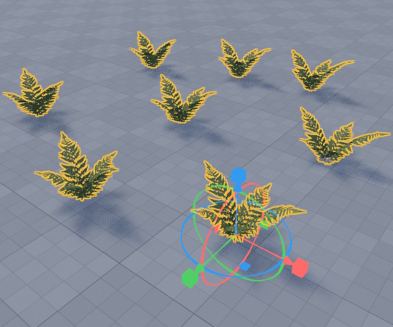
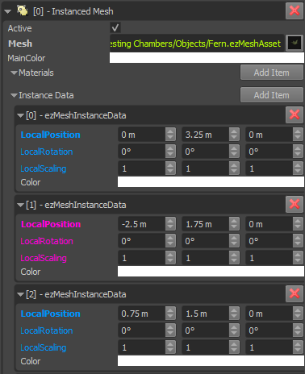

# Instanced Mesh Component

The *instanced mesh component* is used to place multiple instances of the same mesh in a scene, with only a single [game object](../../runtime/world/game-objects.md).

This component is meant for rare special cases where you want to render many mesh instances, but remove the performance overhead of having a dedicated game object for each one.

> **Important:**
>
> Using the instanced mesh component does not mean, that only this enables the use of *instancing* on the GPU. The renderer already uses instancing, even for regular [mesh components](mesh-component.md). So you don't need to fear that using non-instanced mesh components would be inefficient for rendering.

## Editing Instances

The instanced mesh component has an array of items which hold the transform and color for each mesh instance:

You add instances by extending the array. Click the blue properties of an entry, to make a gizmo appear with which you can transform that instance (see image at the top).

This workflow is currently not particularly enjoyable. You can't select individual instances through the viewport and you can't use the [standard gizmos](../../scenes/gizmos.md) to edit an instance.

## When and How to Use the Instanced Mesh Component

This component is not meant to be used manually. For everything that you edit by hand, the regular [mesh component](mesh-component.md) is efficient enough and much more convenient to use.

This component has been created to be used by runtime code that procedurally places meshes and may create hundreds or thousands of instances of the same mesh. In such a situation it does make a performance difference, whether the engine has to handle a single game object with a single instanced mesh component, or thousands of game objects with equally many regular mesh components.

Consequently, if you write custom code that places meshes procedurally, you may utilize this component. Be aware though that the instanced mesh component acts as a single object in regards to frustum culling, meaning either *all* instances are visible or *none*, but nothing in between. So you should group instances by proximity and use multiple instanced mesh components, if the instances span a large area.

## Component Properties

* `Mesh`: The [mesh asset](mesh-asset.md) to render.
* `MainColor`: This color will be combined with the color of each individual mesh instance.
* `Materials`: An array of [materials](../../materials/materials-overview.md) to override the default material. Works the same way as for [regular mesh components](mesh-component.md).
* `InstanceData`: An array of instances. Each instance has its own transform and color. Click the blue transform properties to activate a [manipulator](../../scenes/gizmos.md#manipulators) for that instance.

## See Also

* [Meshes](meshes-overview.md)
