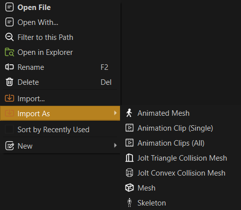
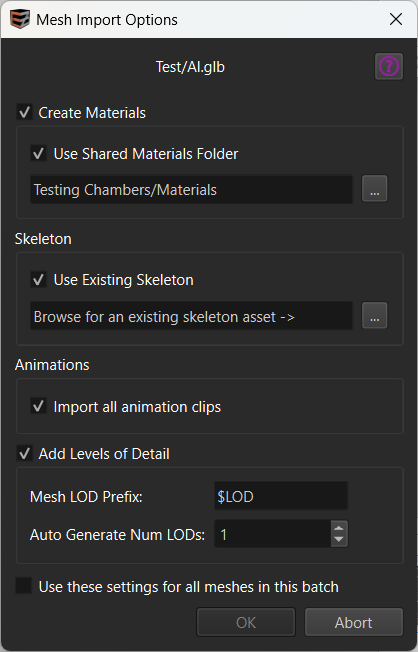

# Mesh Asset Import

This chapter describes how to quickly and conveniently import mesh files and their dependencies.

## General Steps

Make sure your source assets are **located inside your project folder**. In the [asset browser](../../assets/asset-browser.md) navigate to that folder and set the asset browser's *asset type filter* to **\<Importable Files\>**.

You should then be able to see your `.fbx`, `.gltf` and `.glb` files.

Files that have never been imported before show an orange arrow icon as an overlay, assets that are already in use show a grey arrow icon.

Right click a file and navigate to the *Import As* sub-menu.

Mesh files can be imported in different ways, depending on whether they should be used as static, animated
or collision meshes. Since these file types may also contain animation clips, there are also options to import only those.

## Mesh Import Dialog

Select **Mesh** or **Animated Mesh**, depending on the desired usage. The following dialog will appear. For static meshes some options will be hidden, but the general concept is the same.

At the top, the dialog shows the name of the file to import.

The checkbox at the very bottom is relevant when you selected many meshes for import. If checked, the dialog won't be shown again and all meshes will be imported with these settings. Note that static meshes and animated meshes are treated separately, though.

### Create Materials

If this option is *disabled* the mesh will be imported *without* materials, and you need to configure material references manually afterwards.

Otherwise, [material assets](../../materials/materials-overview.md) will be created using the material description from the source asset.

If **Use Shared Materials Folder** is *disabled*, new, unique materials are created and stored in a folder next to the mesh. The folder gets a `_data` suffix, which means that by default [the asset browser hides its contents](../../assets/asset-browser.md#hidden-folders).

If the option is *enabled*, you need to select a folder, where to store materials. The importer will then search the entire folder structure for existing materials with the same names as the *material slots*, and only create those that don't exist yet.

> **Important:**
>
> Sharing materials across assets requires that your team has a plan how to name material slots consistently. Make sure to decide on a naming scheme early to benefit from EZ's automatism.

New materials will be created directly in the selected folder, but you may move them to sub-folders afterwards. The [log](../../debugging/logging.md) lists which new assets where created during the import step.

### Skeleton

This option only shows up when importing as an animated mesh.

If **Use Existing Skeleton** is *disabled*, a new skeleton asset will be created for the animated mesh to use. You may need to open it afterwards to correct the orientation of the mesh. See the [skeleton asset properties](../../animation/skeletal-animation/skeleton-asset.md) for details.

If *enabled*, you need to select an existing skeleton to re-use. This should be preferred, if you have multiple animated characters that share the same bone structure.

If you want to **import only a skeleton**, choose **Import As > Skeleton**.

### Animations

This option only shows up when importing as an animated mesh.

Enable **Import all animation clips** to automatically create [animation clip assets](../../animation/skeletal-animation/animation-clip-asset.md) for all animations found in the mesh. If you don't want to do this now, or new animation clips get added to the source file later, you can also do only this step later by selecting **Import As > Animation Clips (all)**.

### Add Levels of Detail

If *enabled* the import automatically sets up additional mesh assets for level-of-detail (LOD). These can then be used with the [LOD mesh component](lod-mesh-component.md) or [LOD animated mesh component](../../animation/skeletal-animation/lod-animated-mesh-component.md).

There are two possibilities for LODs:

1. Self-made, low-resolution meshes.
2. Automatic mesh decimation.

Option 1. is more effort, but typically yields superior results. Option 2. can be a quick and easy solution, but isn't guaranteed to give good results.

EZ supports both options.

#### Mesh LOD Prefix

This option is for cases where a source asset contains multiple different meshes and the meshes are named in a specific way to distinguish their use. The mesh LOD prefix is ultimately used to set the [MeshIncludeTags](mesh-asset.md#asset-properties) option, such that specific meshes get imported as dedicated LODs.

For instance, name your meshes like this:

* `Door`
* `$LOD1_Door`
* `$LOD2_Door`

Then you set the *Mesh LOD Prefix* to `$LOD`. The importer then sees that the file contains a mesh with the prefix `$LOD1` and one with `$LOD2` and automatically sets up two LOD meshes.

> **Important:**
>
> For this to work well, the main mesh also needs to **exclude** the `$LOD` meshes. By default all meshes whose names start with `$` are excluded, which is why this naming scheme works well out of the box. Other schemes are possible, though.

If the mesh LOD prefix option is set to be empty, no LODs are attempted to be imported this way. However, the automatic mesh decimation (see section below) may still be used.

#### Auto Generate Num LODs

If this value is set to 1 or larger, the import step may add this many additional meshes as LODs and enables [mesh simplification](mesh-asset.md#asset-properties) on them. However, this is only done, if no LODs were found via the *Mesh LOD Prefix*.

After import you should inspect the LOD meshes and check that the simplification settings produce acceptable results and that each LOD has no more than half the number of triangles than the previous one.

## See Also

* [Asset Import](../../assets/import-assets.md)
* [Mesh Asset](mesh-asset.md)
* [Animated Mesh Asset](../../animation/skeletal-animation/animated-mesh-asset.md)
